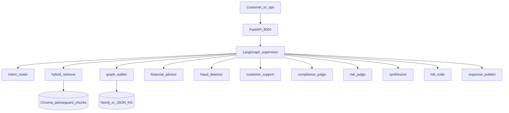
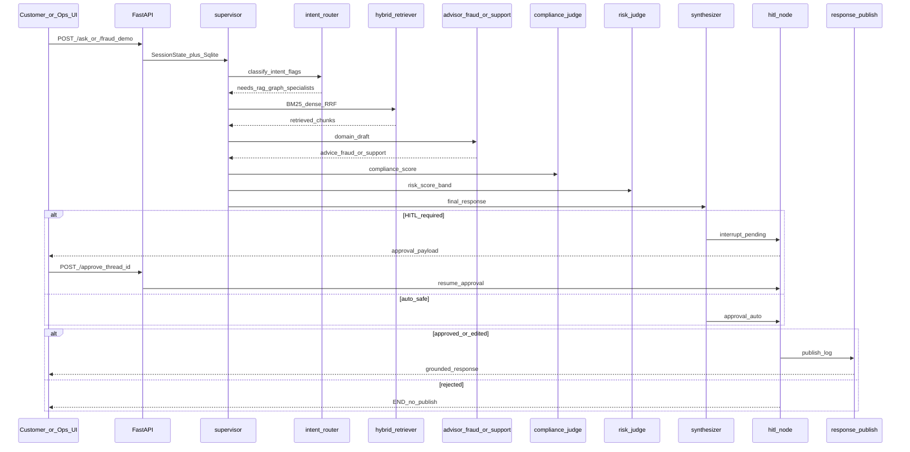

# Architecture

AdviseGuard AI — personalized advice + fraud screening + customer support with HITL on high-stakes paths.

See also [`SYSTEM_DESIGN.md`](SYSTEM_DESIGN.md) · [`AS_BUILT.md`](../AS_BUILT.md).

## High-Level Architecture (HLA)

**UI:** `/` customer · `/ops` employee fraud dashboard · port `8004`.  
**HITL when:** fraud `risk_band` in `{high, critical}`, advice marked `high_stakes`, compliance &lt; 0.6, grounding &lt; 0.7, or soft-escalate injection patterns.

## Low-Level Architecture (LLA)

Ask / fraud demo turn with human-in-the-loop.

