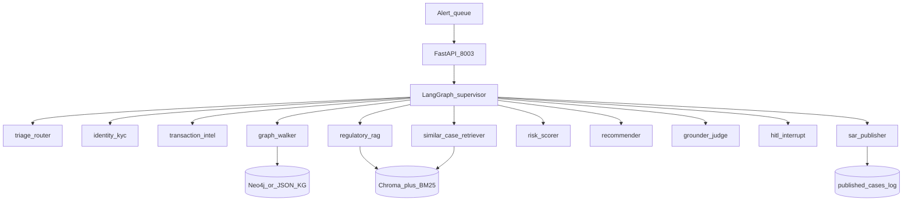
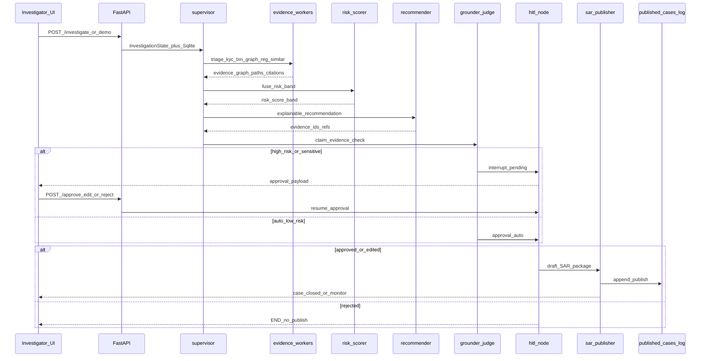

# Architecture

BankShield AI — multi-agent financial-crime investigation (alert → evidence → HITL → SAR draft).

See also [`SYSTEM_DESIGN.md`](SYSTEM_DESIGN.md) · [`AS_BUILT.md`](../AS_BUILT.md).

## High-Level Architecture (HLA)

**HITL rule:** `risk_band in {high, critical}` or fraud types in `{wire, sanctions, aml, mule}` always interrupt before SAR publish. The system never auto-files a regulatory SAR without human approval on high-risk cases.

## Low-Level Architecture (LLA)

Investigation turn with human-in-the-loop.

