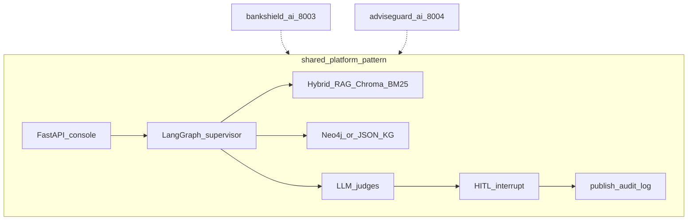

# Architecture

Portfolio overview for two sibling LangGraph fintech platforms. Neither package imports or calls the other at runtime.

| Project | Port | Architecture |
|---------|-----:|--------------|
| [`bankshield-ai/`](../bankshield-ai/) | 8003 | [docs/architecture.md](../bankshield-ai/docs/architecture.md) |
| [`adviseguard-ai/`](../adviseguard-ai/) | 8004 | [docs/architecture.md](../adviseguard-ai/docs/architecture.md) |

## High-Level Architecture (HLA)

**Ports:** BankShield UI `8003` · AdviseGuard UI `8004` · Neo4j `7687` / `7688` · Postgres `5434` / `5435`.

## Low-Level Architecture (LLA)

### LLA omitted (portfolio root)

Per-product HITL sequences are documented in each package’s `docs/architecture.md`. This file only orients the sibling relationship and shared stack.
