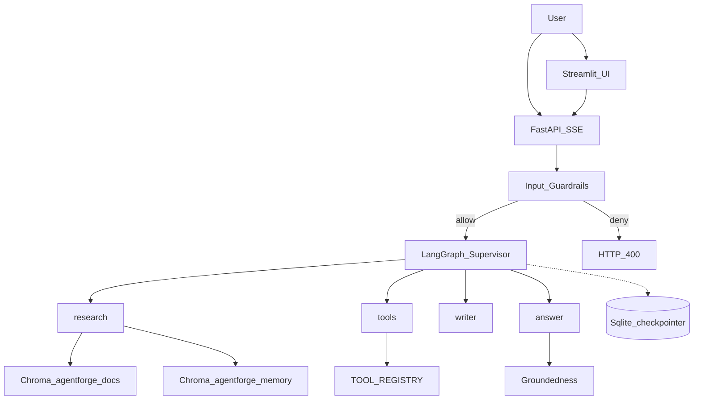

# As-Built — AgentForge

**Document type:** Planning documentation — *as built*  
**Status:** Implemented local-first prototype (v0.1.0)  
**Package:** `agentforge`  
**Location:** `8.agentforge-&-local-llm-agents-ai-projects/agentforge/`  
**Related:** [README.md](README.md) · sibling [`../local-llm-agents/`](../local-llm-agents/) (educational precursor)

This file captures the project **as delivered**: locked decisions, architecture, layout, API, guardrails, memory, eval, deploy, and verification.

---

## 1. Project objective

Build a **production-oriented, local-first** agentic AI platform on Ollama that evolves the notebook demos in `local-llm-agents` into a deployable system with:

1. LangGraph supervisor + worker agents (research / tools / writer / answer)
2. Semantic RAG (Ollama embeddings + Chroma) over a PDF knowledge base
3. FastAPI + SSE streaming API and Streamlit chat UI
4. Short-term (SQLite checkpointer) + long-term (Chroma) memory
5. Prompt-injection and groundedness guardrails
6. DeepEval-backed evaluation (lexical fallback)
7. OpenTelemetry tracing (+ optional Langfuse env hooks)
8. Docker Compose and starter Kubernetes manifests

UI: Streamlit at `http://localhost:8501` · API docs at `http://localhost:8000/docs`

---

## 2. Locked decisions (as built)

| Area | Decision |
|------|----------|
| Runtime | **Local-first** — Ollama LLM + embeddings; no cloud LLM required |
| Chat model (default) | `qwen3` via `OLLAMA_LLM_MODEL` |
| Embeddings | `nomic-embed-text` via `OLLAMA_EMBED_MODEL` |
| Orchestration | LangGraph **supervisor → workers**; workers do not route to each other |
| Workers | `research` · `tools` · `writer` · `answer` |
| Vector store | Chroma persistent (`./data/chroma`) |
| RAG collection | `agentforge_docs` (cosine HNSW); ingest **resets** collection |
| Memory collection | `agentforge_memory` |
| Checkpointer | `SqliteSaver` → `./data/checkpoints.db`; fallback `MemorySaver` |
| Chunking | Fixed windows: size **800**, overlap **120** |
| Retrieve | Top-**4**, min similarity score **0.25** (`1.0 - cosine_distance`) |
| API | FastAPI on port **8000**; SSE when `stream=true` (default) |
| UI | Streamlit — no React/npm in v1 |
| Guardrails | Hard-block injection at `/chat`; soft groundedness refusal in graph |
| Eval | DeepEval Faithfulness + Answer Relevancy; lexical overlap fallback |
| Observability | OpenTelemetry (console or OTLP); Langfuse keys detected, not fully wired |
| Deploy | Docker Compose (api + ui); k8s Deployment/Service for API only |
| Explicitly not v1 | Cloud LLM primary path, HITL interrupt, Neo4j GraphRAG, multi-tenant isolation |

### Do not regress

1. Workers never call each other — only the supervisor chooses the next node.  
2. Injection patterns must hard-block at the API before the graph runs.  
3. Ungrounded research/answers must refuse (weather path may bypass).  
4. Ingest remains replace-index (`reset=True`) unless intentionally changed.  
5. Notebook tool parity: PDF search, Cardiff weather, study-note write, remember fact.

---

## 3. Architecture (as built)



**Runtime flow**

1. Client sends a message to `POST /chat` (Streamlit or curl).
2. `validate_user_message` enforces non-empty, max length, injection patterns.
3. Supervisor picks `research` | `tools` | `writer` | `answer` | `end` (keyword shortcuts + LLM JSON).
4. Workers update `AgentState`; research/answer consult RAG + long-term memory.
5. Response returns answer, route, citations, and events (SSE stream optional).

**Graph topology**

```text
supervisor (entry)
  ├─ research → writer | answer
  ├─ tools    → answer
  ├─ writer   → END
  ├─ answer   → END
  └─ end      → END
```

| After | Next |
|-------|------|
| supervisor | node named by `state.route` (default `answer`) |
| research | `writer` if message mentions study note/guide/markdown/write notes; else `answer` |
| tools | `answer` |
| writer / answer | `END` |

### State (`AgentState`)

`messages`, `user_message`, `route`, `tool_name`, `tool_args`, `context`, `citations`, `research_notes`, `draft`, `answer`, `events`, `memories`

---

## 4. Project layout (as built)

```text
agentforge/
├── AS_BUILT.md
├── README.md
├── .env.example
├── .gitignore
├── requirements.txt
├── pyproject.toml
├── Dockerfile
├── docker-compose.yml
├── k8s/
│   └── deployment.yaml
├── assets/                 # PDF(s) for ingest
├── data/                   # chroma/, checkpoints.db, study_note.md (runtime)
├── ui/
│   └── streamlit_app.py
├── tests/
│   ├── test_guardrails.py
│   └── test_schemas.py
└── app/
    ├── main.py             # FastAPI entry
    ├── config.py           # pydantic-settings
    ├── agents/
    │   ├── graph.py        # build/run/stream graph
    │   ├── nodes.py        # supervisor + workers
    │   ├── state.py
    │   ├── tools.py
    │   └── prompts.py
    ├── api/
    │   ├── routes.py       # /health /ingest /chat /eval
    │   └── schemas.py
    ├── rag/
    │   ├── embeddings.py   # OllamaEmbedder
    │   ├── ingest.py
    │   ├── retriever.py
    │   ├── store.py
    │   └── types.py
    ├── memory/
    │   ├── short_term.py   # SqliteSaver
    │   └── long_term.py    # Chroma memory
    ├── guardrails/
    │   ├── input_filter.py
    │   └── groundedness.py
    ├── eval/
    │   └── runners.py
    └── observability/
        └── tracing.py
```

---

## 5. Tools (as built)

| Tool | Module | Behavior |
|------|--------|----------|
| `search_pdf` | `app/agents/tools.py` | RAG retrieve + formatted context |
| `get_cardiff_weather` | same | Open-Meteo Cardiff temp °C + wind km/h |
| `write_study_note` | same | Persist markdown to `STUDY_NOTE_PATH` |
| `remember_fact` | same | Embed + store in `agentforge_memory` |

Dispatch: `TOOL_REGISTRY` → `run_tool(name, args)` from `tools_node`.

---

## 6. API surface (as built)

| Method | Path | Purpose |
|--------|------|---------|
| `GET` | `/` | Name, version, links |
| `GET` | `/health` | Liveness + indexed doc count |
| `POST` | `/ingest` | PDF → embed → Chroma (`pdf_path` optional) |
| `POST` | `/chat` | Agent turn; SSE when `stream=true` |
| `POST` | `/eval` | Sample DeepEval / fallback metrics |

**Chat request**

```json
{"message": "...", "thread_id": "default", "stream": true}
```

**Chat response (non-stream)**

```json
{"thread_id": "...", "answer": "...", "route": "research", "citations": [], "events": []}
```

**SSE event types:** `node`, `event`, `token` (48-char post-hoc chunks), `final`.

---

## 7. Guardrails & memory

### Input (hard block)

`app/guardrails/input_filter.py` — empty / over `MAX_MESSAGE_CHARS` (4000) / injection regex → HTTP 400.

### Groundedness (soft refuse)

`app/guardrails/groundedness.py` — any retrieved chunk score ≥ `MIN_RETRIEVAL_SCORE`; else refusal text. Weather questions may bypass research refusal.

### Memory

| Layer | Store | API |
|-------|-------|-----|
| Short-term | SQLite checkpointer by `thread_id` | LangGraph compile |
| Long-term | Chroma `agentforge_memory` | `remember` / `recall` |

---

## 8. Evaluation (as built)

`POST /eval` → `app/eval/runners.py`

Sample cases (when `run_sample=true`):

1. Certification topics — expect grounded  
2. Prerequisites — expect grounded  
3. Cardiff weather — expect Temperature/Wind  
4. Absurd out-of-KB question — expect refusal-like answer  

Metrics: DeepEval `FaithfulnessMetric` + `AnswerRelevancyMetric` (threshold 0.5); on failure → token-overlap fallback.

---

## 9. Deploy (as built)

### Docker Compose

- **api** — uvicorn `:8000`, volumes `./data`, `./assets`, Ollama via `host.docker.internal:11434`
- **ui** — Streamlit `:8501`, `AGENTFORGE_API=http://api:8000`

### Kubernetes

- Deployment `agentforge-api` (image `agentforge:latest`), readiness/liveness on `/health`
- Service ClusterIP `80 → 8000`
- Volumes: `emptyDir` for data/assets (ephemeral — not durable across restarts)
- No UI Deployment in starter manifest

---

## 10. Tests & verification checklist

```bash
pytest -q
```

| Test | Covers |
|------|--------|
| `tests/test_guardrails.py` | Injection block, allow normal, grounded score thresholds |
| `tests/test_schemas.py` | `ChatRequest` defaults + structured models |

### Checklist

- [x] Scaffold FastAPI + LangGraph supervisor/workers  
- [x] Chroma RAG with Ollama embeddings (replaces notebook TF-IDF)  
- [x] SQLite short-term + Chroma long-term memory  
- [x] Injection + groundedness guardrails  
- [x] SSE chat + Streamlit UI  
- [x] `/eval` with DeepEval / lexical fallback  
- [x] Docker Compose + k8s starter  
- [x] Unit tests for guardrails and schemas  
- [ ] True token-level LLM streaming (v1 uses post-hoc answer chunking)  
- [ ] Durable k8s volumes for Chroma/SQLite  

---

## 11. How this differs from `local-llm-agents`

| Notebook demo | AgentForge |
|---------------|------------|
| TF-IDF cosine search | Ollama embeddings + Chroma |
| Linear notebook cells | LangGraph supervisor graph |
| Ad-hoc prints | FastAPI + Streamlit |
| No persistence | SQLite threads + long-term memory |
| No safety layer | Injection + groundedness guardrails |
| Manual checks | `/eval` + OpenTelemetry |
