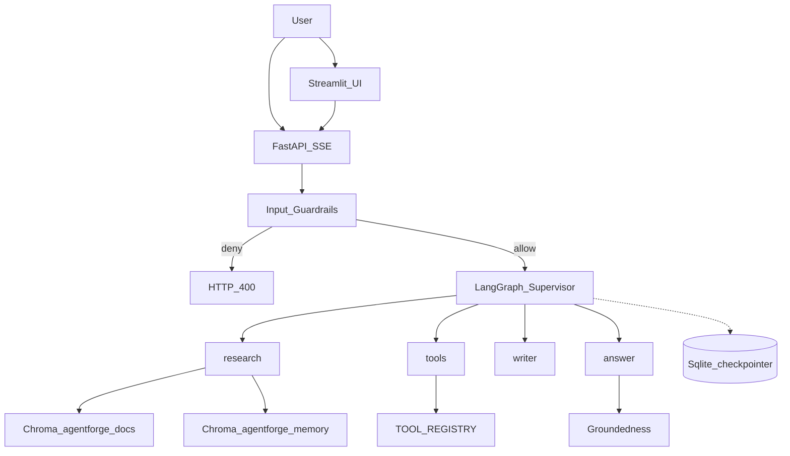
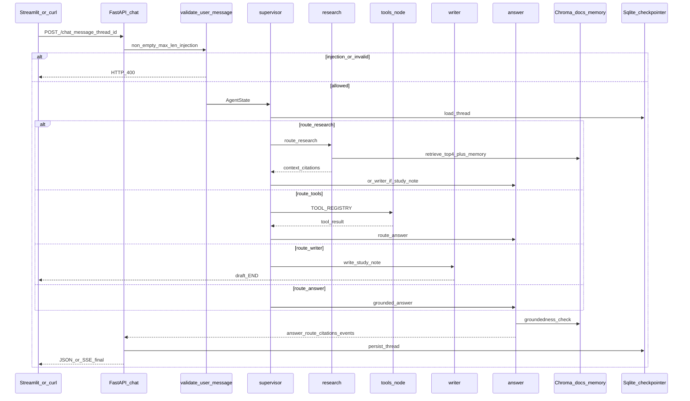

# Architecture

AgentForge — local-first LangGraph + FastAPI + Streamlit platform on Ollama (v0.1.0).

## High-Level Architecture (HLA)

Adapted from [`AS_BUILT.md`](../AS_BUILT.md).

**Workers:** `research` · `tools` · `writer` · `answer` (supervisor routes; workers never call each other).  
**Ports:** API `8000` · Streamlit `8501` · Ollama `11434`.

## Low-Level Architecture (LLA)

`POST /chat` turn (SSE when `stream=true`).

