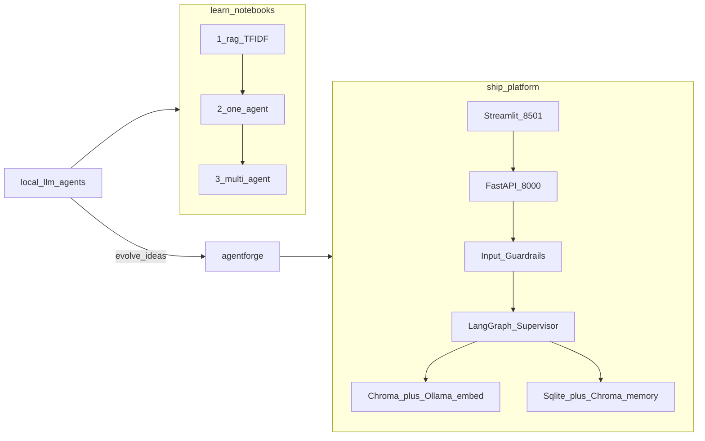

# Architecture

Local-first agents portfolio: learn building blocks in Jupyter, then ship the same ideas as a deployable platform on Ollama.

| Track | Folder | Docs |
|-------|--------|------|
| Learn | [`local-llm-agents/`](../local-llm-agents/) | [architecture](../local-llm-agents/docs/architecture.md) |
| Ship | [`agentforge/`](../agentforge/) | [architecture](../agentforge/docs/architecture.md) |

## High-Level Architecture (HLA)

**Runtime (AgentForge):** Ollama `qwen3` + `nomic-embed-text` · API `http://localhost:8000/docs` · UI `http://localhost:8501`.

## Low-Level Architecture (LLA)

### LLA omitted (portfolio root)

Portfolio-level flow is learn → ship. Detailed `/chat` sequence lives in [`agentforge/docs/architecture.md`](../agentforge/docs/architecture.md). Notebook path LLA is omitted in [`local-llm-agents/docs/architecture.md`](../local-llm-agents/docs/architecture.md).
