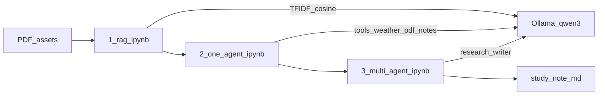

# Architecture

Educational notebook series: RAG → one agent → multi-agent on local Ollama. Precursor to [`../agentforge`](../agentforge/).

## High-Level Architecture (HLA)

**Notebooks:** `1_rag.ipynb` → `2_one_agent.ipynb` → `3_multi_agent.ipynb` (see [`reproduce.md`](../reproduce.md)).

## LLA omitted

These labs are linear Jupyter cells (TF-IDF retrieve → prompt → Ollama → print/file). There is no multi-service request path, so a sequence diagram would only restate notebook cell order. For a production `/chat` sequence, see [`../agentforge/docs/architecture.md`](../agentforge/docs/architecture.md).
