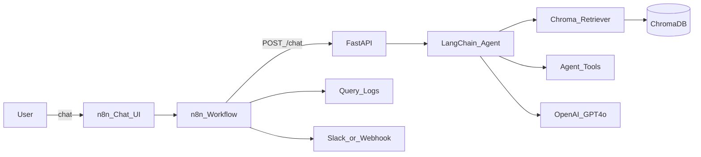

# Agentic RAG Chatbot (LangChain + n8n)

**Document type:** Planning documentation — *as built*  
**Status:** Implemented prototype  
**Related docs:** [README.md](README.md) · [docs/system_design.md](docs/system_design.md) · [docs/final_report.md](docs/final_report.md)

This file captures the project plan **as delivered** in this repository: locked decisions, architecture, layout, implementation, demo queries, out-of-scope items, and verification.

---

## 1. Project objective

Design and implement an Agentic RAG-based chatbot that retrieves relevant information from a custom knowledge base and responds intelligently to user queries. The system uses **LangChain** for agentic reasoning and **n8n** for workflow automation and orchestration.

By the end of this project, the operator can:

- Understand how RAG enhances chatbot responses.
- Integrate LangChain for agentic reasoning and tool use.
- Use n8n to automate workflows and external API integrations.
- Run a functional prototype of an AI-powered knowledge assistant.

---

## 2. Locked decisions (as built)

| Decision | Choice |
|----------|--------|
| **Use case** | AI Research Knowledge Assistant grounded in Lilian Weng’s blog posts (research Q&A over 20 curated URLs) |
| **LLM** | OpenAI `gpt-4o` |
| **Embeddings** | OpenAI `text-embedding-3-small` |
| **Vector DB** | Local persistent **ChromaDB** (`data/chroma/`, collection `lilian_weng_kb`) |
| **Orchestration / demo UI** | **n8n via Docker** with importable workflow JSON; chat via n8n Chat Trigger |
| **Backend** | **FastAPI** exposing the LangChain agent so n8n can call it over HTTP |
| **Web search fallback** | DuckDuckGo by default; optional Serper via `SERPER_API_KEY` |
| **Host ↔ Docker networking** | API at `http://host.docker.internal:8000` from the n8n container |

---

## 3. Architecture (as built)



**Runtime flow**

1. User asks a question in the n8n Chat UI.
2. The n8n workflow `POST`s to FastAPI `/chat`.
3. The LangChain agent retrieves from Chroma (and may call other tools).
4. The API returns `answer`, `sources`, and tool `steps`.
5. n8n formats the reply, writes a query log under `data/logs/`, and optionally notifies Slack/webhook on escalation keywords or errors.

**Text view (same flow)**

```text
User → n8n Chat UI → n8n Workflow → FastAPI (/chat)
                                      → LangChain Agent
                                         → ChromaDB (RAG)
                                         → Web search (optional)
                                      → JSONL logs (+ optional webhook)
```

---

## 4. Project layout (as built)

```text
6.agentic_rag_based_chatbot/
├── AS_BUILT.md                 # This planning doc (as built)
├── README.md                   # Setup and runbook
├── .env.example                # Env template (no secrets)
├── .gitignore
├── requirements.txt
├── docker-compose.yml          # n8n on port 5678
├── docs/
│   ├── system_design.md        # Deliverable 1 — system design
│   └── final_report.md         # Deliverable 4 — report + screenshot placeholders
├── data/
│   ├── urls.txt                # 20 Lilian Weng URLs
│   ├── chroma/                 # Persisted vector store (gitignored)
│   └── logs/                   # Query logs (gitignored)
├── src/
│   ├── config.py               # pydantic-settings / env
│   ├── ingest.py               # load → chunk → embed → Chroma
│   ├── rag/
│   │   ├── embeddings.py
│   │   ├── vectorstore.py
│   │   └── retriever.py
│   ├── agent/
│   │   ├── tools.py            # KB search, source summary, web search
│   │   └── graph.py            # Tool-calling agent loop
│   └── api/
│       └── main.py             # FastAPI: /health, /chat, /ingest
└── n8n/
    └── workflows/
        └── agentic_rag_chatbot.json
```

---

## 5. Deliverables (as built)

### 5.1 System design document

- [docs/system_design.md](docs/system_design.md) — problem statement, use case, architecture diagram, component responsibilities, data flow, tech choices, risks.

### 5.2 Implementation

| Area | As-built location | Notes |
|------|-------------------|--------|
| Knowledge base ingestion | `src/ingest.py`, `data/urls.txt` | HTML fetch → BeautifulSoup extract → chunk → embed → Chroma |
| RAG retrieval | `src/rag/*` | Semantic search, `TOP_K` (default 4) |
| Augmented generation | `src/agent/graph.py` | GPT-4o with KB-first system prompt + citations |
| Agent tools | `src/agent/tools.py` | See §6 |
| HTTP API | `src/api/main.py` | `/health`, `/chat`, `/ingest` |
| n8n orchestration | `n8n/workflows/agentic_rag_chatbot.json` | Chat, HTTP call, logging, escalation webhook |
| Local logging | `data/logs/` | API JSONL + n8n session log files |

### 5.3 Demo chatbot

- n8n Chat Trigger interface (workflow import + Docker Compose). See [README.md](README.md).

### 5.4 Final report

- [docs/final_report.md](docs/final_report.md) — RAG + agentic behavior, challenges, future improvements, screenshot placeholders.

---

## 6. Implementation plan (as executed)

### 6.1 Foundations

- Created `requirements.txt` (LangChain, OpenAI, Chroma, FastAPI, uvicorn, BeautifulSoup, httpx, pydantic-settings, duckduckgo-search, etc.).
- Added `.env.example` with `OPENAI_API_KEY`, model names, `CHROMA_DIR`, `TOP_K`, chunk settings, optional `SERPER_API_KEY` / Slack webhook.
- Added `docker-compose.yml` for `n8nio/n8n` on port **5678**, with `/logs` volume and `host.docker.internal` for the host API.

### 6.2 Knowledge base ingestion

- `data/urls.txt` — 20 Lilian Weng post URLs.
- Pipeline: fetch HTML → extract article text → `RecursiveCharacterTextSplitter` (chunk size **1000**, overlap **150**) → OpenAI embeddings → persist to Chroma with metadata `title`, `url`, `source`.
- CLI: `python -m src.ingest`
- API: `POST /ingest`

### 6.3 LangChain RAG + agent

**Retriever:** similarity search with configurable `k` (`TOP_K`, default 4).

**Agent tools (as built names):**

| Tool | Purpose |
|------|---------|
| `search_knowledge_base_tool` | Semantic search over Chroma (primary RAG path) |
| `get_source_summary` | Metadata + snippet for a title/URL (citations) |
| `web_search` | Out-of-KB / weak retrieval (Serper or DuckDuckGo) |

**Agent behavior:**

- Prefer KB retrieval first.
- Cite sources (title + URL).
- Say “I don’t know” when evidence is weak.
- Return tool steps for transparency.

**API response shape:**

```json
{
  "answer": "...",
  "sources": [{"title": "...", "url": "..."}],
  "steps": [{"tool": "search_knowledge_base_tool", "input": {"query": "..."}}],
  "session_id": "demo",
  "error": null
}
```

### 6.4 FastAPI service

| Method | Path | Description |
|--------|------|-------------|
| `GET` | `/health` | Status + KB document count + model names |
| `POST` | `/chat` | `{ "message", "session_id?" }` → answer, sources, steps |
| `POST` | `/ingest` | Re-run ingestion pipeline |

- CORS enabled for local n8n.
- Clear errors when `OPENAI_API_KEY` is missing or the knowledge base is empty.
- Best-effort append to `data/logs/chat_log.jsonl` on each `/chat` call.

### 6.5 n8n workflow (demo UI)

Importable file: [n8n/workflows/agentic_rag_chatbot.json](n8n/workflows/agentic_rag_chatbot.json)

| Step | Node role |
|------|-----------|
| 1 | **Chat Trigger** — primary demo surface |
| 2 | **HTTP Request** → `POST http://host.docker.internal:8000/chat` |
| 3 | **Code** — format answer + sources (+ tools used) for chat reply |
| 4 | **Convert to File + Write** — log under `/logs` → host `data/logs/` |
| 5 | **IF + HTTP Request** — notify when query matches `escalate` / `human`, or on API error (default target: httpbin; replace with Slack webhook) |

### 6.6 Documentation deliverables

- System design, final report, README, and this as-built planning doc.

---

## 7. Tech stack (as built)

| Layer | Technology |
|-------|------------|
| Agent / RAG | LangChain (Python), tool-calling loop |
| Vector DB | ChromaDB (local persistent) |
| LLM | OpenAI GPT-4o |
| Embeddings | OpenAI text-embedding-3-small |
| API | FastAPI + Uvicorn |
| Orchestration | n8n (Docker) |
| Optional search | DuckDuckGo / Serper |
| Dataset | 20 Lilian Weng blog posts (`data/urls.txt`) |

---

## 8. Dataset (knowledge base)

Ingested from `data/urls.txt` (Lilian Weng posts), including topics such as:

- Why We Think; Reward Hacking; Extrinsic Hallucinations; Diffusion Video; Human Data Quality  
- Adversarial Attacks on LLMs; LLM Powered Autonomous Agents; Prompt Engineering  
- Transformer Family v2; Inference Optimization; NTK; VLMs  
- Learning with not Enough Data (Parts 1–3); Training Large Models; Diffusion Models  
- Contrastive Representation Learning; LM Toxicity; Controllable Text Generation  

---

## 9. Demo query set (for report screenshots)

Use these when capturing screenshots for [docs/final_report.md](docs/final_report.md):

1. **What causes extrinsic hallucinations in LLMs?**  
   Expected: KB retrieval + citation to the hallucination post.

2. **Summarize LLM-powered autonomous agents.**  
   Expected: Structured summary grounded in the agents post.

3. **How do diffusion models generate video?**  
   Expected: KB retrieval from diffusion / diffusion-video posts.

4. **Compare prompt engineering techniques from the posts.**  
   Expected: Multi-chunk synthesis with sources.

5. **What’s the weather in Toronto?** *(out-of-KB control)*  
   Expected: Web search and/or honest refusal — **not** a fake KB citation.

6. **Please escalate this to a human.** *(n8n path)*  
   Expected: Chat still answers; escalation/webhook branch may fire.

---

## 10. Out of scope (prototype focused)

Intentionally **not** built:

- Production auth, multi-tenant memory, or hardened public deployment.
- Pinecone / cloud-hosted vector DB.
- Fine-tuning or fully local LLMs (Ollama / LLaMA as primary).
- Full Slack/email product integration beyond one configurable webhook HTTP node in n8n.
- Streaming tokens through n8n Chat.
- Automated RAG evaluation suite (golden set CI).

---

## 11. Verification checklist

| # | Check | How |
|---|--------|-----|
| 1 | Ingest all 20 URLs without crash; Chroma has documents | `python -m src.ingest` then `GET /health` → `knowledge_base_documents > 0` |
| 2 | `/chat` returns grounded answers with source URLs for in-KB questions | `POST /chat` with demo queries 1–4 |
| 3 | Agent tool steps visible in API response | Inspect `steps` in `/chat` JSON |
| 4 | n8n Chat UI end-to-end: question → answer → log entry | Import workflow, activate, chat; check `data/logs/` |
| 5 | Escalation / webhook path works | Message containing `escalate` or `human`; inspect n8n execution + webhook target |
| 6 | System design + final report present | `docs/system_design.md`, `docs/final_report.md` |
| 7 | Env / secrets hygiene | `.env` gitignored; only `.env.example` committed |

---

## 12. How to run (quick reference)

```bash
# Python
python -m venv .venv
# activate venv, then:
pip install -r requirements.txt
cp .env.example .env          # set OPENAI_API_KEY
python -m src.ingest
uvicorn src.api.main:app --host 0.0.0.0 --port 8000

# n8n
docker compose up -d
# Open http://localhost:5678 → Import n8n/workflows/agentic_rag_chatbot.json → Activate → Chat
```

Full steps: [README.md](README.md).

---

## 13. Mapping: plan vs as-built notes

| Plan item | As-built note |
|-----------|----------------|
| Tool name `search_knowledge_base` | Implemented as LangChain tool `search_knowledge_base_tool` |
| Agent module `graph.py` | Tool-calling loop (not LangGraph graph state machine) |
| n8n logging | Per-turn log files under `data/logs/` + API `chat_log.jsonl` |
| Slack notifications | HTTP webhook node; default URL is httpbin — replace with Slack Incoming Webhook for real alerts |
| System design / final report | Markdown under `docs/` (screenshot placeholders for live demo) |

---

## 14. Document history

| Version | Description |
|---------|-------------|
| 1.0 | As-built planning documentation matching the implemented prototype |
