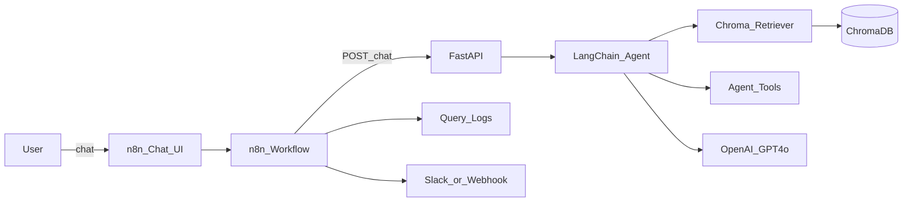
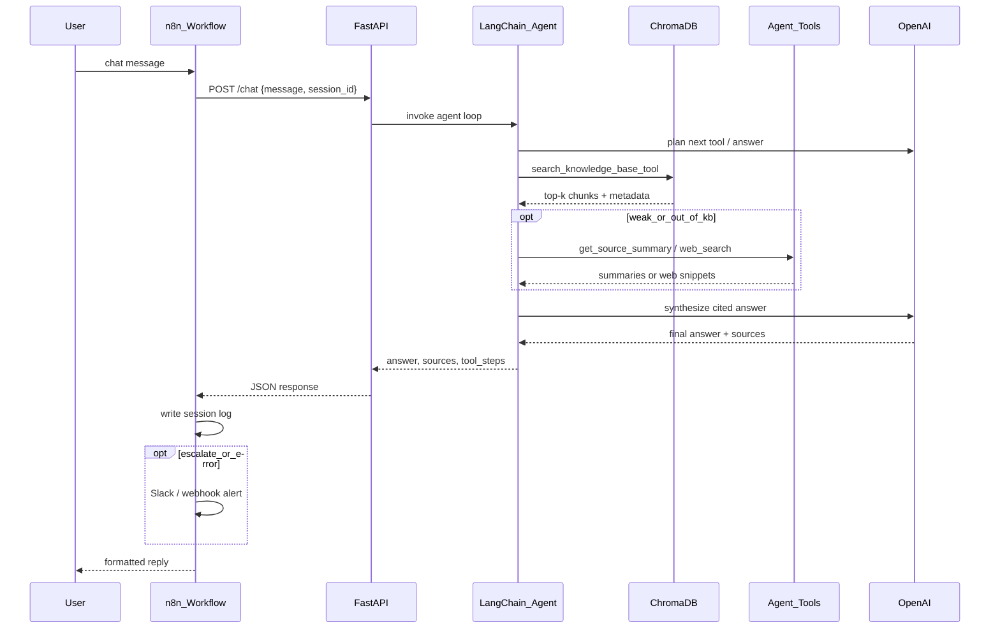

# Architecture

Canonical high-level and low-level views for the Agentic RAG Chatbot. Detailed design: [system_design.md](system_design.md).

## High-Level Architecture (HLA)

| Component | Role |
|-----------|------|
| n8n Chat UI / Workflow | Chat surface, HTTP orchestration, session logs, optional escalation |
| FastAPI (`/chat`, `/ingest`, `/health`) | API contract for n8n |
| LangChain agent | Tool-calling loop; prefers KB search first |
| ChromaDB | Local persistent vector index (`lilian_weng_kb`) |
| Tools | `search_knowledge_base_tool`, `get_source_summary`, `web_search` |
| OpenAI | Embeddings + GPT-4o generation |

## Low-Level Architecture (LLA)

Happy path: user question grounded in the Lilian Weng KB.

