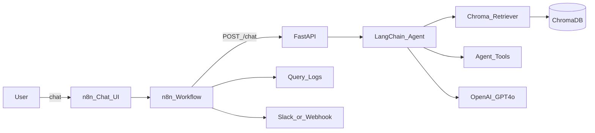

# System Design Document — Agentic RAG Chatbot

## 1. Problem statement

Students and practitioners researching modern ML topics often bounce between long blog posts, papers, and docs. Searching by keyword misses semantic connections (e.g., relating *reward hacking* to *agent evaluation*, or *extrinsic hallucinations* to *retrieval grounding*).

This project builds an **AI Research Knowledge Assistant** that answers questions **grounded in a curated knowledge base** (20 Lilian Weng blog posts) using Retrieval-Augmented Generation (RAG), with an **agent** that can choose tools and an **n8n** layer for chat UI, logging, and external notifications.

## 2. Use case

| Actor | Goal |
|-------|------|
| Student / researcher | Ask natural-language questions about agents, LLMs, diffusion, prompt engineering, etc. |
| Demo operator | Show end-to-end RAG + tools + orchestration without building a custom frontend |
| Ops / TA (optional) | Get Slack/webhook alerts when a user asks to escalate to a human |

**Primary interface:** n8n Chat Trigger UI.  
**Primary brain:** FastAPI + LangChain tool-calling agent + ChromaDB.

## 3. Goals and non-goals

**Goals**

- Ingest and index the specified blog corpus.
- Retrieve relevant chunks via semantic search.
- Generate answers with citations.
- Expose agent tools (KB search, source lookup, web search).
- Orchestrate chat, logging, and optional external API calls in n8n.

**Non-goals**

- Production auth / multi-tenant memory.
- Fine-tuning or fully local LLMs.
- Guaranteed perfect factuality on topics outside the KB.

## 4. Architecture

### Component responsibilities

| Component | Responsibility |
|-----------|----------------|
| `src/ingest.py` | Fetch HTML, extract article text, chunk, embed, persist to Chroma |
| `src/rag/*` | Embeddings, Chroma store, similarity search helpers |
| `src/agent/*` | Tool definitions + tool-calling agent loop |
| `src/api/main.py` | HTTP API: `/health`, `/chat`, `/ingest` |
| ChromaDB | Local persistent vector index under `data/chroma/` |
| OpenAI | `text-embedding-3-small` + `gpt-4o` |
| n8n | Chat UI, HTTP orchestration, file logging, escalation webhooks |

## 5. Data flow

### 5.1 Ingestion (offline / on demand)

1. Read URLs from `data/urls.txt`.
2. HTTP GET each post; parse title + article body (BeautifulSoup).
3. Split with `RecursiveCharacterTextSplitter` (chunk size 1000, overlap 150).
4. Embed chunks with OpenAI embeddings.
5. Upsert into Chroma collection `lilian_weng_kb` with metadata: `title`, `url`, `source`.

### 5.2 Query-time (online)

1. User sends a message in n8n Chat.
2. n8n `HTTP Request` → `POST /chat` with `{ message, session_id }`.
3. Agent system prompt instructs: **search KB first**.
4. Tools may run: `search_knowledge_base_tool`, `get_source_summary`, `web_search`.
5. Final answer + sources + tool steps returned to n8n.
6. n8n formats the reply, writes a session log under `/logs`, and optionally POSTs to Slack/webhook if the query matches escalation keywords or the API reports an error.

## 6. Agentic design

The assistant is **agentic** because the LLM decides **whether and when** to call tools, rather than always running a fixed retrieve→generate pipeline only.

| Tool | When used |
|------|-----------|
| `search_knowledge_base_tool` | Default first step for in-domain research questions |
| `get_source_summary` | Confirm citations / inspect a specific post |
| `web_search` | Out-of-KB or weak retrieval; Serper if configured, else DuckDuckGo |

Guardrails in the system prompt:

- Prefer KB evidence and cite URLs.
- Admit uncertainty when evidence is missing.
- Label web-sourced content separately from KB content.

## 7. Technology choices

| Layer | Choice | Rationale |
|-------|--------|-----------|
| Framework | LangChain (Python) | Mature RAG + tool-calling primitives |
| Vector DB | ChromaDB (local) | Zero cloud setup; persists on disk |
| LLM | OpenAI GPT-4o | Strong reasoning + reliable tool calling |
| Embeddings | text-embedding-3-small | Cost-effective semantic search |
| API | FastAPI | Simple contract for n8n HTTP nodes |
| Orchestration | n8n (Docker) | Chat UI + logging + external integrations without a custom frontend |

## 8. Deployment topology (local prototype)

1. Host machine runs Python venv + `uvicorn` on port **8000**.
2. Docker Compose runs **n8n** on port **5678**.
3. Container reaches the API via `http://host.docker.internal:8000`.
4. Logs land in `./data/logs` (mounted into the n8n container as `/logs`).

## 9. Risks and mitigations

| Risk | Mitigation |
|------|------------|
| Hallucinated answers | Cite KB chunks; instruct model to say “I don’t know” |
| Poor retrieval | Tune `TOP_K`, chunk size; re-ingest after parser fixes |
| Blog HTML changes | Robust selectors + failure logging per URL |
| API key leakage | `.env` gitignored; `.env.example` without secrets |
| n8n ↔ host networking | Document `host.docker.internal` for Windows/macOS |

## 10. Knowledge base corpus

Twenty Lilian Weng posts covering thinking, reward hacking, hallucinations, diffusion video, human data quality, adversarial attacks, agents, prompt engineering, transformers, inference optimization, NTK, VLMs, data generation / active / semi-supervised learning, large-model training, diffusion models, contrastive learning, LM toxicity, and controllable text generation. Full list: `data/urls.txt`.
