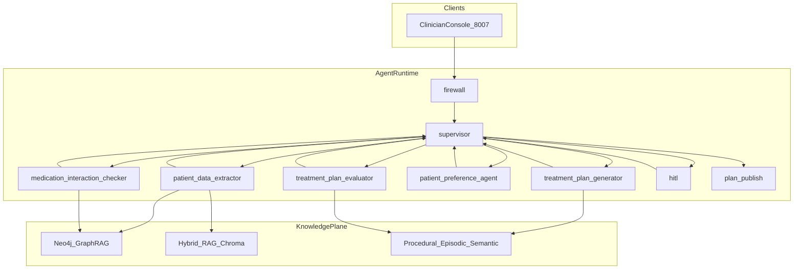

# CarePath AI — Execution Plan

**HealthTech Intelligence Suite** · sister of [HEDI Platform](plan-hedip.md) and [RAIP Engine](plan-raip.md) · [overview](plan-overview.md)

| | |
|--|--|
| Folder | `carepath-ai/` |
| Product | CarePath AI — AI-driven patient care pathway and clinical decision support |
| Port / env | **8007** / `CAREPATH_*` |
| Coupling | Clinical-only and **standalone**. HEDIP must not become a runtime dependency. |

This file is the **canonical** CarePath plan: suite framing plus the original delivery plan previously at `.cursor/plans/carepath_ai_plan_f38ddef2.plan.md`.

---
name: CarePath AI Plan
overview: Greenfield scaffold of **carepath-ai** (CarePath AI) in `10.healthcare-insurance/carepath-ai/` — a LangGraph supervisor multi-agent system for personalized treatment plan generation with Neo4j GraphRAG, three memory layers, cross-provider judges, clinician HITL, and dual Bedrock/Vertex deploy, aligned with WAIP and panasonic-egkp portfolio conventions.
todos:
  - id: phase-0-docs
    content: Write AS_BUILT.md, SYSTEM_DESIGN.md, ARCHITECTURE.md, project-prompts.md
    status: completed
  - id: phase-1-scaffold
    content: Scaffold pyproject.toml, state, llm, fake LLM, guardrails, graph skeleton, FastAPI shell on port 8007
    status: completed
  - id: phase-2-knowledge
    content: Seed data (patients, corpus, protocols, KG) + hybrid RAG + Neo4j tool + docker-compose
    status: completed
  - id: phase-3-memory
    content: Implement procedural, episodic, semantic memory modules and wire to generator
    status: completed
  - id: phase-4-workers
    content: Implement 5 worker agents + supervisor routing with revise loop
    status: completed
  - id: phase-5-hitl
    content: Treatment plan evaluator judge, HITL interrupt, plan_publish + audit log
    status: completed
  - id: phase-6-ui
    content: "Clinician console UI: patient selector, step log, citations, interaction alerts, HITL card"
    status: completed
  - id: phase-7-quality
    content: evals/run_all.py golden scenarios + security/injection_eval.py ≥95%
    status: completed
  - id: phase-8-deploy
    content: Bedrock AgentCore + Vertex Agent Engine deploy entrypoints
    status: completed
isProject: false
---

# CarePath AI — Personalized Treatment Plan Generation

## Decisions (from your "A" selection)

| Area | Choice |
|------|--------|
| Project codename | **carepath-ai** — CarePath AI (Personalized Treatment Plan Platform) |
| v1 scope | **Clinical only** — no prior-auth / payer policy agents in v1 |
| Port | **8007** (8000–8006 used by siblings) |
| Env prefix | `CAREPATH_MODEL`, `CAREPATH_JUDGE_MODEL`, `CAREPATH_MEMORY` |

## Reference templates

Clone structure and patterns from sibling projects rather than inventing new conventions:

- **Supervisor loop + GraphRAG + grounder + HITL**: [`7.enterprise-ai-knowledge-platform`](c:\Users\deched\projects(ml-ai)\0.ide_vs-code_&_cursor\7.enterprise-ai-knowledge-platform) (`app/agents/`, `app/tools/neo4j_graph.py`, `AS_BUILT.md`)
- **Judges + firewall + regulated flow**: [`9.walmart/waip`](c:\Users\deched\projects(ml-ai)\0.ide_vs-code_&_cursor\9.walmart\waip) (`compliance_agent`, `response_validator`, `guardrails.py`)
- **Offline dev**: `CAREPATH_MODEL=fake` pattern from all siblings

---

## Problem and v1 use cases

Healthcare providers need personalized treatment plans for patients with complex histories, multiple chronic conditions, medication interactions, lifestyle factors, and stated preferences — with safety gates before any plan is published to the chart.

| ID | Actor | Use case |
|----|-------|----------|
| UC1 | Clinician | Generate a draft plan for a diabetic + hypertensive patient with 6 active meds |
| UC2 | Clinician | Re-run plan after patient rejects a medication class (preference incorporation) |
| UC3 | Clinical reviewer | HITL approve / edit / reject before plan is "published" to mock EHR |
| UC4 | Platform eng | Ship only if safety judge + injection suite pass quality gates |

**Non-goals v1:** live FHIR/EHR integration, real drug databases (RxNorm/FDA APIs), SSO/IdP, insurance prior-auth, HIPAA production hardening.

---

## Architecture



### Orchestration: LangGraph supervisor loop

Workers **never route to each other** — only the supervisor decides the next node (same constraint as WAIP / EGKP).

**Graph flow:**

```
START → firewall → supervisor
  ├─ patient_data_extractor   → supervisor
  ├─ medication_interaction_checker → supervisor
  ├─ treatment_plan_generator   → supervisor
  ├─ patient_preference_agent   → supervisor
  ├─ treatment_plan_evaluator   → supervisor  (judge; may loop back to generator)
  ├─ hitl                       → supervisor  (interrupt until approve/edit/reject)
  ├─ plan_publish               → supervisor
  └─ END
```

**Supervisor routing logic** (state-driven, similar to EGKP `supervisor.py`):

| Condition | Next node |
|-----------|-----------|
| `blocked` | `plan_publish` (error response) |
| `patient_profile is None` | `patient_data_extractor` |
| `medication_review is None` | `medication_interaction_checker` |
| `draft_plan is None` | `treatment_plan_generator` |
| `preferences_applied is False` and `patient_preferences` present | `patient_preference_agent` |
| `safety_score is None` | `treatment_plan_evaluator` |
| judge requests revise and `revise_count < 2` | clear draft → `treatment_plan_generator` |
| `approval == pending` | `hitl` |
| approved/edited and not `published` | `plan_publish` |
| else | `END` |

---

## Workers (agents)

| Agent | File | Responsibility |
|-------|------|----------------|
| Patient data extractor | `app/agents/patient_data_extractor.py` | Parse mock EHR JSON / clinical notes; extract conditions, meds, labs, allergies, lifestyle; query Neo4j for related entities |
| Medication interaction checker | `app/agents/medication_interaction_checker.py` | Cross-check active meds against interaction seeds + KG edges; flag severity (major/moderate/minor) |
| Treatment plan generator | `app/agents/treatment_plan_generator.py` | Draft goals, interventions, monitoring, follow-up using procedural protocols + episodic history + semantic retrieval |
| Patient preference agent | `app/agents/patient_preference_agent.py` | Adapt plan for stated preferences (e.g. avoid injections, dietary limits, cost sensitivity) |
| Treatment plan evaluator | `app/agents/treatment_plan_evaluator.py` | Judge: safety, guideline adherence, completeness, citation coverage; cross-provider vs generator |
| Supervisor | `app/agents/supervisor.py` | Route only; no LLM generation |
| HITL | `app/agents/hitl.py` | `langgraph.types.interrupt` for clinician approve/edit/reject |
| Plan publish | `app/agents/plan_publish.py` | Append to `data/published_plans.log` + mock EHR write |

---

## State schema (`app/state.py`)

```python
class TreatmentPlanState(TypedDict, total=False):
    thread_id: str
    clinician_id: str
    patient_id: str
    patient_preferences: dict[str, Any]   # lifestyle, med class avoidances, goals
    raw_ehr_payload: dict[str, Any]       # mock FHIR-ish bundle or notes
    patient_profile: dict[str, Any]       # structured extraction output
    retrieved_evidence: list[dict]        # RAG chunks
    graph_paths: list[dict]               # Neo4j traversal results
    medication_review: dict[str, Any]     # interactions, contraindications
    draft_plan: str | None
    citations: list[dict]
    preferences_applied: bool
    safety_score: float | None
    judge_feedback: str | None
    revise_count: int
    approval: Literal["pending","approved","edited","rejected","auto"]
    published: bool
    final_plan: str
    step_log: Annotated[list[str], operator.add]
    blocked: bool
    next: str
```

---

## Memory layers

| Layer | Module | Content |
|-------|--------|---------|
| Procedural | `app/memory/procedural.py` | Treatment protocols (diabetes, hypertension, CKD staging, etc.) from `data/protocols/*.json` |
| Episodic | `app/memory/episodic.py` | Patient encounter history JSONL in `data/patients/{id}/history.jsonl`; optional pgvector table |
| Semantic | `app/memory/semantic.py` | LangGraph Store for clinician corrections and plan feedback loops |

Synthesizer (plan generator) and judge both read procedural + episodic; generator additionally uses semantic for prior plan edits on same patient.

---

## Knowledge graph (Neo4j GraphRAG)

**Seed data** in `data/kg/`:

- `entities.jsonl` — Patient, Condition, Medication, Lab, Guideline, Protocol nodes
- `edges.jsonl` — `HAS_CONDITION`, `PRESCRIBED`, `INTERACTS_WITH`, `CONTRAINDICATED_FOR`, `GUIDELINE_FOR`, `MONITORS`

**Tools** (`app/tools/neo4j_graph.py`):

- `graph_lookup(entity_type, name)` — find node + 1-hop neighbors
- `find_interactions(med_names[])` — traverse `INTERACTS_WITH` edges
- `guideline_for_condition(condition)` — protocol path via KG

**Fallback:** when `NEO4J_URI` unset, load JSONL seeds into in-memory adjacency (same pattern as WAIP `app/rag/kg.py`).

**Hybrid RAG** (`app/rag/retrieval.py`):

- Chroma index over `data/corpus/` (clinical guidelines, drug interaction summaries, lifestyle counseling snippets)
- BM25-style lexical + dense merge + rerank
- ACL tags on chunks: `domain=cardiology|endocrinology|pharmacy`

---

## Models and LLM gateway

`app/llm.py` — mirror EGKP/WAIP:

| Role | Default | Env override |
|------|---------|--------------|
| Worker LLM | Bedrock Claude | `CAREPATH_MODEL` |
| Judge LLM | **Cross-provider** Vertex Gemini | `CAREPATH_JUDGE_MODEL` |
| Embeddings | Titan v2 | `CAREPATH_EMBED_MODEL` |
| Offline / CI | `fake` | `CAREPATH_MODEL=fake` |

---

## Safety and quality gates

| Gate | Implementation | Ship bar |
|------|----------------|----------|
| Input firewall | `app/guardrails.py` — injection patterns + clinical prompt-injection suite | ≥ 95% on 50 attacks (`security/injection_eval.py`) |
| Medication checker | Rule + KG traversal before generation | Zero unaddressed major interactions in golden path |
| Treatment plan evaluator | LLM judge + heuristics (required sections, allergy cross-check) | Safety score ≥ 0.90 |
| HITL | Always required for v1 (clinical domain = sensitive) | Clinician must approve before publish |
| Citations | Every clinical claim must map to retrieved chunk or KG path | ≥ 90% citation coverage in evals |
| Evals | `evals/run_all.py` — golden patient scenarios | All golden paths pass with `fake` model |

---

## UI (Clinician Console)

FastAPI + static HTML (no React/npm), port **8007**:

- **Left panel:** patient selector (3 seeded complex patients)
- **Center:** streaming step log + draft plan with inline citations
- **Right panel:** medication interaction alerts + judge scores
- **HITL card:** approve / edit / reject (fetch-polled, same pattern as EGKP `app/ui/approval.html`)

Files: `app/main.py`, `app/ui/console.html`, `app/ui/styles.css`

---

## Mock data (seeded patients)

`data/patients/` — three golden demo cases:

1. **P001** — T2DM + HTN + hyperlipidemia, 6 meds, mild CKD
2. **P002** — COPD + depression, conflicting sedative risk
3. **P003** — post-MI, preference to avoid beta-blocker (tests preference agent loop)

Each patient: `ehr_bundle.json`, `notes.md`, `preferences.json`, `history.jsonl`

---

## Project layout

```
10.healthcare-insurance/carepath-ai/
├── app/
│   ├── agents/          # 8 agent modules + __init__.py
│   ├── memory/          # procedural, episodic, semantic
│   ├── rag/             # retrieval, kg fallback
│   ├── tools/           # neo4j_graph, drug_db_mock, publish_plan
│   ├── ui/              # console.html, styles.css
│   ├── graph.py
│   ├── main.py
│   ├── state.py
│   ├── llm.py
│   ├── guardrails.py
│   └── _fake_llm.py
├── data/
│   ├── patients/        # 3 golden patients
│   ├── corpus/          # guideline chunks
│   ├── protocols/       # procedural memory JSON
│   └── kg/              # Neo4j seed JSONL
├── docs/
│   ├── SYSTEM_DESIGN.md
│   ├── ARCHITECTURE.md
│   └── IMPLEMENTATION_PLAN.md
├── evals/
├── security/
├── deploy/
│   ├── agentcore/entrypoint.py
│   └── vertex_engine/entrypoint.py
├── infra/compose/docker-compose.yml   # Neo4j + Postgres
├── AS_BUILT.md
├── project-prompts.md
├── pyproject.toml
└── README.md
```

**pyproject.toml** — same dependency set as WAIP (`langgraph`, `langchain-aws`, `langchain-google-vertexai`, `fastapi`, `uvicorn`, `pydantic`, `ruff`).

**docker-compose** — Neo4j 5 on `7688:7687` (avoid collision with other projects on 7687), Postgres on `5435:5432`.

---

## Implementation phases (day-ordered)

### Phase 0 — Design lock (docs only)
- Write `AS_BUILT.md`, `docs/SYSTEM_DESIGN.md`, `docs/ARCHITECTURE.md`, `project-prompts.md`
- Lock graph flow, state schema, quality gates, port 8007

### Phase 1 — Scaffold
- `uv init` / `pyproject.toml`, `uv sync --python 3.12`
- `app/state.py`, `app/llm.py`, `app/_fake_llm.py`, `app/guardrails.py`
- `app/graph.py` skeleton with supervisor routing stubs
- `app/main.py` + minimal UI shell
- Verify: `CAREPATH_MODEL=fake` graph smoke runs

### Phase 2 — Knowledge plane
- Seed corpus, protocols, KG JSONL, 3 patient bundles
- `app/rag/retrieval.py` hybrid search
- `app/tools/neo4j_graph.py` + JSONL fallback
- `infra/compose/docker-compose.yml`
- Verify: retrieval returns guideline chunks for diabetes query

### Phase 3 — Memory layers
- `app/memory/procedural.py`, `episodic.py`, `semantic.py`
- Wire into plan generator context assembly

### Phase 4 — Workers
- Implement all 5 worker agents + supervisor routing
- Patient extractor → med checker → generator → preference → evaluator loop
- Verify: golden P001 produces draft plan with citations under `fake` model

### Phase 5 — Judges, HITL, publish
- Treatment plan evaluator with revise loop (max 2)
- HITL interrupt + UI approval card
- `plan_publish` → `data/published_plans.log`
- Verify: full golden path requires HITL approve before publish

### Phase 6 — UI polish
- Streaming step log, interaction alert panel, citation rendering
- Patient selector for P001–P003

### Phase 7 — Evals and security
- `evals/run_all.py` — 3 golden scenarios + safety/citation checks
- `security/injection_eval.py` — 50 clinical prompt-injection attacks
- LangSmith-ready experiment stubs

### Phase 8 — Cloud deploy adapters
- `deploy/agentcore/entrypoint.py` (PostgresSaver checkpointer)
- `deploy/vertex_engine/entrypoint.py`
- Document `CAREPATH_MODEL` / `CAREPATH_JUDGE_MODEL` for Bedrock + Vertex

---

## Golden demo script

> Select patient P001 (T2DM + HTN + 6 meds). Preferences: avoid injectable GLP-1. Generate treatment plan.

Expected flow:
1. Extractor surfaces conditions, meds, eGFR 58
2. Med checker flags metformin dose vs CKD + one moderate interaction
3. Generator drafts plan with lifestyle + med adjustments, cited to ADA guideline chunk
4. Preference agent removes injectable pathway, adds oral alternative
5. Evaluator scores safety ≥ 0.90
6. HITL card appears — clinician approves
7. Plan published to log with audit trail

---

## Success metrics (v1)

| Metric | Target |
|--------|--------|
| Golden scenario pass rate (`fake`) | 100% (3/3 patients) |
| Injection suite | ≥ 95% |
| Safety judge score (golden) | ≥ 0.90 |
| Citation coverage | ≥ 90% of claims |
| P95 latency (`fake`) | ≤ 5s (no cloud calls) |

---

## Future extensions (out of v1, documented in SYSTEM_DESIGN)

- Insurance prior-auth agent + payer policy GraphRAG
- Live FHIR R4 read from Epic/Cerner sandbox
- RxNorm / openFDA real drug interaction API
- FHIR CarePlan write-back
- HIPAA audit logging, encryption, BAA-ready infra
