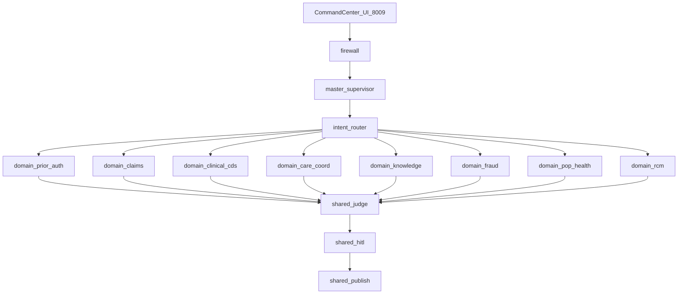

# HEDI Platform (HEDIP) — Execution Plan

**HealthTech Intelligence Suite** · sister of [CarePath AI](plan-carepath-ai.md) and [RAIP Engine](plan-raip.md) · [overview](plan-overview.md)

| | |
|--|--|
| Folder | `hedip/` |
| Product | HEDI Platform — Healthcare Effectiveness Data & Information Performance Engine |
| Port / env | **8009** / `HEDIP_*` |
| Coupling | Reuses CarePath **patterns**; includes a clinical CDS domain. Does **not** import `carepath-ai`. |

**Suite thesis:** HEDIS / quality-measure performance (gaps, compliance, population effectiveness) on the existing `pop_health`, `claims`, `rcm`, and `knowledge` domains.

**As-built v1:** umbrella Healthcare Decision Intelligence Platform (one supervisor, many payer/provider domains).

This file is the **canonical** HEDIP plan: suite framing plus the original umbrella delivery plan previously at `.cursor/plans/hedip_umbrella_platform.plan.md`.

---

# HEDIP — Enterprise Healthcare Decision Intelligence Platform

**Title:** Enterprise Healthcare Decision Intelligence Platform Using Agentic AI, GraphRAG, and Multi-Agent Reasoning  
**Codename / folder:** `hedip` → `10.healthcare-insurance/hedip/`  
**Port:** `8009` (CarePath `8007`; reserve `8008` if a thin PA-only app is split later)  
**Env prefix:** `HEDIP_MODEL`, `HEDIP_JUDGE_MODEL`, `HEDIP_MEMORY`

---

## 1. Locked decisions

| Area | Decision |
|------|----------|
| Scope v1 | **Umbrella platform** with multiple decision domains under one supervisor |
| Relationship to CarePath | **Sibling module patterns reused**; CarePath remains standalone. HEDIP includes a **clinical CDS** domain with equivalent capability (not a runtime dependency on `carepath-ai`) |
| Orchestration | LangGraph **master supervisor** → domain routers → specialized workers (workers never peer-route) |
| Domains in v1 | Prior Auth, Claims Denial Prevention, Clinical CDS, Care Coordination, Enterprise Knowledge Q&A, Fraud/W&A (scoring + investigator copilot), Population Risk (lite), Revenue Cycle coding assist (lite) |
| Depth | **Full path** for PA + Claims + Clinical CDS + Knowledge; **thin but runnable** for Care Coord / Fraud / Pop Health / RCM |
| GraphRAG | Shared Neo4j/JSONL healthcare KG (Patient, Provider, Dx, Rx, Policy, Claim, Trial, Facility) |
| Models | Bedrock / Vertex / `fake`; cross-provider judge |
| HITL | Required for PA decisions, claim submit advice, fraud escalate, clinical publish |
| UI | Single FastAPI **Command Center** — domain picker + shared evidence / judge / HITL panels |
| Deploy | Bedrock AgentCore + Vertex Agent Engine adapters |
| Explicitly not v1 | Live Epic/Cerner, real CMS/PBM APIs, Kafka-in-request-path, HIPAA prod hardening, Azure Foundry as third cloud |

---

## 2. Why umbrella (not PA-only)

Your brief lists eight enterprise problems that share the same stack: hybrid RAG, GraphRAG, multi-agent orchestration, three memory layers, LLM-as-judge, HITL, and dual-cloud deploy. An umbrella platform is the interview-grade artifact: one architecture story, many high-value workflows.



---

## 3. Domain catalog (v1)

| Domain ID | Workflow | Decision output | Depth |
|-----------|----------|-----------------|-------|
| `prior_auth` | Evidence → policy → guidelines → drug/formulary → KG → reason → compliance | `approve` / `deny` / `need_info` | **Full** |
| `claims` | Claim → ICD/CPT → coverage → coding → fraud signals → denial predict → appeal draft | `submit_ok` / `fix_first` / `high_denial_risk` | **Full** |
| `clinical_cds` | EHR extract → med check → plan → preferences → evaluate | Personalized treatment plan | **Full** (CarePath-parity) |
| `care_coord` | Discharge + meds + appts + education → escalation | Care plan + tasks | Thin |
| `knowledge` | Intent → hybrid retrieve → graph walk → cite → ground | Cited enterprise answer | **Full** |
| `fraud` | Claim/provider/member graph → score → investigator brief | `clear` / `review` / `investigate` | Thin |
| `pop_health` | Risk factors → vitals/labs/SDOH → care recommendation | Risk tier + actions | Thin |
| `rcm` | Note → coding suggestions → compliance check | ICD/CPT draft + gaps | Thin |

---

## 4. Shared platform layers

### 4.1 Master supervisor + intent router

1. Firewall (injection / PHI exfil patterns)  
2. Intent router classifies `domain` + `sensitivity`  
3. Master supervisor dispatches to **one** domain subgraph (v1: single-domain per request; multi-domain fan-out documented as v1.1)  
4. Shared judge → HITL (if sensitive) → publish/audit  

### 4.2 Shared workers / tools (reusable)

| Shared component | Used by |
|------------------|---------|
| `hybrid_retrieval` | All |
| `neo4j_graph` / JSONL KG | All |
| `fhir_mock` patient bundle loader | PA, CDS, Care, Claims |
| `drug_formulary_mock` | PA, CDS, Claims |
| `policy_corpus` | PA, Claims, Knowledge |
| `guideline_corpus` | PA, CDS |
| `compliance_scanner` | PA, Claims, RCM, Knowledge |
| `judge_grounding` | All |
| Memory P/E/S | All |

### 4.3 Memory

| Layer | Content |
|-------|---------|
| Procedural | Per-domain playbooks in `data/playbooks/{domain}.json` |
| Episodic | Prior decisions / appeals / HITL outcomes in `data/episodic/` |
| Semantic | Member/provider feedback store |

### 4.4 Knowledge graph (unified)

Nodes: Patient, Condition, Medication, Procedure, Policy, Guideline, Claim, Provider, Facility, Pharmacy, Trial, Biomarker  
Edges: HAS_CONDITION, PRESCRIBED, COVERED_BY, REQUIRES_STEP_THERAPY, DENIED_FOR, SIMILAR_CLAIM, TREATS, ELIGIBLE_FOR, BILLED_AS, …

---

## 5. Per-domain agent sets (full domains)

### Prior Auth (`prior_auth`)
Patient Context → Policy Retrieval → Clinical Guideline → Drug/PBM → KG → Reasoning → Compliance → (shared Judge/HITL/Publish)

### Claims (`claims`)
Claims Intake → ICD-10 → CPT → Coverage → Coding QA → Fraud Signals → Denial Predictor → Appeal Generator → (shared Judge/HITL/Publish)

### Clinical CDS (`clinical_cds`)
Mirror CarePath: Extract → Med Check → Plan Gen → Preferences → Evaluate → (shared HITL/Publish)

### Knowledge (`knowledge`)
Query Planner → Retriever → Graph Walker → Synthesizer → Citation Verifier → Compliance → (shared Judge/HITL if sensitive)

### Thin domains
Single composite worker each that calls shared RAG/KG + domain playbook, then returns structured draft for shared judge.

---

## 6. State schema (sketch)

```python
class HedipState(TypedDict, total=False):
    thread_id: str
    user_id: str
    role: str                    # clinician | payer_reviewer | coder | investigator | care_manager
    domain: str                  # prior_auth | claims | ...
    query: str
    case_id: str
    abac: dict                   # org, role, region
    intent: dict
    domain_result: dict
    evidence: list
    graph_paths: list
    draft: str
    recommendation: dict         # domain-specific structured decision
    citations: list
    judges: dict
    compliance: dict
    approval: str
    published: bool
    step_log: list
    blocked: bool
    next: str
```

---

## 7. UI — Healthcare Decision Command Center (`:8009`)

- Left: domain selector + golden case list per domain  
- Center: streaming step log + draft recommendation + citations  
- Right: risk/fraud/med alerts + judge scores  
- Bottom: HITL approve / edit / reject  

---

## 8. Project layout

```
10.healthcare-insurance/hedip/
├── app/
│   ├── agents/           # master, intent, shared judge/hitl/publish, firewall
│   ├── domains/
│   │   ├── prior_auth/
│   │   ├── claims/
│   │   ├── clinical_cds/
│   │   ├── care_coord/
│   │   ├── knowledge/
│   │   ├── fraud/
│   │   ├── pop_health/
│   │   └── rcm/
│   ├── memory/
│   ├── rag/
│   ├── tools/
│   ├── ui/
│   ├── graph.py          # master graph + domain subgraphs
│   ├── main.py
│   ├── state.py
│   ├── llm.py
│   └── guardrails.py
├── data/
│   ├── cases/{domain}/
│   ├── corpus/ policies/ guidelines/ formulary/ pathways/
│   ├── kg/
│   ├── playbooks/
│   └── episodic/
├── docs/ AS_BUILT SYSTEM_DESIGN ARCHITECTURE IMPLEMENTATION_PLAN
├── evals/ security/ deploy/ infra/compose/
├── pyproject.toml README.md project-prompts.md
```

---

## 9. Implementation phases

| Phase | Deliverable |
|-------|-------------|
| 0 | Docs lock: AS_BUILT, SYSTEM_DESIGN, ARCHITECTURE, project-prompts |
| 1 | Scaffold package, state, llm/fake, firewall, master graph stub, Command Center shell |
| 2 | Shared knowledge plane: hybrid RAG, Neo4j/JSONL, unified KG seeds, docker-compose |
| 3 | Memory layers + playbooks |
| 4 | **Full** `prior_auth` domain end-to-end |
| 5 | **Full** `claims` domain end-to-end |
| 6 | **Full** `clinical_cds` + **Full** `knowledge` |
| 7 | Thin domains: care_coord, fraud, pop_health, rcm |
| 8 | Shared judge, compliance, HITL, audit publish |
| 9 | Command Center UI polish |
| 10 | Evals (per-domain goldens) + injection ≥95% |
| 11 | AgentCore + Vertex deploy entrypoints |

---

## 10. Golden demos (minimum)

| Domain | Case | Expected |
|--------|------|----------|
| prior_auth | Lumbar MRI incomplete PT | `need_info` |
| prior_auth | Biologic step therapy fail | `deny` + alternatives |
| prior_auth | Oncology regimen aligned | `approve` |
| claims | Upcoded E/M + missing doc | `fix_first` / high denial risk |
| clinical_cds | P001-style T2DM+CKD | Cited plan, med alerts |
| knowledge | “What is step therapy for drug X?” | Cited policy answer |
| fraud | Collusive billing pattern | `investigate` brief |
| care_coord | Post-discharge CHF | Task list + escalation flag |

---

## 11. Success metrics

| Metric | Target |
|--------|--------|
| Full-domain golden pass (`fake`) | 100% for PA, Claims, CDS, Knowledge |
| Thin-domain smoke | Runnable + structured output for all 4 |
| Injection suite | ≥ 95% (50 attacks) |
| Judge grounding on full goldens | ≥ 0.90 |
| Workers never peer-route | Enforced in graph |

---

## 12. Resume one-liner

Built an **Enterprise Healthcare Decision Intelligence Platform** using LangGraph multi-agent orchestration, hybrid RAG, and Neo4j GraphRAG to automate prior authorization, claims denial prevention, clinical decision support, and enterprise knowledge Q&A with cross-provider LLM judges and human-in-the-loop governance — deployable to AWS Bedrock AgentCore and Google Vertex AI Agent Engine.

---

## 13. Confirm before implement

**Package:** `hedip`  
**Title:** Enterprise Healthcare Decision Intelligence Platform Using Agentic AI, GraphRAG, and Multi-Agent Reasoning  
**v1:** Umbrella with 8 domains (4 full, 4 thin) as specified above  

Reply **implement** / **go ahead** to scaffold and build `10.healthcare-insurance/hedip/`.
