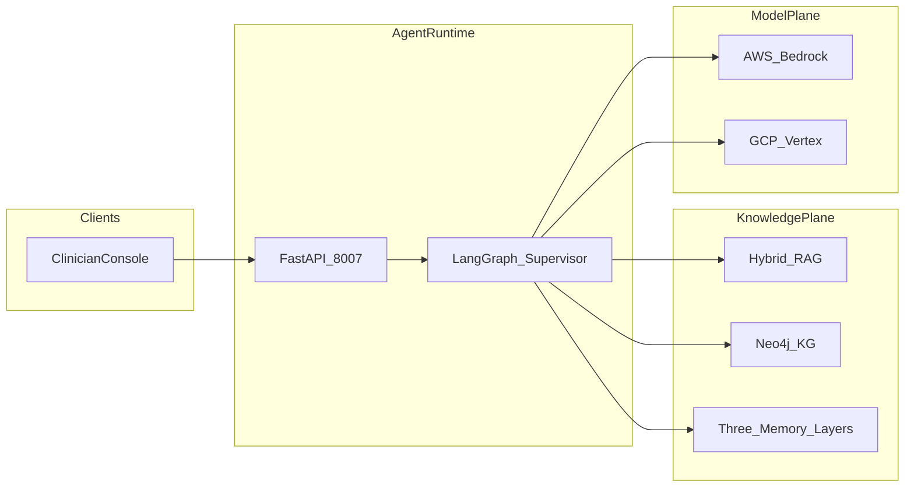

# System Design Document — CarePath AI

## 1. Problem statement and use cases

### Problem

Healthcare providers need to create personalized treatment plans for patients with complex medical histories and multiple chronic conditions. Manual planning is slow, error-prone around medication interactions, and often fails to incorporate lifestyle factors and patient preferences. Uncited LLM drafts are unsafe for clinical use without retrieval grounding, interaction checks, and human approval.

### Primary use cases

| ID | Actor | Use case |
|----|-------|----------|
| UC1 | Clinician | Generate a draft plan for a diabetic + hypertensive patient with 6 active meds |
| UC2 | Clinician | Re-run plan after patient rejects a medication class (preference incorporation) |
| UC3 | Clinical reviewer | HITL approve / edit / reject before plan is published to mock EHR |
| UC4 | Platform eng | Ship only if safety judge + injection suite pass quality gates |

### Non-goals (v1)

- Live FHIR / Epic / Cerner integration
- Real RxNorm / openFDA drug interaction APIs
- Full enterprise IdP / SSO
- Insurance prior-authorization workflows
- HIPAA production hardening (encryption at rest, BAA infra)

---

## 2. Success metrics

| Category | Metric | Target |
|----------|--------|--------|
| Quality | Golden scenario pass rate (`fake`) | 100% (3/3) |
| Safety | Injection suite | ≥ 95% |
| Safety | Judge safety score (golden) | ≥ 0.90 |
| Quality | Citation coverage | ≥ 90% of claims |
| Latency | P95 end-to-end (`fake`) | ≤ 5s |
| Clinical | Major interactions addressed | 100% on golden paths |

---

## 3. High-level architecture

### Agent roles

| Agent | Role |
|-------|------|
| Firewall | Hard-block prompt injection / exfil |
| Supervisor | Pure routing; never generates clinical content |
| Patient data extractor | Structure EHR + notes; enrich via KG |
| Medication interaction checker | Flag major/moderate/minor interactions |
| Treatment plan generator | Draft goals, interventions, monitoring, follow-up |
| Patient preference agent | Adapt plan to stated preferences |
| Treatment plan evaluator | Safety + guideline + citation judge |
| HITL | Clinician interrupt gate |
| Plan publish | Append audit log + mock EHR write |

---

## 4. Knowledge plane

### Hybrid RAG

- Corpus under `data/corpus/` (guidelines, drug interaction summaries, lifestyle counseling)
- Dense + BM25-style lexical merge + light rerank
- Domain ACL tags: `endocrinology`, `cardiology`, `pharmacy`, `pulmonology`, `psychiatry`

### Neo4j GraphRAG

Node types: Patient, Condition, Medication, Lab, Guideline, Protocol  
Edges: `HAS_CONDITION`, `PRESCRIBED`, `INTERACTS_WITH`, `CONTRAINDICATED_FOR`, `GUIDELINE_FOR`, `MONITORS`

When `NEO4J_URI` is unset, JSONL seeds in `data/kg/` power an in-memory adjacency fallback.

### Memory layers

| Layer | Source | Consumer |
|-------|--------|----------|
| Procedural | `data/protocols/*.json` | Generator, evaluator |
| Episodic | `data/patients/{id}/history.jsonl` | Generator, extractor |
| Semantic | In-process LangGraph-style store / JSONL feedback | Generator (prior edits) |

---

## 5. Safety model

1. **Input firewall** — hard-block injection patterns; soft-escalate HITL bypass attempts.  
2. **Medication checker** — KG + seed interaction table before draft finalization.  
3. **Treatment plan evaluator** — required sections, allergy cross-check, citation coverage, safety score.  
4. **Mandatory HITL** — clinical domain always interrupts.  
5. **Audit publish** — JSONL append-only log at `data/published_plans.log`.

---

## 6. Deploy

| Target | Entrypoint | Checkpointer |
|--------|------------|-------------|
| Local | `python -m app.main` | Sqlite / MemorySaver |
| Bedrock AgentCore | `deploy/agentcore/entrypoint.py` | PostgresSaver when `POSTGRES_DSN` set |
| Vertex Agent Engine | `deploy/vertex_engine/entrypoint.py` | PostgresSaver when `POSTGRES_DSN` set |

---

## 7. Future extensions

- Insurance prior-auth agent + payer policy GraphRAG  
- Live FHIR R4 read/write  
- RxNorm / openFDA real interaction APIs  
- HIPAA audit logging and encryption  
