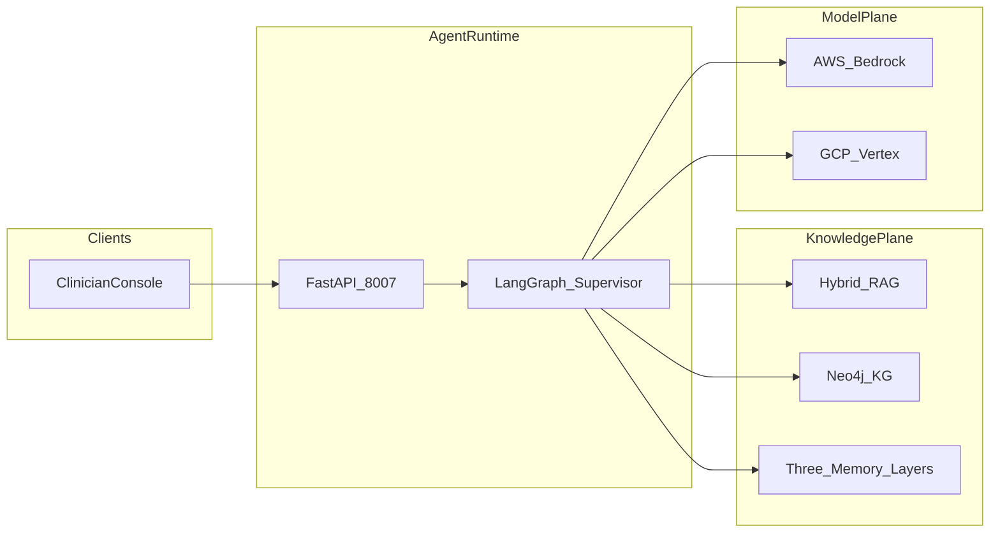
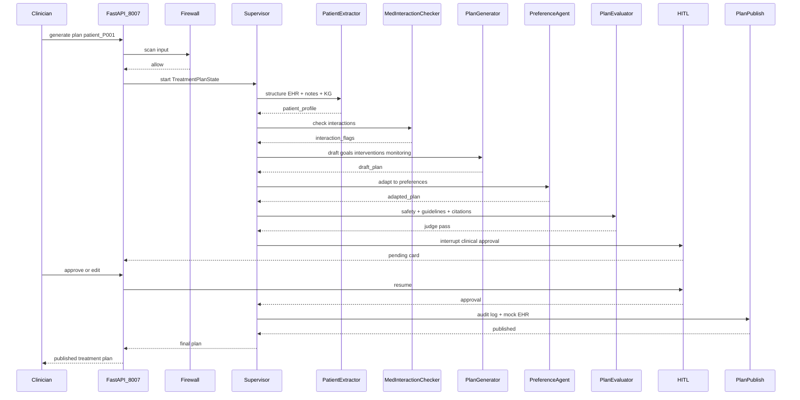

# Architecture

Canonical HLA/LLA for CarePath AI. Narrative design: [SYSTEM_DESIGN.md](SYSTEM_DESIGN.md). Locked decisions: [`../AS_BUILT.md`](../AS_BUILT.md).

**Port:** Clinician console FastAPI **8007**.

## High-Level Architecture (HLA)

Extracted from [SYSTEM_DESIGN.md](SYSTEM_DESIGN.md) §3:

Agents: firewall → supervisor ↔ (patient_data_extractor, medication_interaction_checker, treatment_plan_generator, patient_preference_agent, treatment_plan_evaluator) → HITL → plan_publish.

## Low-Level Architecture (LLA)

Clinical HITL happy path: generate plan for complex chronic patient → clinician approve → mock EHR publish.

