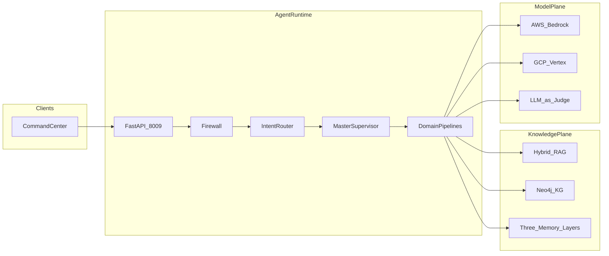
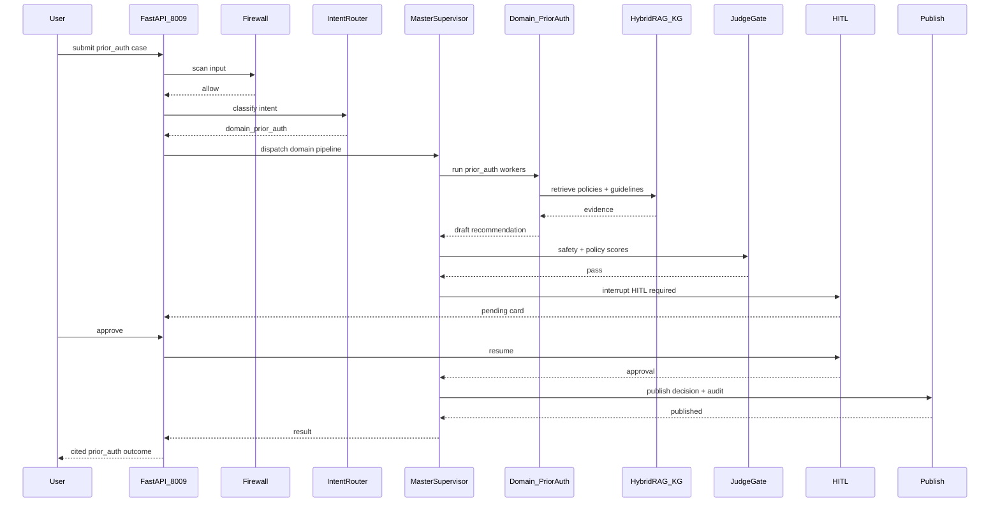

# Architecture

Canonical HLA/LLA for HEDIP (Healthcare Decision Intelligence Platform). Mirrors the CarePath HLA pattern (console → FastAPI → LangGraph → knowledge + model planes) with multi-domain routing. Narrative: [SYSTEM_DESIGN.md](SYSTEM_DESIGN.md). Locked decisions: [`../AS_BUILT.md`](../AS_BUILT.md).

**Port:** Command Center FastAPI **8009**.

## High-Level Architecture (HLA)

Domains (v1): `prior_auth`, `claims`, `clinical_cds`, `care_coord`, `knowledge`, `fraud`, `pop_health`, `rcm`. HITL required for prior_auth, claims, clinical_cds, and fraud (investigate).

Flow: `START → firewall → intent_router → master_supervisor → domain_* → judge → HITL → publish`.

## Low-Level Architecture (LLA)

Happy path: prior-authorization request with HITL before publish.

