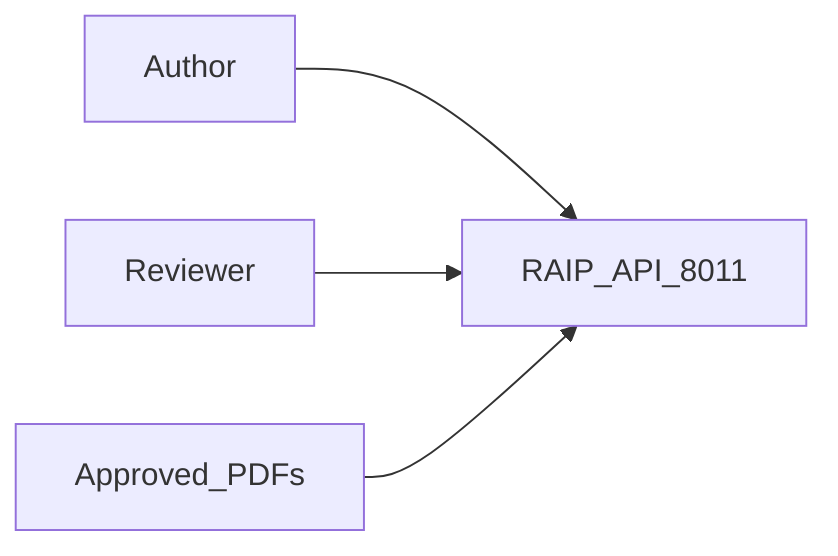
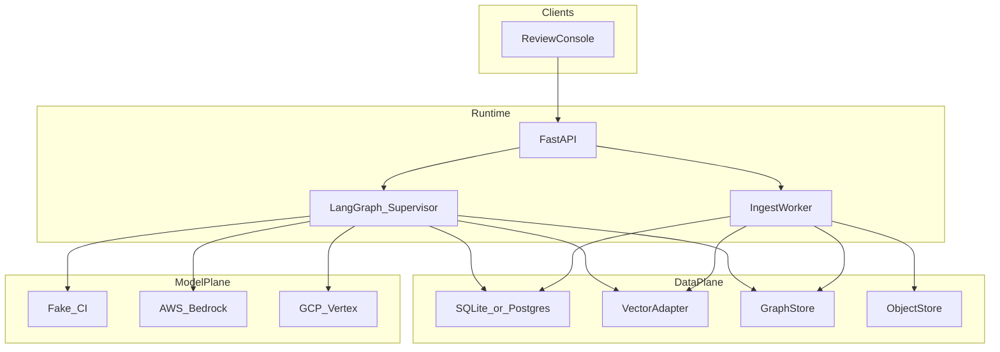
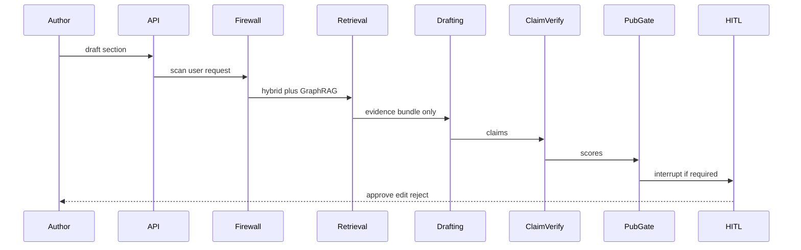

# RAIP Architecture

Canonical index. Locked as-built: [`../../AS_BUILT.md`](../../AS_BUILT.md). ADRs: [`ADR/`](ADR/).

**Port:** Review console FastAPI **8011**.

| Document | Use when |
|----------|----------|
| [../SYSTEM_DESIGN.md](../SYSTEM_DESIGN.md) | Problem, use cases, metrics, safety, deploy |
| [../IMPLEMENTATION_PLAN.md](../IMPLEMENTATION_PLAN.md) | v1 build order and next slices |
| [HIGH_LEVEL.md](HIGH_LEVEL.md) | System context, containers, workflow, trust, publication policy |
| [LOW_LEVEL.md](LOW_LEVEL.md) | Packages, LangGraph routing, ingest, retrieval, claims, schema, APIs |
| [LOCAL_VS_PRODUCTION.md](LOCAL_VS_PRODUCTION.md) | Honest local vs production matrix |
| [PILOT_TO_SCALE.md](PILOT_TO_SCALE.md) | Pilot → expansion → enterprise |
| [ADR/](ADR/) | Locked decisions (supervisor, grounding, gates, fake model) |

## System context

## High-level architecture

Full HLA: [HIGH_LEVEL.md](HIGH_LEVEL.md).

## Authoring workflow

## Trust boundaries

1. User request — may be blocked on jailbreak.
2. Source documents — **always untrusted data** (delimited in prompts).
3. Retrieval index — tenant-filtered.
4. Draft output — claim-verified before HITL.
5. Publication — boolean AND of gates + human approval.

## Physical / deployment

Local: single FastAPI process + optional worker; SQLite file; optional Docker Postgres/Neo4j.

Production path (not applied in this repo): ECS/Cloud Run or Bedrock AgentCore / Vertex Agent Engine; RDS Postgres+pgvector; Neo4j Aura; S3/GCS; IdP.

See [LOCAL_VS_PRODUCTION.md](LOCAL_VS_PRODUCTION.md) and [../deployment/DEPLOYMENT.md](../deployment/DEPLOYMENT.md).

## Data model (logical)

Document → DocumentVersion → EvidenceChunk  
Draft → claims JSON → EvidenceChunk  
Review and AuditEvent hang off Draft / request_id.

Low-level ER and tables: [LOW_LEVEL.md](LOW_LEVEL.md#logical-data-model).

## Failure handling

`INGESTION_FAILED`, `INSUFFICIENT_EVIDENCE`, `CONTRADICTORY_EVIDENCE`, `GROUNDING_FAILED`, `SAFETY_FAILED`, `SECURITY_FAILED`, `PUBLICATION_BLOCKED`, `HUMAN_REVIEW_REQUIRED`. Critical evidence failure stops confident generation (EVIDENCE GAP) rather than silent continuation.
