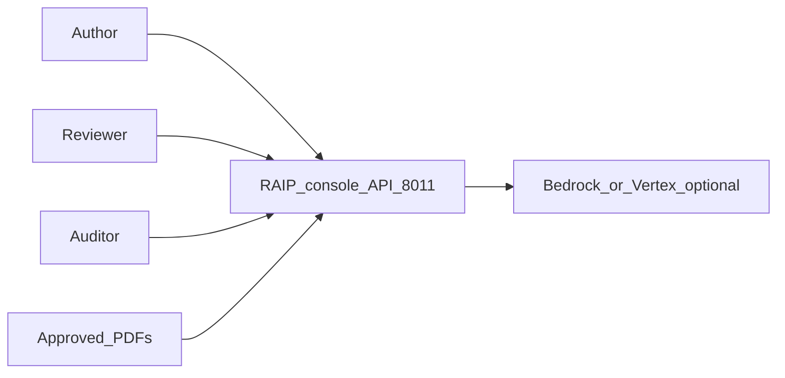
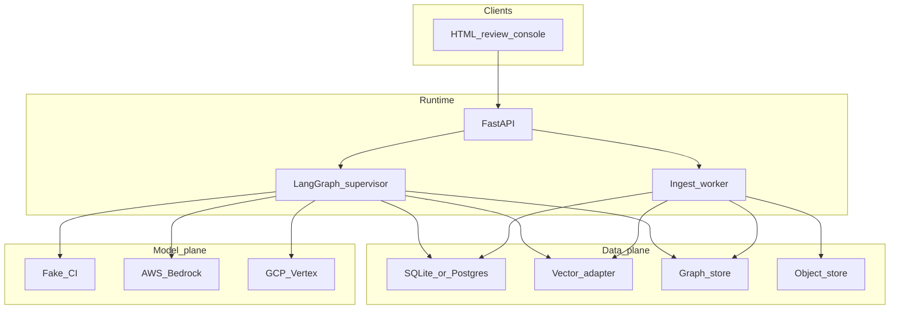
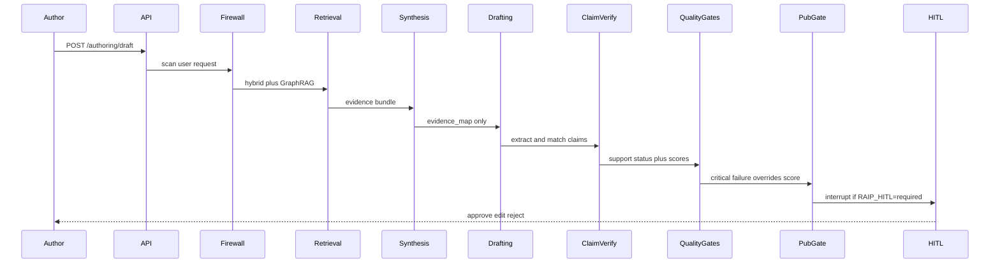

# High-level architecture (HLA)

C4 context and container view of RAIP. Implementation detail lives in [LOW_LEVEL.md](LOW_LEVEL.md). Locked as-built: [`../../AS_BUILT.md`](../../AS_BUILT.md).

**Port:** FastAPI review console **8011**. Env prefix: `RAIP_*`.

## Intent

RAIP drafts clinical/regulatory **document sections** from approved, versioned sources. Generation is subordinate to evidence. An unsupported material claim cannot publish, even if the aggregate quality score is high.

This is **not** a chatbot, not CarePath CDS, and not a HIPAA certification.

## System context (C4 L1)

Authors and reviewers use one console. Approved PDFs enter through ingest. The API owns orchestration, evidence, and audit. Humans remain on the publication path.



| Actor | Intent |
|-------|--------|
| Author | Upload sources, request a section draft, inspect claims |
| Reviewer | Approve, edit, or reject; HITL is required in demo mode |
| Auditor | Reconstruct `request_id` → sources, claims, scores, decision |
| Source PDFs | Untrusted **data**, never instructions |

## Container view (C4 L2)



| Container | Responsibility |
|-----------|----------------|
| Review console | 3-pane UI: query/sources, draft, claims/evidence/scores |
| FastAPI | Auth headers, upload, draft invoke, HITL resume, audit |
| LangGraph | Supervisor loop; workers never peer-route |
| Ingest worker | Parse → chunk → embed → register evidence + graph edges |
| Metadata DB | Tenants, versions, chunks, drafts, jobs, audit (source of truth) |
| Vector adapter | Dense embeddings; cosine locally, pgvector/Pinecone as path |
| Graph store | Supersession + claim–evidence edges; Neo4j optional |
| Object store | Raw PDF bytes; local disk or S3/GCS adapter |
| Model gateway | `RAIP_MODEL=fake` in CI; Bedrock/Vertex in production |

## Authoring workflow

Happy path. Failure states are first-class (`INSUFFICIENT_EVIDENCE`, `GROUNDING_FAILED`, `PUBLICATION_BLOCKED`, …). Critical evidence failure emits an **EVIDENCE GAP** rather than filling from model knowledge.



## Trust boundaries

1. **User request** — may be blocked on jailbreak (`firewall`).
2. **Source documents** — always untrusted data; delimited in prompts.
3. **Retrieval index** — tenant-filtered; superseded versions dropped by default.
4. **Draft output** — claim-verified before HITL.
5. **Publication** — boolean AND of gates **and** human approval.

## Quality and publication policy

Configurable weights produce an aggregate score. **Any critical gate failure sets `PUBLICATION_BLOCKED`**, regardless of that score.

```
APPROVED iff
  grounding PASS
  AND citation PASS
  AND safety PASS
  AND regulatory PASS
  AND template PASS
  AND security PASS
  AND human approval
```

## Deployment shapes

| Shape | What runs |
|-------|-----------|
| Local (default) | One FastAPI process; SQLite; in-memory graph; fake model |
| Docker Compose | API + worker + Postgres+pgvector + Neo4j |
| Production path | Same containers behind HTTPS; RDS; Neo4j Aura; S3/GCS; Bedrock or Vertex; OIDC. **Not applied in this repo.** |

See [LOCAL_VS_PRODUCTION.md](LOCAL_VS_PRODUCTION.md) and [PILOT_TO_SCALE.md](PILOT_TO_SCALE.md).

## What this HLA deliberately omits

Kubernetes, Kafka, live EHR/FHIR, production OCR, ClamAV, and a React SPA. Those are documented as non-goals or later phases, not implied by the container diagram.
