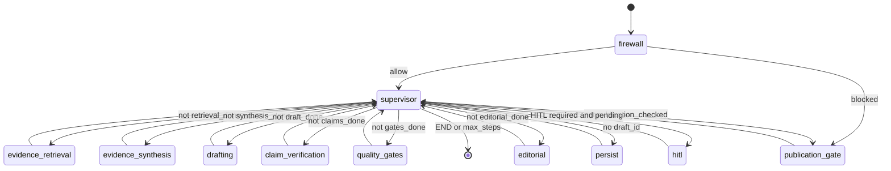
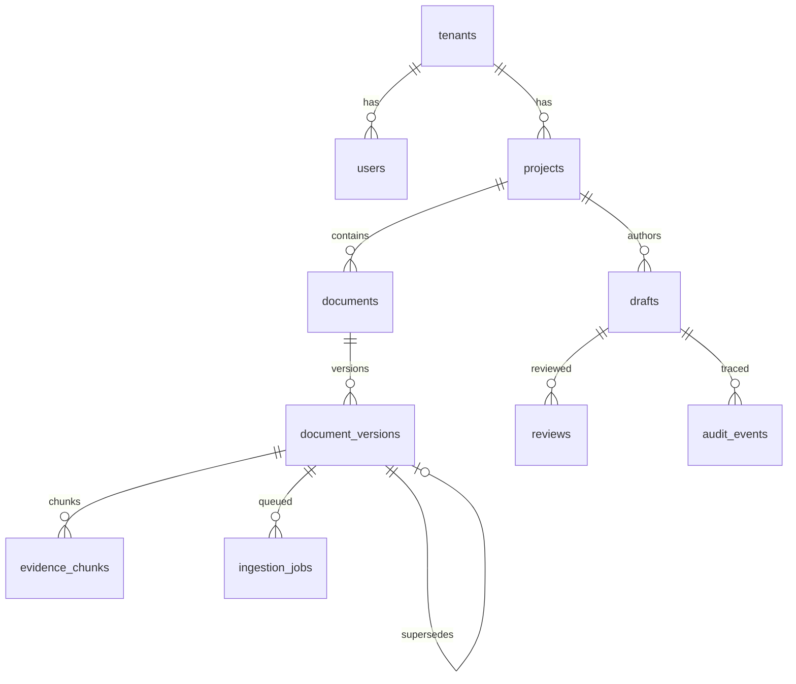

# Low-level architecture (LLA)

Module, graph, data, and API detail matching this repository. HLA: [HIGH_LEVEL.md](HIGH_LEVEL.md). As-built: [`../../AS_BUILT.md`](../../AS_BUILT.md).

LangGraph compile lives in `app.orchestration.graph`, **not** `app/graph.py` — that path would clash with package `app/graph/` (Neo4j / in-memory store).

## Package map

```text
app/
  main.py                 FastAPI console + REST
  config.py               RAIP_* settings (.env)
  llm.py                  fake | Bedrock | Vertex gateway
  _fake_llm.py            deterministic CI responses
  orchestration/
    graph.py              StateGraph compile + routing
    state.py              AuthoringState TypedDict
  agents/nodes.py         firewall … persist (workers return to supervisor)
  ingestion/              parse, chunk, classify, job worker
  retrieval/hybrid.py     BM25 + dense + RRF + authority + GraphRAG
  grounding/engine.py     claim extract, match, contradiction
  safety/gates.py         quality / safety / regulatory / template / security
  graph/store.py          GraphStore protocol; Memory | Neo4j
  storage/                SQLAlchemy schema, repo, object store
  security/               injection, uploads, PII, header Principal
  policies/authority.py   tier + supersession preference
  memory/layers.py        procedural / semantic / episodic hints
  ui/console.html         3-pane review console
```

## LangGraph state machine

`AuthoringState` is a TypedDict. Domain payloads (`EvidencePassage`, `ClaimRecord`, `GateResult`, `QualityScores`) are Pydantic models in `app.models.contracts`. Supervisor routing uses explicit `*_done` flags so empty lists do not infinite-loop.



| Node | File | LLM? | Contract |
|------|------|------|----------|
| `firewall` | `agents/nodes.py` | No | Block jailbreak on **user query** only; PDFs stay data |
| `supervisor` | same | No | Route by flags; `max_graph_steps` cap; never drafts |
| `evidence_retrieval` | `retrieval/hybrid.py` | No | Tenant-scoped hybrid bundle |
| `evidence_synthesis` | nodes | Yes | Evidence map + conflicts; untrusted wrap |
| `drafting` | nodes | Yes | Evidence-only; `EVIDENCE GAP` if no support |
| `claim_verification` | `grounding/engine.py` | Mixed | Support status per claim |
| `quality_gates` | `safety/gates.py` | No | Sub-checks, not extra agents |
| `editorial` | nodes | Yes | Tone only; cannot override grounding |
| `publication_gate` | nodes | No | Boolean AND + critical override |
| `hitl` | nodes | No | `interrupt()` when `RAIP_HITL=required` |
| `persist` | nodes | No | Draft + audit rows |

Document intelligence (`ingestion/intelligence.py`) runs on **ingest**, not on every draft.

## Ingest pipeline

```text
POST /documents/upload
  → MIME / size / hash / extension allowlist
  → ObjectStore.put(tenant/doc/ver/filename)
  → Document + DocumentVersion + IngestionJob
  → worker: parse_bytes (page numbers) → chunk_document
  → embed → EvidenceChunk rows
  → graph upsert DOCUMENT / VERSION / CHUNK / SUPERSEDES
```

Scanned PDFs set `ocr_required=true` and do not fake OCR. Injection language inside a PDF is flagged on the chunk; it does not become a system instruction.

## Hybrid retrieval

`retrieve()` in `app/retrieval/hybrid.py`:

1. Drop superseded versions (`supersedes_version_id` + graph `superseded_version_ids`), unless the pool would be empty.
2. BM25 (`rank-bm25`) and dense cosine over chunk embeddings.
3. Reciprocal Rank Fusion (`k=60`).
4. Authority prior: `+0.05 * (7 - tier_rank)`.
5. Parent/child expansion (`PARENT::{section}`).
6. GraphRAG neighborhood (`SECTION_CONTAINS_CHUNK`).
7. Heuristic rerank: `0.5 * RRF + 0.3 * lexical_overlap + 0.2 * authority_score`.
8. Return top-k `EvidencePassage` (page, section, version, tier, superseded flag).

## Claim verification

`app/grounding/engine.py`:

- Strip markdown headings; split sentences; skip `EVIDENCE GAP` / reference lines.
- High-risk if dose / first-line / CRISPR / DrugZ markers.
- Match claim ↔ passage by lexical overlap + cosine.
- `DrugZ` / `CRISPR` force `UNSUPPORTED` unless present in evidence (avoids false support from unrelated overlap).
- Contradiction pairs (e.g. metformin vs sulfonylurea) when both appear across live vs superseded sources.
- Graph edges: `CLAIM_SUPPORTED_BY` / `CLAIM_CONTRADICTED_BY`.

Statuses: `SUPPORTED | PARTIALLY_SUPPORTED | UNSUPPORTED | CONTRADICTED | NOT_APPLICABLE`.

## Publication gate

`run_gates()` then `publication_gate_node`:

- Critical gates: grounding, citation, safety, security.
- `critical_safety_failure` ⇒ `publication_blocked=true` even if weighted `overall` is high.
- HITL: `RAIP_HITL=required` interrupts; `evaluate` skips interrupt for CI.

## Logical data model

Postgres/SQLite is source of truth. The graph is the **relationship plane**. Claims are persisted as JSON on `drafts` (not a separate `claims` table in v1).



Every evidence/draft/audit row carries `tenant_id`. Retrieval, graph keys, and object keys all include it.

| Table | Role |
|-------|------|
| `tenants`, `users`, `projects`, `templates` | Tenancy and section template |
| `documents`, `document_versions` | Authority tier, checksum, `supersedes_version_id`, OCR flag |
| `evidence_chunks` | Page, section, parent, embedding JSON, hash |
| `drafts` | Content, scores, `claims_json`, `evidence_json`, `provenance_json` |
| `reviews`, `audit_events` | HITL decision; reconstruct by `request_id` |
| `ingestion_jobs` | Queue (`SKIP LOCKED` path on Postgres) |

Graph relations: `DOCUMENT_HAS_VERSION`, `DOCUMENT_SUPERSEDES_DOCUMENT`, `SECTION_CONTAINS_CHUNK`, `CLAIM_SUPPORTED_BY`, `CLAIM_CONTRADICTED_BY`.

## HTTP surface

Console: `GET /` → `app/ui/console.html`. OpenAPI: `/docs`.

| Method | Path | Notes |
|--------|------|-------|
| GET | `/health` `/ready` `/metrics` | Liveness, schema, counters |
| GET | `/projects` `/projects/{id}` | Tenant-scoped |
| POST | `/documents/upload` | Enqueue ingest |
| POST | `/documents/{id}/ingest` | Re-run job |
| POST | `/authoring/draft` | Compile graph, stream, persist thread |
| GET | `/status/{thread_id}` | Snapshot for console poll |
| GET | `/drafts/{id}` `/evidence` `/claims` `/provenance` | 3-pane payloads |
| POST | `/drafts/{id}/approve` `/reject` `/review` | HITL |
| POST | `/approve/{thread_id}` | Resume `interrupt` via LangGraph `Command` |
| GET | `/audit/{request_id}` | Provenance reconstruction |
| GET | `/evaluations` | Pointer to measured reports |

Auth: `X-Tenant-Id`, `X-Role`, `X-User-Id` → `Principal`. Not a live IdP.

## HITL resume

```text
draft invoke → hitl_node → interrupt(payload)
  → console Approve
  → POST /approve/{thread_id}  Command(resume=decision)
  → supervisor → persist → END
```

Checkpointer: `MemorySaver` by default; `PostgresSaver` when `RAIP_MEMORY=postgres` and `POSTGRES_DSN` is set.

## Model gateway

`RAIP_MODEL` / `RAIP_JUDGE_MODEL` / `RAIP_EMBEDDINGS`: `fake` | `bedrock_converse:<id>` | `google_vertexai:<id>`. Fake LLM is heuristic and query-triggered (draft / synthesize / CRISPR on the **author request**, not because the prompt mentions CRISPR). CI must use `fake`.

## Failure handling

| Status | Typical cause |
|--------|----------------|
| `SECURITY_FAILED` | Firewall on user query; injection/PII in output |
| `INSUFFICIENT_EVIDENCE` | Empty live bundle or explicit gap |
| `CONTRADICTORY_EVIDENCE` | Unresolved material conflict |
| `GROUNDING_FAILED` | High-risk unsupported / contradicted claims |
| `SAFETY_FAILED` | Unsafe recommendation without gap framing |
| `PUBLICATION_BLOCKED` | Any critical gate fail |
| `HUMAN_REVIEW_REQUIRED` | Gates passed or routed; HITL pending |

## Honest deltas vs the original plan

| Plan said | As-built |
|-----------|----------|
| Pydantic `AuthoringState` | TypedDict state + Pydantic **contracts** |
| Postgres as v1 local default | SQLite default; Postgres via URL / Compose |
| Separate `Claim` / `ClaimEvidence` tables | `claims_json` / `evidence_json` on `drafts` |
| pgvector required locally | JSON embeddings + cosine; pgvector in Compose |
| 24 golden cases | 29 golden cases measured |
