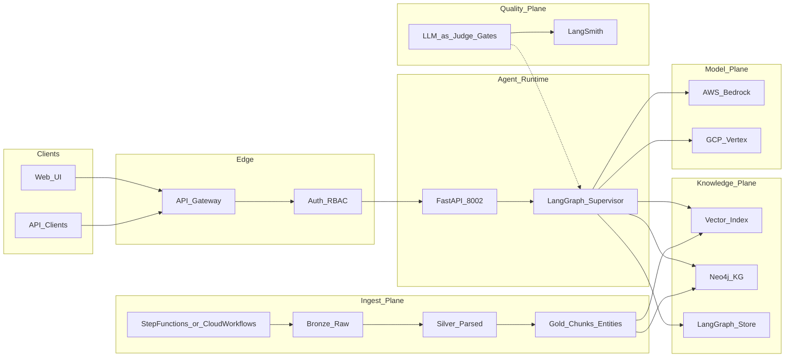

# System Design Document — Panasonic Enterprise GenAI Knowledge Platform

## 1. Problem statement and use cases

### Problem

Enterprise knowledge at a Panasonic-scale manufacturer is fragmented across SharePoint sites, Confluence spaces, PDF manuals, plant SOPs, HR handbooks, and support KBs. Employees in engineering, manufacturing, operations, HR, and customer support spend significant time searching, and keyword search fails when the answer depends on **relationships** (which SOP applies to which part at which plant; which policy superseded another).

Manual search is slow; uncited LLM answers are untrusted; a single vector index without access control or graph context is insufficient for production.

### Primary use cases

| ID | Actor | Use case |
|----|-------|----------|
| UC1 | Manufacturing engineer | “What torque spec applies to PN-4421 on the Osaka line?” |
| UC2 | Support agent | “LED blinks 3× on power-up — what’s the procedure?” |
| UC3 | HR partner | “PTO accrual for full-time US employees?” (sensitive → HITL) |
| UC4 | SRE / ops | “What’s the change window for payment-service?” |
| UC5 | Quality / compliance | “Which document superseded SOP-M-104?” (graph-first) |
| UC6 | Platform eng | Ship a model/prompt change only if pairwise + groundedness gates pass |

### Non-goals (v1)

- Full enterprise IdP / SSO wiring (simulate RBAC with `role` + chunk ACL tags)
- Real proprietary Panasonic document dumps
- Multi-orchestrator stacks (CrewAI / AutoGen / Strands)

---

## 2. Success metrics

Aligned with the production narrative (2,000+ users; projected productivity impact; 99.9% availability):

| Category | Metric | Target |
|----------|--------|--------|
| Retrieval | Relevance lift vs naive chunking | ≥ 40% |
| Latency | P50 / P95 end-to-end | ≤ 2s / ≤ 4s |
| Quality | Groundedness judge pass rate | ≥ 0.85 to ship |
| Quality | Citation coverage | ≥ 90% of claims |
| Safety | Injection suite | ≥ 95% blocked/escalated |
| Reliability | Availability | 99.9% design target |
| Cost | Token + infra cost per request | Tracked; alert on budget |
| Business | Information discovery time | ~90% reduction vs manual search (survey / proxy) |

**How we know it works:** technical metrics (groundedness, retrieval, latency, cost) and business metrics (adoption, discovery time, support handle time) move together; human feedback continuously updates procedural prompts and retrieval strategy.

---

## 3. High-level architecture



### Component responsibilities

| Component | Responsibility |
|-----------|----------------|
| FastAPI console | Ingest queries, list pending HITL, resume interrupts, demo path |
| LangGraph supervisor | Deterministic routing among workers; checkpoint threads |
| Intent router | Domain, intent, sensitivity, `needs_graph` |
| Retriever | Hybrid search, metadata/ACL filter, rerank |
| Graph walker | Entity lookup + 1–2 hop traversal (budget ≤ 6) |
| Synthesizer | Cited answer using 3 memory layers |
| Grounder | Claim–evidence alignment; revise or escalate |
| HITL | Human approve/edit/reject for sensitive / low-confidence |
| Answer publish | Persist published answer (mock + optional Slack) |
| Ingest pipeline | Medallion load → chunk → embed → KG seed |
| LLM-as-judge | Offline gates for ship / deploy / report |

### Dual-cloud deployment

| Concern | AWS | GCP |
|---------|-----|-----|
| Chat / agents | Bedrock + **AgentCore** | Vertex + **Agent Engine** |
| Vectors | OpenSearch Serverless or Bedrock KB | Vertex Vector Search or AlloyDB pgvector |
| Graph | Neo4j Aura (shared) or Amazon Neptune* | Neo4j Aura (shared) |
| Ingest orchestration | Step Functions | Cloud Workflows |
| Observability | CloudWatch + LangSmith | Cloud Logging + LangSmith |
| Safety | Bedrock Guardrails | Vertex safety filters |

\*Neptune is an optional AWS-native graph; **v1 locks Neo4j** for identical Cypher tooling on both clouds.

**Not used as primary agent frameworks:** CrewAI, AutoGen, Strands Agents (avoids dual orchestration paradigms). Temporal is reserved for future long-running ingest, not the Q&A loop.

---

## 4. Multi-agent design (LangGraph supervisor + HITL)

### Supervisor contract

Workers **never** route to each other. Each worker returns to the supervisor. Routing is pure state logic (no LLM).

### Worker contracts

| Worker | Input | Output |
|--------|-------|--------|
| `intent_router` | `query`, `role` | `domain`, `intent`, `sensitivity`, `needs_graph` |
| `retriever` | query + domain filters | `retrieved_chunks[]` with `chunk_id`, text, score, ACL |
| `graph_walker` | entities from query/chunks | `graph_paths[]` (nodes + rels) |
| `synthesizer` | chunks + paths + memory | `draft_answer`, `citations[]`, risk flags |
| `grounder` | draft + evidence | `grounding_score`, `revise` flag |
| `hitl` | interrupt payload | `approval`, optional `edited_body` |
| `answer_publish` | approved draft | `published=true` |

### Memory model

| Layer | Storage | Use |
|-------|---------|-----|
| Procedural | `data/prompts/answerer_{domain}.json` | Versioned system style + citation rules |
| Episodic | pgvector / JSONL | Similar past successful Q&A |
| Semantic | LangGraph Store | Per-user preferences, plant assignment, role facts |

---

## 5. RAG pipeline

### Ingestion (medallion)

```text
Bronze (raw md/pdf)
  → Silver (parse, normalize, PII scrub, doc-level ACL)
    → Gold (semantic chunks, embeddings, entity/relation extract)
      → Vector index + Neo4j
```

**Chunking:** heading-aware semantic chunking (not fixed 500-token only); attach metadata: `domain`, `doc_id`, `section`, `plant`, `doc_type`, `acl_roles[]`, `effective_date`, `supersedes`.

**Hybrid retrieval at query time:**

1. Dense top-k  
2. BM25 top-k  
3. Reciprocal rank fusion (or weighted merge)  
4. Metadata / ACL filter (`role` must intersect `acl_roles`)  
5. Rerank top-n  
6. Optional KG expansion when `needs_graph`  
7. Context pack with stable `citation_id`s  

### Why not vector-only

Semantic similarity fails for:

- Supersession (“which SOP replaced X?”)  
- Applicability (“does policy P apply to role R at plant Y?”)  
- Multi-hop troubleshooting (symptom → component → procedure)

Those queries set `needs_graph=true` and invoke `graph_walker`.

---

## 6. Corpus & knowledge graph schema

Demo corpora are **NDA-safe**: synthetic enterprise docs plus short, license-clear public excerpts. Generator: `scripts/generate_synthetic_corpus.py`.

### Directory layout

```text
data/
  corpus/
    manufacturing/
      SOP-M-104-torque-assembly.md
      SOP-M-105-torque-assembly-v2.md      # supersedes 104
      PLANT-OSAKA-line-safety.md
      ...
    engineering/
      STD-E-220-connector-spec.md
      STD-E-221-connector-spec-rev.md
      ...
    support/
      KB-BAT-led-codes.md
      KB-BAT-troubleshooting-tree.md
      ...
    hr/
      POL-HR-pto-us.md
      POL-HR-travel.md
      POL-HR-code-of-conduct.md
      ...
    operations/
      RB-OPS-payment-service-change.md
      RB-OPS-incident-sev1.md
      ...
  kg/
    seed_entities.jsonl
    seed_relations.jsonl
  prompts/
    answerer_manufacturing.json
    answerer_engineering.json
    answerer_support.json
    answerer_hr.json
    answerer_operations.json
```

### Document frontmatter (required)

```yaml
---
doc_id: SOP-M-105
domain: manufacturing
doc_type: sop
plant: Osaka
acl_roles: [engineer, manufacturing, quality]
effective_date: 2025-06-01
supersedes: SOP-M-104
entities: [PN-4421, Plant-Osaka, SOP-M-105]
---
```

### Entity types (`seed_entities.jsonl`)

One JSON object per line:

```json
{"id": "PN-4421", "label": "Part", "name": "PN-4421", "props": {"family": "battery_tray"}}
{"id": "Plant-Osaka", "label": "Plant", "name": "Osaka Assembly", "props": {"region": "APAC"}}
{"id": "SOP-M-105", "label": "SOP", "name": "Torque Assembly v2", "props": {"version": 2}}
{"id": "POL-HR-pto-us", "label": "Policy", "name": "US PTO Accrual", "props": {"region": "US"}}
{"id": "Role-FT-US", "label": "Role", "name": "Full-time US Employee", "props": {}}
{"id": "Svc-payment", "label": "Service", "name": "payment-service", "props": {}}
```

**Allowed labels:** `Document`, `Section`, `Part`, `BOM`, `Plant`, `SOP`, `Policy`, `Role`, `TicketPattern`, `Service`, `Symptom`.

### Relation types (`seed_relations.jsonl`)

```json
{"src": "SOP-M-105", "rel": "SUPERSEDES", "dst": "SOP-M-104", "props": {}}
{"src": "SOP-M-105", "rel": "APPLIES_TO", "dst": "PN-4421", "props": {"plant": "Osaka"}}
{"src": "SOP-M-105", "rel": "LOCATED_AT", "dst": "Plant-Osaka", "props": {}}
{"src": "POL-HR-pto-us", "rel": "GOVERNS", "dst": "Role-FT-US", "props": {}}
{"src": "Symptom-LED-3x", "rel": "REQUIRES", "dst": "KB-BAT-troubleshooting-tree", "props": {}}
{"src": "RB-OPS-payment-service-change", "rel": "APPLIES_TO", "dst": "Svc-payment", "props": {}}
```

**Allowed rels:** `GOVERNS`, `APPLIES_TO`, `SUPERSEDES`, `LOCATED_AT`, `REQUIRES`, `PART_OF`, `REFERENCES`.

### Domain corpus rationale

| Domain | Why this documentation | Graph value |
|--------|------------------------|-------------|
| Manufacturing | Plant SOPs + machine-safety style procedures | Part ↔ SOP ↔ Plant |
| Engineering | Design standards with revision chains | Spec supersession |
| Support | KB articles + troubleshooting trees | Symptom → procedure |
| HR | Handbook policies | Role ↔ policy (HITL) |
| Operations | ITIL-style incident/change runbooks | Service ↔ runbook |

**Avoid for demos:** random blog posts, single-topic essay dumps (e.g. unrelated ML blogs), or uncited scraped PDFs without ACL/entity metadata.

### Public excerpt policy

When including public text (e.g. short OSHA-style safety phrasing, RFC boilerplate):

- Keep excerpts short  
- Attribute source in doc footer  
- Prefer synthetic paraphrase for narrative body  
- Never commit proprietary Panasonic PDFs

### Minimum seed sizes (for credible demo)

| Artifact | Minimum |
|----------|---------|
| Docs per domain | ≥ 6 markdown files |
| Entities | ≥ 40 |
| Relations | ≥ 60 |
| Golden eval questions | ≥ 25 across domains |
| Injection attacks | 20 |

---

## 7. LLM-as-judge evaluation design

Judges are **decision systems**, not dashboards.

| Gate | Blocks / enables | Rubric focus |
|------|------------------|--------------|
| Retrieval judge | Retrieval config ship | Relevance, coverage, ACL correctness |
| Groundedness judge | Answer publish + CI | Each claim supported by cited chunk |
| Answer quality judge | Weekly report | Accuracy, completeness, citation, safety (1–5) |
| Pairwise regression | Model / prompt deploy | A vs B win-rate on golden set |
| Injection eval | Release | blocked vs escalated outcomes |

### Failure modes and mitigations

| Bias / failure | Mitigation |
|----------------|------------|
| Same-model bias | Cross-provider judge (`EGKP_JUDGE_MODEL`) |
| Verbosity bias | Length normalization; penalize ungrounded tokens |
| Position bias | Randomize pairwise order; report both orientations |
| Self-preference | Separate judge prompt templates from answerer prompts |
| Judge outage | Fail **closed** on deploy gates; shadow metrics may fail open |
| Rubric drift | Version rubrics in `evals/rubrics/*.md`; pin in LangSmith experiment metadata |

### Online vs offline

- **Offline (required for ship):** golden JSONL + LangSmith experiments  
- **Online (stretch):** shadow groundedness on a sample of production threads; never auto-block users without HITL path for sensitive domains  

---

## 8. Security, privacy, and governance

- Input hard-block patterns for classic injection / DAN / “ignore previous”  
- Optional Bedrock Guardrail ID  
- Chunk ACL tags enforced at retrieval  
- HR and PII-like content → HITL  
- Published answers logged for audit  
- No secrets in corpus; `.env` for cloud keys  
- Prompt-injection suite must pass ≥ 95% before release  

---

## 9. Observability

| Signal | Where |
|--------|-------|
| Latency per node | LangSmith traces + CloudWatch / Cloud Logging |
| Retrieval hit rate / empty retrieval | Custom metrics |
| Groundedness distribution | Eval jobs + ops dashboard |
| HITL rate / time-to-approve | `hitl_outcomes.jsonl` |
| Token + cost per request | Provider usage + billing alerts |
| Failures / guardrail refusals | Structured logs |

Ops UI: Streamlit `app/ops/dashboard.py` — domain volume, latency, groundedness, HITL rate, last 20 answers.

---

## 10. Challenges and mitigations

| Challenge | Mitigation |
|-----------|------------|
| Hallucinations | Grounder + citation requirement + fail closed on ship gates |
| Retrieval quality | Semantic chunking, hybrid search, rerank, metadata filters |
| Relationship queries | Neo4j GraphRAG worker |
| Same-model eval bias | Cross-provider judges |
| Verbosity gaming judges | Length-normalized rubrics |
| Sensitive HR leakage | ACL + HITL + injection suite |
| Dual-cloud drift | Single LangGraph codebase; thin cloud entrypoints |
| Latency budget | Parallel retrieve where safe; tool budgets; cache embeddings |

---

## 11. Future improvements

- Real SharePoint / Confluence connectors with incremental sync  
- Enterprise SSO (OIDC) and fine-grained ABAC  
- Neptune dual-write for AWS-only graph SKU  
- Online evaluation sampling with human adjudication UI  
- Auto-proposed procedural prompt v+1 with canary traffic  
- Multimodal manuals (figure-aware chunking)  
- Temporal for multi-hour ingest / backfill  
- Cost-based routing (small model for intent, large for synthesis)  

---

## 12. Deliverables map

| Deliverable | Artifact |
|-------------|----------|
| System design | This document |
| As-built / locked decisions | [`../AS_BUILT.md`](../AS_BUILT.md) |
| Implementation prompts | [`../project-prompts.md`](../project-prompts.md) |
| Demo | FastAPI `:8002` + CLI graph run + eval screenshots |
| Final report inputs | Challenges (§10), future work (§11), metrics (§2), architecture diagrams (§3) |

---

## 13. Framework selection summary

| Need | Framework | How |
|------|-----------|-----|
| Agent orchestration | **LangGraph** | Supervisor loop + `interrupt` HITL |
| RAG primitives | **LangChain** | Loaders, splitters, retrievers inside workers |
| Graph | **Neo4j** | Cypher tools in `graph_walker` |
| Local vectors | **Chroma** (+ pgvector optional) | Demo / CI |
| AWS prod vectors | OpenSearch or Bedrock KB | Via `EGKP_VECTORS` |
| GCP prod vectors | Vertex Vector Search / AlloyDB | Via `EGKP_VECTORS` |
| AWS deploy | **Bedrock AgentCore** | `deploy/deploy_agentcore.sh` |
| GCP deploy | **Vertex AI Agent Engine** | `deploy/deploy_vertex_engine.sh` |
| Batch ingest | Step Functions / Cloud Workflows | Not in chat path |
| Evals | LangSmith + custom judges | Ship / deploy / report gates |
| UI | FastAPI | Port 8002 approval console |

---

*Keep this document aligned with [`AS_BUILT.md`](../AS_BUILT.md). When implementation finishes a prompt day, update verification checklists there rather than duplicating runtime details here.*
