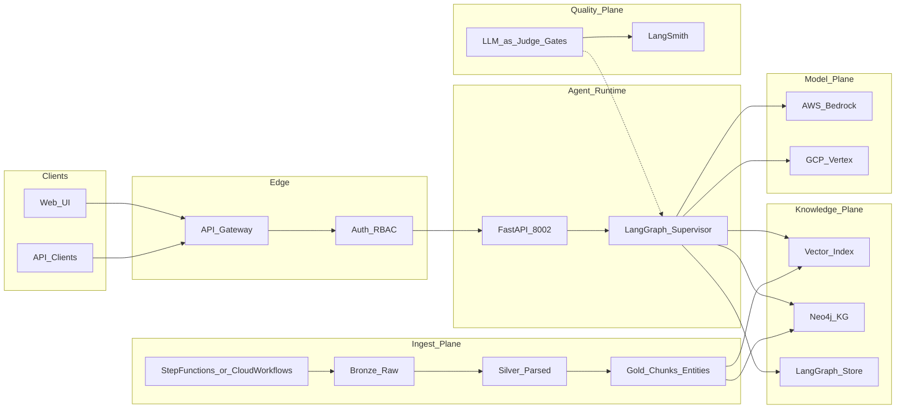
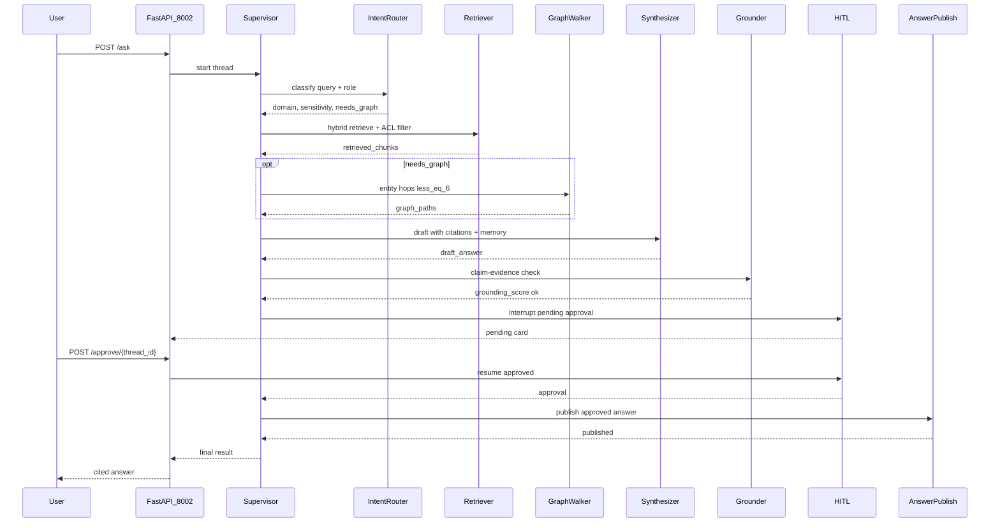

# Architecture

Canonical HLA/LLA for the Panasonic Enterprise GenAI Knowledge Platform (`panasonic-egkp`). Full narrative design remains in [SYSTEM_DESIGN.md](SYSTEM_DESIGN.md); as-built locks in [`../AS_BUILT.md`](../AS_BUILT.md). Prefer this file over duplicating divergent architecture diagrams in the README.

## High-Level Architecture (HLA)

Adapted from [SYSTEM_DESIGN.md](SYSTEM_DESIGN.md) §3.

Workers (supervisor-owned; never peer-route): `intent_router` → `retriever` → `graph_walker` → `synthesizer` → `grounder` → `hitl` → `answer_publish`.

## Low-Level Architecture (LLA)

Supervisor + HITL happy path (sensitive / low-confidence answer approved and published).

