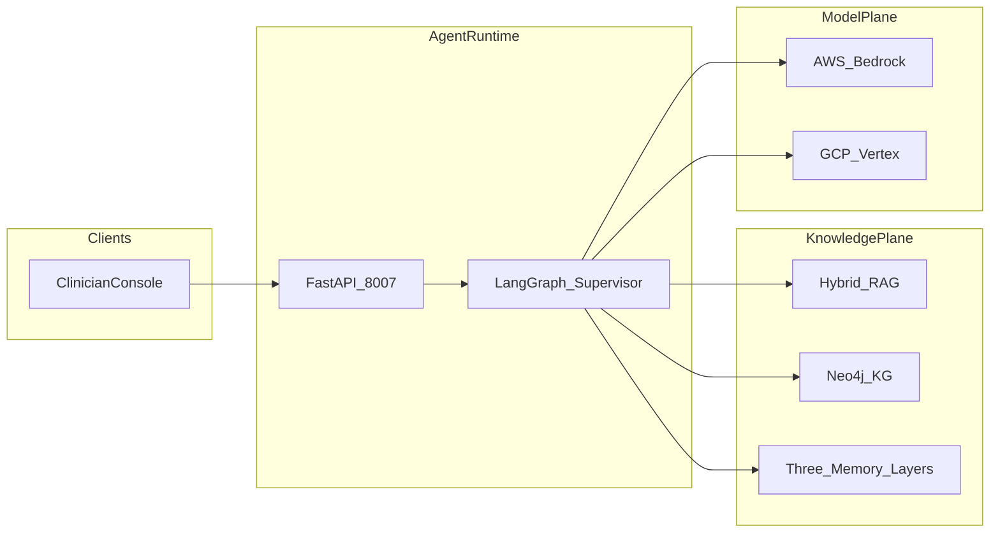

# System Design Document — CarePath AI

**Product:** CarePath AI (care pathways and clinical decision support)  
**Port:** Clinician console FastAPI **8007** · **Env:** `CAREPATH_*`  
**HLA/LLA:** [architecture.md](architecture.md) · **As-built:** [`../AS_BUILT.md`](../AS_BUILT.md)

Sister of HEDI Platform (quality / HEDIS) and RAIP Engine (evidence-first authoring). CarePath does **not** import those packages.

This is the presentation-grade design document. It describes **what is implemented**. It is not a HIPAA certification, live EHR integration, or production drug-interaction service.

---

## 1. Problem

Healthcare providers need personalized treatment plans for patients with complex histories and multiple chronic conditions. Manual planning is slow, misses medication interactions, and often ignores lifestyle and patient preferences. Uncited LLM drafts are unsafe for clinical use without retrieval grounding, interaction checks, and human approval.

CarePath’s job is a **defensible care pathway** for a single patient encounter — not payer prior-auth, not HEDIS scoring, and not regulatory document authoring.

## 2. Users

| Actor | Intent |
|-------|--------|
| Clinician | Generate, inspect, and edit a draft plan for a complex chronic patient |
| Clinical reviewer | HITL approve / edit / reject before mock EHR publish |
| Platform engineer | Ship only if golden evals and injection suite pass |

Golden patient **P001**: T2DM + HTN + 6 active medications.

## 3. Requirements

- Structure EHR notes + labs into a patient profile (synthetic seeds).
- Surface major / moderate / minor medication interactions before the plan is finalized.
- Draft goals, interventions, monitoring, and follow-up with citations from guidelines or the knowledge graph.
- Incorporate stated patient preferences (e.g. avoid injectables).
- Always interrupt for clinician HITL before publish.
- Dual-cloud model path: Bedrock primary, Vertex swap, `CAREPATH_MODEL=fake` for CI.

## 4. Assumptions

- v1 corpus and patients are **synthetic**. No production PHI.
- Medication checks use the seeded interaction table + GraphRAG, not live RxNorm / openFDA.
- Publish writes an append-only mock log, not Epic / Cerner.
- `fake` model proves mechanism (routing, citations, HITL), not clinical validity.
- Workers never peer-route; only the supervisor routes.

## 5. Architecture



Full HLA/LLA: [architecture.md](architecture.md). Locked decisions: [`../AS_BUILT.md`](../AS_BUILT.md).

## 6. Data flow

```
START → firewall → supervisor
          ├─ patient_data_extractor
          ├─ medication_interaction_checker
          ├─ treatment_plan_generator
          ├─ patient_preference_agent
          ├─ treatment_plan_evaluator   (may clear draft → revise, max 2)
          ├─ hitl                       (interrupt)
          ├─ plan_publish               (audit JSONL + mock EHR)
          └─ END
```

Clinician → FastAPI `:8007` → firewall scan → LangGraph `TreatmentPlanState` → extract → med check → draft → preferences → evaluator → HITL card → approve/edit → `data/published_plans.log`.

## 7. Agent roles

Workers **never** call each other. The supervisor is a router, not a clinician.

| Agent | Role |
|-------|------|
| Firewall | Hard-block prompt injection / exfil; refusal path still publishes a blocked record |
| Supervisor | Pure routing on state fields |
| Patient data extractor | Structure EHR + notes; enrich via KG |
| Medication interaction checker | Flag major / moderate / minor interactions |
| Treatment plan generator | Draft goals, interventions, monitoring, follow-up |
| Patient preference agent | Adapt plan to stated preferences |
| Treatment plan evaluator | Safety + guideline + citation judge |
| HITL | Clinician interrupt (`langgraph.types.interrupt`) |
| Plan publish | Append-only audit log + mock EHR write |

## 8. RAG flow

- Corpus under `data/corpus/` (guidelines, drug-interaction summaries, lifestyle counseling).
- Hybrid retrieval: dense + BM25-style lexical merge + light rerank.
- Domain ACL tags: `endocrinology`, `cardiology`, `pharmacy`, `pulmonology`, `psychiatry`.
- GraphRAG node types: Patient, Condition, Medication, Lab, Guideline, Protocol. Edges include `HAS_CONDITION`, `PRESCRIBED`, `INTERACTS_WITH`, `CONTRAINDICATED_FOR`, `GUIDELINE_FOR`, `MONITORS`.
- When `NEO4J_URI` is unset, JSONL seeds in `data/kg/` power an in-memory adjacency fallback.
- Memory: procedural protocols, episodic patient history, semantic prior-edit store.

## 9. Claim-level provenance

CarePath provenance is **plan-statement provenance**, not RAIP’s claim-verification graph.

Each published plan records: patient id, draft text, `citations[]` (corpus chunk or KG path), medication alerts, safety score, HITL actor/decision, and timestamp in `data/published_plans.log`. A reviewer can reconstruct *what was recommended and from which seed source* for that run. There is no `CLAIM_SUPPORTED_BY` edge store and no per-sentence support enum.

## 10. Groundedness

Factual / clinical statements in the draft must come from retrieved passages or KG paths. The evaluator scores guideline adherence and citation coverage. A revise loop (max 2) can clear the draft if the judge requests it. Groundedness here is **heuristic + LLM-as-judge**, not a deterministic claim matcher. That is an honest gap versus RAIP.

## 11. Citation validation

Citations are attached during generation from retrieval/KG hits. The evaluator boosts coverage when the draft references citation markers or protocol/guideline language. Target: **≥ 90% of claims cited** on golden paths. v1 does not checksum citation ids against an evidence store the way RAIP does; invalid or decorative cites are a known limitation of the clinician-plan path.

## 12. PHI/PII

- Golden and demo patients are **synthetic** (P001 and siblings).
- No live FHIR, no production EHR, no real member identifiers.
- Injection suite includes “dump patient PHI” style attacks; firewall must block.
- This package is **not** a HIPAA production system. Encryption at rest, BAA, and enterprise DLP are out of scope.

## 13. Security

- Input firewall: hard-block jailbreak / exfil patterns; HITL-bypass attempts escalate rather than auto-approve.
- Clinical domain always interrupts; the model cannot self-publish.
- Dual-cloud judge (`CAREPATH_JUDGE_MODEL`) should be cross-provider vs the generator when both are configured.
- Secrets via env; no hardcoded cloud keys.
- Injection suite: **≥ 95%** on 50 attacks before promote.

## 14. Evaluation

| Suite | Gate |
|-------|------|
| Golden scenarios (`evals.run_all`) | 3/3 with `CAREPATH_MODEL=fake` (P001 cited plan, HITL publish, preference path) |
| Injection (`security.injection_eval`) | ≥ 95% |
| Judge safety score (golden) | ≥ 0.90 |
| Citation coverage (golden) | ≥ 90% |
| Major interactions addressed | 100% on golden paths |

`fake` results prove wiring, not a clinical validation study.

## 15. Quality gates

Promote only if: goldens pass, injection ≥ 95%, major interactions surfaced, HITL required on the clinical path, and deploy entrypoints import under `fake`. Composer constraints that must not regress: workers never peer-route; factual claims need citations; judge cross-provider when both clouds are set.

## 16. Failure handling

| Failure | Behavior |
|---------|----------|
| Firewall block | Skip generation; publish a refusal / blocked record |
| Missing patient profile / meds / draft | Supervisor routes to the next required worker |
| Judge `needs_revise` and `revise_count < 2` | Clear draft → generator |
| HITL reject | `END` without mock EHR write |
| Process restart with MemorySaver | In-flight HITL is lost (use Sqlite / Postgres checkpointer) |
| Neo4j down | JSONL KG fallback |

## 17. Scaling

v1 is a single FastAPI process + optional Neo4j/Postgres. Horizontal scale is a production concern: replica APIs, shared Postgres checkpointer for HITL, Neo4j Aura or equivalent, and corpus indexing outside the request path. No Kafka-in-path in v1.

## 18. Cost

Local `fake` is $0 model spend. Cloud path: one generator pass plus optional judge call per plan, plus embedding calls if not cached. Cost is not metered in-app; keep `CAREPATH_MODEL=fake` for CI. Do not claim production unit-cost SLAs.

## 19. Productionization

| Target | Entrypoint | Checkpointer |
|--------|------------|-------------|
| Local | `python -m app.main` | Sqlite / MemorySaver |
| Bedrock AgentCore | `deploy/agentcore/entrypoint.py` | PostgresSaver when `POSTGRES_DSN` set |
| Vertex Agent Engine | `deploy/vertex_engine/entrypoint.py` | PostgresSaver when `POSTGRES_DSN` set |

AgentCore / Vertex entrypoints are **sketches that run fake smoke**, not applied production deploys.

## 20. Trade-offs

- Supervisor loop over a fully autonomous multi-agent mesh: auditable routing, slower than a single prompt.
- Always-on HITL: safer clinical demo, not a lights-out workflow.
- Seeded med table vs live RxNorm: reproducible goldens, stale interaction knowledge.
- Heuristic citation coverage vs claim-level matching: faster v1, weaker hallucination control than RAIP.
- FastAPI HTML console vs React SPA: no npm, less UX polish.

## 21. Known limitations

Live FHIR/Epic/Cerner, real RxNorm/openFDA APIs, insurance prior-auth, enterprise IdP/SSO, encryption-at-rest as an app feature, and HIPAA production hardening are **not** implemented. Sample data is synthetic. CarePath is not a diagnostic device and not a HIPAA certification.

## 22. Future improvements

- Insurance prior-auth agent + payer policy GraphRAG (belongs in HEDIP; do not duplicate at runtime).
- Live FHIR R4 read/write.
- RxNorm / openFDA interaction APIs.
- Stronger citation-id validation (move toward RAIP-style chunk checksums).
- HIPAA audit logging and encryption as platform controls.
