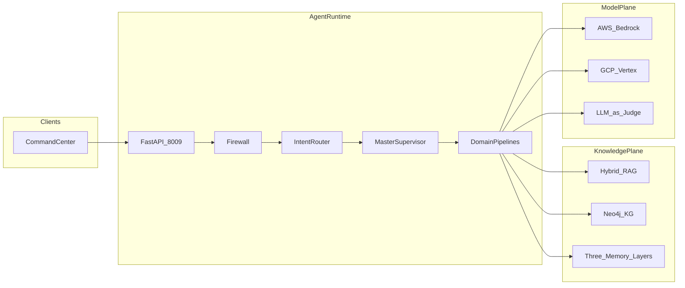

# System Design Document — HEDI Platform (HEDIP)

**Product:** Healthcare Effectiveness Data & Information Performance Engine  
**As-built name:** Healthcare Decision Intelligence Platform  
**Port:** Command Center FastAPI **8009** · **Env:** `HEDIP_*`  
**HLA/LLA:** [architecture.md](architecture.md) · **As-built:** [`../AS_BUILT.md`](../AS_BUILT.md)

Sister of CarePath AI (care pathways) and RAIP Engine (evidence-first authoring). HEDIP reimplements clinical CDS as **one domain**; it does **not** import `carepath-ai` at runtime.

This is the presentation-grade design document. It describes **what is implemented**. It is not a live CMS/PBM integration, production HEDIS engine, or HIPAA certification.

---

## 1. Problem

Providers and payers operate fragmented stacks across EHR, claims, policies, guidelines, pharmacy, and documents. Prior authorization, denial prevention, clinical CDS, care coordination, fraud, knowledge Q&A, population risk, and RCM coding all need multi-agent retrieval, GraphRAG, judges, and HITL — not a chatbot.

HEDIP’s job is **decision intelligence** for that umbrella. Quality / HEDIS-style performance is the suite thesis and lands on the population-health, claims, RCM, and knowledge domains. It is not CarePath’s single-patient care pathway and not RAIP’s evidence-gated document authoring.

## 2. Users

| Actor | Intent |
|-------|--------|
| Utilization / PA nurse | Submit a prior-auth case; inspect cited policy outcome |
| Claims / denial analyst | Score denial risk and recommended appeal language |
| Clinician (CDS domain) | Get a cited clinical recommendation (HEDIP-owned CDS, not CarePath) |
| Care coordinator | Thin structured handoff / next-step list |
| SIU / fraud analyst | Investigate-risk score (HITL before action) |
| Population-health / quality analyst | Risk and gap-style views (HEDIS thesis) |
| RCM coder | Coding-assist suggestions |
| Knowledge user | Policy / guideline Q&A |
| Platform engineer | Domain goldens + injection ≥ 95% before promote |

## 3. Requirements

- One Command Center routes each request to a domain pipeline.
- Shared knowledge plane: hybrid RAG, Neo4j GraphRAG (JSONL fallback), three memory layers.
- Full pipelines: prior_auth, claims, clinical_cds, knowledge.
- Thin structured workers: care_coord, fraud, pop_health, rcm.
- HITL required for prior_auth, claims, clinical_cds, and fraud (investigate).
- Citations required for policy / clinical claims.
- Dual-cloud models via `HEDIP_MODEL` / `HEDIP_JUDGE_MODEL`; `fake` for CI.

## 4. Assumptions

- v1 members, claims, and policies are **synthetic**. No live EHR or CMS/PBM APIs.
- One request maps to **one domain** (no multi-domain fan-out in v1).
- HEDIS is a thesis on existing domains, not a certified measure calculator.
- Workers never peer-route; only the master supervisor / domain routers dispatch.
- `fake` proves routing and citation wiring, not actuarial or clinical validity.

## 5. Architecture



Domains (v1): `prior_auth`, `claims`, `clinical_cds`, `care_coord`, `knowledge`, `fraud`, `pop_health`, `rcm`. Full HLA/LLA: [architecture.md](architecture.md).

## 6. Data flow

```
START → firewall → intent_router → master_supervisor
  → domain_{prior_auth|claims|clinical_cds|care_coord|knowledge|fraud|pop_health|rcm}
  → shared_judge → hitl? → publish → END
```

User → FastAPI `:8009` → firewall → intent classification → domain workers retrieve policies/guidelines/claims seeds → draft recommendation + `citations[]` → shared judge (groundedness / citation / hallucination risk) → HITL on sensitive domains → publish + audit.

Happy-path sequence (prior auth): [architecture.md](architecture.md) LLA.

## 7. Agent roles

| Node | Role |
|------|------|
| Firewall | Block jailbreak / exfil on the user query |
| Intent router | Map the request to one domain |
| Master supervisor | Dispatch only; never peer-routes workers |
| Domain pipelines | PA, claims, CDS, knowledge (full); care coord, fraud, pop health, RCM (thin) |
| Shared judge | Groundedness, citation coverage, hallucination risk, safety score |
| HITL | Interrupt on prior_auth, claims, clinical_cds, fraud (investigate) |
| Publish | Persist decision + citations + audit |

Regulatory / HEDIS calculators are **not** extra chat agents. Quality thesis work uses the same domain + judge + HITL path.

## 8. RAG flow

- Hybrid BM25 + dense over a shared corpus (policies, guidelines, coding notes).
- Neo4j GraphRAG when `NEO4J_URI` is set; otherwise JSONL in `data/kg/`.
- Memory: procedural playbooks, episodic prior decisions, semantic feedback.
- Domain retrieval should stay scoped to the active domain’s corpus tags; v1 is a shared index with metadata filters, not eight isolated clusters.
- Graph is used for relationship context (member–claim–policy–measure style seeds), not RAIP’s document-supersession graph.

## 9. Claim-level provenance

HEDIP provenance is **decision / request provenance**, not RAIP’s per-sentence evidence map.

A published decision records: domain, request payload (synthetic), retrieved citation list, judge scores, HITL actor/decision, and outcome. An analyst can reconstruct *which policy/guideline chunks supported this PA or claims recommendation*. There is no `evidence_map` of `SUPPORTED | UNSUPPORTED` per sentence and no publication-AND gate that blocks a high score on one unsupported clause — that is RAIP’s differentiator.

## 10. Groundedness

The shared judge scores `groundedness`, `citation_coverage`, and `hallucination_risk` (heuristics ∩ optional LLM-as-judge). Policy and clinical claims are supposed to be backed by retrieved chunks. Thin domains return structured outputs with lighter grounding. Groundedness is **judge-scored**, not a deterministic claim matcher.

## 11. Citation validation

Citations are retrieval hits attached to the domain draft. The judge inspects whether citations exist and how they relate to the draft. v1 does not validate citation ids against chunk checksums or fail closed on a single unsupported sentence. Decorative or stale cites are a known limitation versus RAIP.

## 12. PHI/PII

- Members, claims, and clinical snippets are **synthetic**.
- No live CMS, PBM, or EHR identifiers.
- Firewall targets PHI-exfil style prompts in the injection suite.
- Not a HIPAA production system: no BAA, no in-app encryption-at-rest, no enterprise DLP.

## 13. Security

- Query firewall before intent routing.
- Sensitive domains cannot auto-publish (HITL).
- Cross-provider judge when `HEDIP_JUDGE_MODEL` is set.
- Env-based secrets; dual-cloud adapters.
- Injection suite **≥ 95%** before promote.
- No Kafka-in-request-path (DoS / replay surface stays out of v1).

## 14. Evaluation

| Suite | Gate |
|-------|------|
| Domain goldens (`evals.run_all`) | PA / Claims / CDS / Knowledge pass under `HEDIP_MODEL=fake` |
| Thin domains | Structured outputs present |
| Injection | ≥ 95% |
| Dual deploy smoke | AgentCore + Vertex entrypoints import under `fake` |

Results prove mechanism across eight domains, not NCQA HEDIS certification.

## 15. Quality gates

Promote only if: domain goldens pass, injection ≥ 95%, HITL remains on sensitive domains, workers never peer-route, and citations remain required for policy/clinical claims. Do not promote on a high judge score if HITL was skipped on PA/claims/CDS/fraud.

## 16. Failure handling

| Failure | Behavior |
|---------|----------|
| Firewall block | Skip domain pipeline; publish refusal |
| Unknown / low-confidence intent | Stay on knowledge or fail closed per router rules — do not silently fan out |
| Judge fail on sensitive domain | HITL still required; do not auto-publish |
| HITL reject | End without publish |
| Neo4j unset / down | JSONL KG fallback |
| MemorySaver restart | In-flight HITL lost |

## 17. Scaling

v1 is one API process routing eight domains. Production scale means: shared Postgres checkpointer, Neo4j/pgvector sized for the corpus, domain workers as separate processes only if latency requires it, and **no** in-request Kafka. Multi-domain fan-out is explicitly not v1.

## 18. Cost

`fake` CI is $0 model spend. A live request may call generator + judge and embeddings per domain. Eight domains increase the *potential* bill if mis-routed; the intent router exists to keep that to one pipeline. No in-app cost SLA.

## 19. Productionization

| Target | Notes |
|--------|--------|
| Local | `uv run python -m app.main` (or `app.graph`) on **8009** |
| Docker | Suite compose Postgres **5436**, Neo4j **7476 / 7689** |
| Bedrock AgentCore / Vertex | Entrypoints exist for **fake smoke**; not applied production deploys |

OIDC, live payer APIs, and HIPAA BAA infra are future platform work.

## 20. Trade-offs

- Umbrella platform vs eight microservices: one graph and one console for the demo; noisier product story.
- Reimplement CDS inside HEDIP vs calling CarePath: runtime isolation, duplicated clinical logic.
- Full vs thin domains: honest v1 depth; pop_health / RCM are not full HEDIS engines.
- Judge-scored grounding vs RAIP claim gates: faster multi-domain ship, weaker publication integrity.
- Always-on HITL for four domains: safer, not lights-out utilization management.

## 21. Known limitations

Live Epic/Cerner FHIR, real CMS/PBM APIs, Kafka-in-path, production HIPAA hardening, certified HEDIS measure calculation, and multi-domain fan-out in one request are **out of scope**. Sample data is synthetic. HEDIP is not a NCQA product and not a HIPAA certification.

## 22. Future improvements

- Deepen pop_health / RCM toward HEDIS-style gap lists on the same HITL path.
- Stronger citation-id / checksum validation.
- Real (still synthetic-scoped) measure definitions without claiming certification.
- OIDC and encryption as platform controls.
- Narrative handoff to RAIP for documentation (copy the artifact; do not wire a runtime mesh).
