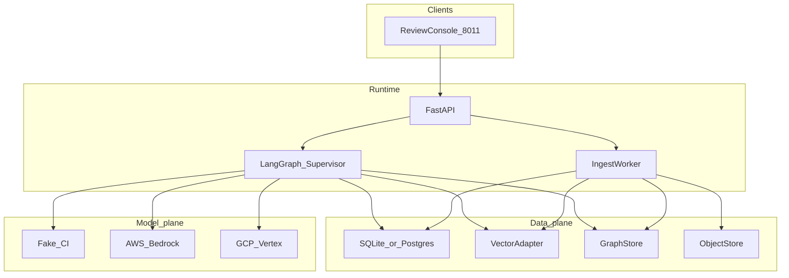

# System Design Document — RAIP Engine

**Product:** RAIP Engine — ReguMed Authoring Intelligence Platform  
**Suite thesis:** Risk Adjustment & Quality Incentive Processing on the same evidence gate  
**Port:** FastAPI review console **8011** · **Env:** `RAIP_*`

Sister of CarePath AI (care pathways) and HEDI Platform (quality / HEDIS). RAIP does **not** import those packages.

HLA: [architecture/HIGH_LEVEL.md](architecture/HIGH_LEVEL.md) · LLA: [architecture/LOW_LEVEL.md](architecture/LOW_LEVEL.md) · As-built: [`../AS_BUILT.md`](../AS_BUILT.md) · Security: [security/SECURITY.md](security/SECURITY.md) · Evaluation: [evaluation/EVALUATION.md](evaluation/EVALUATION.md)

This is the presentation-grade design document. It describes **what is implemented**. It is not a chatbot, not CarePath CDS, not a production CMS-HCC calculator, and not a HIPAA certification.

---

## 1. Problem

Clinical and regulatory authors spend significant time reconciling guidelines, regulations, SOPs, and templates. Generic LLMs draft quickly but can emit **plausible unsupported claims** — a high-severity failure in regulated authoring and in risk-adjustment / quality-incentive documentation.

CarePath and HEDIP prove agents can retrieve and cite. RAIP must prove **generation is subordinate to evidence**, and unsupported material claims **cannot publish** — even when the aggregate quality score looks high.

## 2. Users

| Actor | Intent |
|-------|--------|
| Author | Upload approved PDFs, request a section draft, inspect claims |
| Medical / regulatory / quality reviewer | HITL approve, edit, or reject |
| Auditor | Reconstruct `request_id` → sources, claims, scores, decision |
| Admin | Tenant and role headers (local); IdP in production |
| Platform engineer | Ship only if goldens pass and injection ≥ 95% |

Source PDFs are untrusted **data**, never instructions.

## 3. Requirements

- Draft document **sections** from approved, versioned sources and templates.
- Hybrid retrieval + GraphRAG supersession with tenant filters.
- Claim extraction with support status per claim.
- Publication is a boolean AND of gates; critical failure overrides score.
- HITL required in demo (`RAIP_HITL=required`); `evaluate` skips interrupt for CI.
- Dual-cloud model gateway; `RAIP_MODEL=fake` for CI.
- HCC / RAF / quality-incentive narratives must use the **same** publication gate when those document types land (suite thesis — not a live RAF calculator in v1).

## 4. Assumptions

- v1 corpus is **synthetic**. No production PHI.
- Local default is SQLite + in-memory graph; Postgres+pgvector and Neo4j via Compose / env.
- Scanned PDFs are flagged `ocr_required`; production OCR is not shipped.
- LLM-as-judge is **secondary** and cannot override a critical unsupported/contradicted material claim (ADR 0003).
- Workers never peer-route. Regulatory, template, safety, and security are **gate functions**, not extra chat agents.
- `fake` proves mechanism (29/29 goldens, 50/50 injection on 2026-08-13), not a clinical study.

## 5. Architecture



Containers and C4 context: [architecture/HIGH_LEVEL.md](architecture/HIGH_LEVEL.md). Module/graph detail: [architecture/LOW_LEVEL.md](architecture/LOW_LEVEL.md).

## 6. Data flow

1. Author uploads PDF/text → allowlist (MIME, size, hash) → object store → ingest worker chunks (parent/child, page, checksum, authority tier).
2. Author requests a section → firewall on the **user query** → supervisor routes.
3. Evidence retrieval (tenant-scoped BM25 + dense + RRF + GraphRAG supersession) → evidence map.
4. Drafting is template-constrained and may use **only** the evidence map; unsupported → `EVIDENCE GAP`.
5. Claim verification assigns support status; quality gates run; HITL interrupt when required.
6. Persist versioned draft + audit. Publish only if every required gate and human approval pass.

## 7. Agent roles

| Node | Role |
|------|------|
| Firewall | Block jailbreak on the user query; PDFs remain data |
| Supervisor | Route only; `max_graph_steps` cap; never drafts |
| Evidence retrieval | Tenant-scoped BM25 + dense + RRF + GraphRAG supersession |
| Evidence synthesis | Evidence map, conflicts, authority ranking |
| Drafting | Template-constrained; evidence map only |
| Claim verification | `SUPPORTED` / `PARTIAL` / `UNSUPPORTED` / `CONTRADICTED` / `N/A` |
| Quality gates | Grounding, citation, safety, regulatory, template, security |
| Editorial | Tone only; cannot override grounding |
| Publication gate | Boolean AND; critical failure overrides score |
| HITL | Interrupt when `RAIP_HITL=required` |
| Persist | Versioned draft + `AuditEvent` |

## 8. RAG flow

- BM25 (in-process rank-bm25) + dense cosine → Reciprocal Rank Fusion → authority / lexical rerank.
- Parent/child chunks with page, section, checksum, authority tier (configurable 1–6).
- Tenant filter on **every** retrieve.
- GraphRAG relationship plane: document supersession, section containment, `CLAIM_SUPPORTED_BY` / `CLAIM_CONTRADICTED_BY`. Postgres/SQLite remains source of truth for text and audit; Neo4j when `NEO4J_URI` is set.
- Current versions preferred; superseded language dropped by default. Missing supersession with conflicting recommendations → `CONFLICT DETECTED` + HITL.
- Memory layers (playbooks, prior reviews) are hints, not a substitute for the evidence store.

## 9. Claim-level provenance

This is RAIP’s core differentiator (ADR 0003).

After drafting, material claims are split (deterministic segmentation + classifiers) and matched to retrieved chunks (lexical Jaccard + embedding cosine). Each claim carries support status and pointers to chunk ids, pages, checksums, and authority tier. Graph edges record `CLAIM_SUPPORTED_BY` / `CLAIM_CONTRADICTED_BY`. An auditor can reconstruct `request_id` → sources → claims → scores → decision. Claims persist as `claims_json` on drafts in v1 (not separate claim tables).

## 10. Groundedness

Drafting may only use the `evidence_map`. If the author asks for something with no approved support (e.g. a CRISPR protocol in the golden set), the system emits **EVIDENCE GAP** and must not invent a citation. Policy target for promotion: grounding ≥ 95%. LLM judge cannot waive a critical unsupported/contradicted material claim.

## 11. Citation validation

Citations must resolve to real chunk ids (checksum / page / section). Citation swap and poisoned-PDF instruction attacks are in the threat model: retrieved text is `wrap_untrusted` delimited; citation validation is against the store, not the model’s word. Citation gate must PASS for publication. Do not invent citations. Measured fake-model goldens include metformin grounded and DrugZ absent.

## 12. PHI/PII

- **No production PHI.** Sample PDFs and drafts are synthetic.
- Tenant isolation: all tables include `tenant_id`; retrieval and graph queries are tenant-scoped; CI fails if Northstar can see another tenant’s secret token.
- Log redaction regex; do not log full clinical drafts at info in production configurations.
- HIPAA-ready **patterns** only — not a certification or BAA.

## 13. Security

STRIDE summary (full table: [security/SECURITY.md](security/SECURITY.md)):

- Spoofing: local header RBAC (`X-Tenant-Id`, `X-User-Id`, `X-Role`); OIDC in production.
- Tampering: checksums, untrusted wrappers, citation validation.
- Repudiation: `AuditEvent` + review rows.
- Disclosure: tenant filters + isolation tests.
- DoS: upload size cap, `max_graph_steps`.
- Privilege: publication gate ignores the model; HITL required in demo.

Uploads: allowlisted extensions, size cap, SHA-256. ClamAV is a production boundary, not v1. Injection suite target: **≥ 95%** on 50 attacks (measured 50/50 with `fake` on 2026-08-13).

## 14. Evaluation

Record **measured** numbers from the suites; do not hand-edit reports.

| Suite | Gate | Measured 2026-08-13 (`fake`) |
|-------|------|------------------------------|
| Pytest | All pass (incl. tenant isolation) | 20 passed |
| Golden authoring / retrieval / grounding | All cases (policy ≥ 80%) | 29/29 |
| Injection | ≥ 95% | 50/50 |

Metrics implemented: retrieval hit + provenance, tenant leak check, grounded metformin / absent DrugZ / EVIDENCE GAP on CRISPR, critical unsupported ⇒ `PUBLICATION_BLOCKED`. Details: [evaluation/EVALUATION.md](evaluation/EVALUATION.md). These are local fake-model results, not a clinical validation study.

## 15. Quality gates

```
APPROVED iff
  grounding PASS
  AND citation PASS
  AND safety PASS
  AND regulatory PASS
  AND template PASS
  AND security PASS
  AND human approval
```

Critical safety failure ⇒ `PUBLICATION_BLOCKED` regardless of weighted score (ADR 0008). Configurable promotion targets: grounding ≥ 95%, citation ≥ 95%, unsupported rate ≤ 1% on material claims without an explicit gap, injection ≥ 95%, critical safety failures = 0.

## 16. Failure handling

| Failure | Behavior |
|---------|----------|
| User-query jailbreak | Firewall hard-block; no draft |
| Poisoned PDF instructions | Treated as data; `wrap_untrusted`; citation/grounding gates still apply |
| Unsupported material claim | `EVIDENCE GAP`; publication blocked |
| Contradicted / missing supersession | `CONFLICT DETECTED` + HITL |
| Scanned PDF | `ocr_required`; no fake OCR text |
| Critical gate fail with high weighted score | Still `PUBLICATION_BLOCKED` |
| HITL reject | Draft not publishable |
| Cross-tenant retrieval | CI fail |
| Windows `.venv` lock | Use `scripts/with-python.ps1` / `scripts/run.sh` — not `uv run` |

## 17. Scaling

Pilot → expansion → enterprise: [architecture/PILOT_TO_SCALE.md](architecture/PILOT_TO_SCALE.md). v1 is one API + polling ingest worker. Production path: API replicas, Postgres checkpointer for HITL stickiness, pgvector/OpenSearch, Neo4j Aura, object store (S3/GCS), SQS/Pub/Sub for ingest. Same job schema and chunk ids so retrieval fusion stays stable.

## 18. Cost

`RAIP_MODEL=fake` is $0 model spend (CI). Live drafts cost generator + embeddings + optional secondary judge; ingest costs parse + embed per chunk. A cost-estimate field exists on provenance for the demo. There is no production unit-cost SLA. Prefer fake for regression.

## 19. Productionization

Local vs production matrix: [architecture/LOCAL_VS_PRODUCTION.md](architecture/LOCAL_VS_PRODUCTION.md).

| Target | Data |
|--------|------|
| Local (`bash scripts/run.sh` / `.\scripts\run.ps1`) | SQLite; in-memory graph; `RAIP_MODEL=fake` |
| Docker Compose from `raip/` | Postgres+pgvector + Neo4j + API **8011** + worker |
| Bedrock AgentCore / Vertex | Entrypoint **sketches** — not applied |
| Terraform / K8s | Sketches — not applied |

Auth today: headers. Production: OIDC. OCR, ClamAV, Pinecone/OpenSearch adapters are documented interfaces, not running farms.

## 20. Trade-offs

- Fewer agents + gate functions vs a large agent mesh (ADR 0006): auditable, less “agent theater.”
- Deterministic-first claim matching vs NLI entailment: reproducible `fake` evals; NLI is a future accuracy upgrade.
- Boolean publication gate vs a 97% quality score: one unsupported dosage cannot ship.
- SQLite default vs Postgres-only: laptop demo works; HA is Compose/prod.
- HTML 3-pane console vs React SPA: no npm; less polish.
- PDFs as data vs trusting retrieved instructions: extra wrapping, essential for injection resistance.

## 21. Known limitations

Not implemented: production OCR, ClamAV, live OIDC, Pinecone/OpenSearch (interface only), Kafka, React UI, live EHR/FHIR, HIPAA certification/BAA, production CMS-HCC / RAF calculator. `AuthoringState` is a TypedDict; Pydantic models are the contracts. Claims live in `claims_json` on drafts. Do not present v1 as a certified risk-adjustment engine.

## 22. Future improvements

- HCC / RAF narratives as **document types** on the same evidence store and publication gate (unsupported codes must not publish).
- Quality-incentive gap notes handed off from HEDIP (narrative copy, not a runtime mesh).
- pgvector / OpenSearch / Pinecone adapters in production; OIDC; Textract OCR worker; ClamAV sidecar.
- NLI entailment for claim matching.
- Additional templates and guideline families ([architecture/PILOT_TO_SCALE.md](architecture/PILOT_TO_SCALE.md)).
