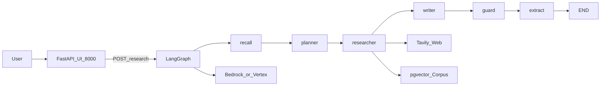
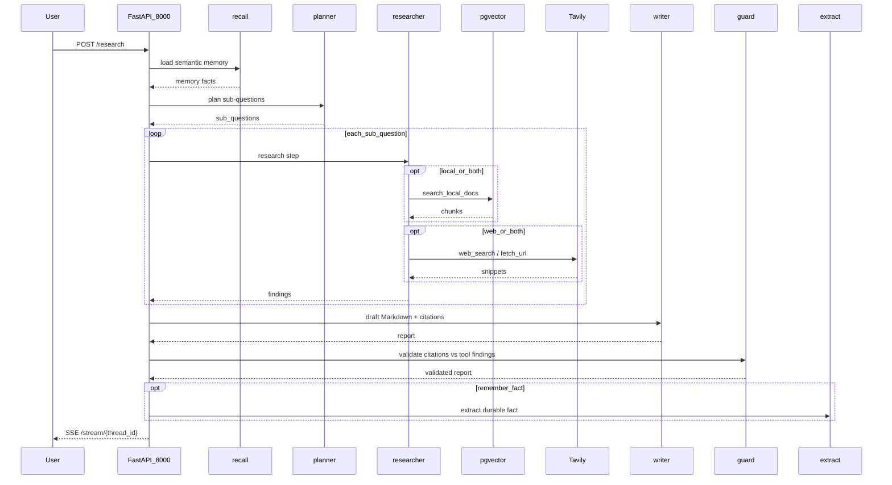

# Architecture

Canonical HLA/LLA for the Resonance AI Research Assistant. There is no standalone `SYSTEM_DESIGN.md` in this package; HLA is extracted from the README Mermaid / ASCII flow. Locked decisions: [`../AS_BUILT.md`](../AS_BUILT.md).

## High-Level Architecture (HLA)

| Node | Role |
|------|------|
| `recall` | Semantic memory facts for the session |
| `planner` | 3–7 sub-questions (`web` \| `local` \| `both`) |
| `researcher` | Tools ≤ 4 calls / sub-question |
| `writer` | Cited Markdown report |
| `guard` | Citation / URL validator |
| `extract` | Optional durable `remember()` |

## Low-Level Architecture (LLA)

Happy path: research question → cited report via SSE.

