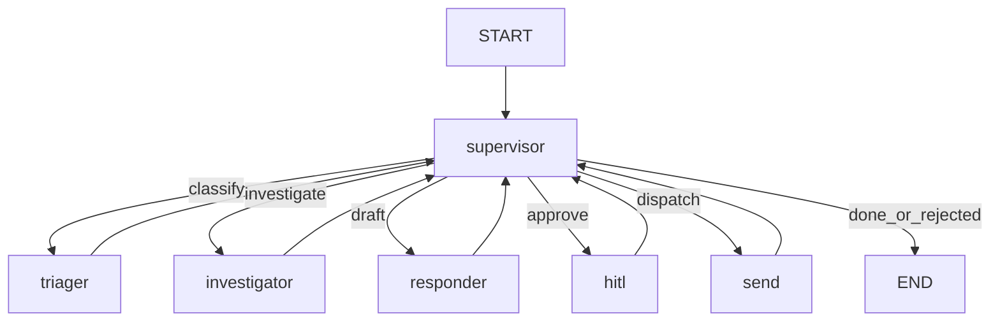
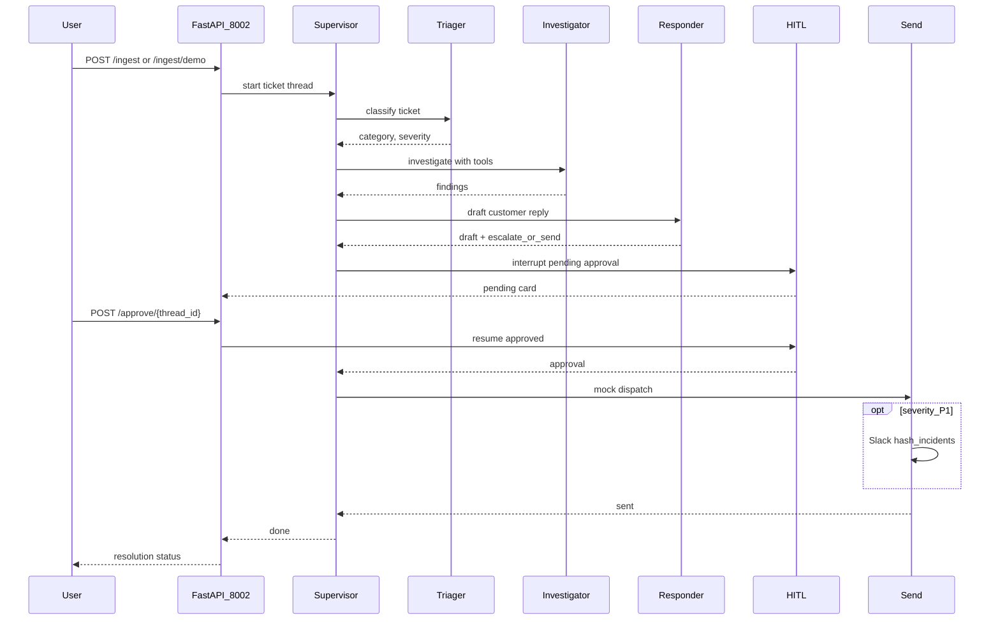

# Architecture

Canonical HLA/LLA for the Resonance Ticket Triage Agent. There is no standalone `SYSTEM_DESIGN.md` in this package; HLA is extracted from the README Mermaid / ASCII flow. Locked decisions: [`../AS_BUILT.md`](../AS_BUILT.md).

## High-Level Architecture (HLA)

| Worker | Role |
|--------|------|
| `triager` | Category + severity |
| `investigator` | Logs / metrics / runbooks / history (≤ 8 tools) |
| `responder` | Draft reply using three memory layers |
| `hitl` | Interrupt → approve \| edit \| reject |
| `send` | Mock email (+ Slack if P1) |

UI: FastAPI approval console on port **8002**.

## Low-Level Architecture (LLA)

Happy path: demo ticket → investigate → draft → HITL approve → send.

