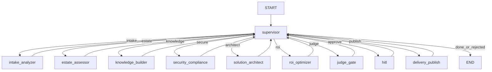

# As-Built Planning Document — RoboForge AI

## Project title

**RoboForge AI: Autonomous Enterprise AI Delivery Platform (LangGraph Supervisor + GraphRAG + Continuous Learning + HITL)**

Package: `roboforge-ai` v0.1.0 — second R&P portfolio project under `8.robots-&-pencils/`.  
Reference patterns: Resonance Ticket Triage (Project 2), EGKP doc format, sibling [`rp-agentic-fabric`](../rp-agentic-fabric/).

---

## Purpose

An autonomous consulting / solution-factory system that:

1. Analyzes intake packs (RFP, SOW, architecture notes, policy excerpts)  
2. Assesses cloud estate + legacy applications (mocked inventories)  
3. Builds / queries an enterprise knowledge graph (Neo4j GraphRAG)  
4. Maps security + compliance controls to findings  
5. Drafts a Bedrock/AgentCore solution blueprint using three memory layers  
6. Estimates cost, ROI, and delivery risk  
7. Scores outputs with in-graph judges before human approval  
8. Publishes a delivery pack (roadmap, risk matrix, ROI) and writes lessons into episodic memory  

UI: FastAPI Forge Console at `http://127.0.0.1:8003`.

---

## Locked decisions

| Area | Decision |
|------|----------|
| Orchestration | LangGraph **supervisor loop** — workers never route to each other |
| Workers | `intake_analyzer` → `estate_assessor` → `knowledge_builder` → `security_compliance` → `solution_architect` → `roi_optimizer` → `judge_gate` → `hitl` → `delivery_publish` |
| Chat model (default) | `bedrock_converse:openai.gpt-oss-120b-1:0` via `RFAI_MODEL` |
| Vertex swap | `google_vertexai:gemini-2.5-pro` |
| Offline | `RFAI_MODEL=fake` |
| Embeddings | Titan v2 or fake hashed vectors |
| Local checkpointer | `SqliteSaver` → `checkpoints.sqlite` |
| Cloud checkpointer | `PostgresSaver` via `POSTGRES_DSN` |
| Procedural memory | `data/prompts/architect_{domain}.json` + AWS Pattern playbooks |
| Episodic memory | Past delivery packs / lessons (`data/episodic/*.jsonl` + pgvector optional) |
| Semantic memory | LangGraph Store (org facts, industry templates) |
| Knowledge graph | Neo4j or JSONL seeds in `data/kg/` |
| Tool budget (estate + knowledge) | Max **8** tool calls combined per worker |
| HITL | `interrupt` in `hitl_node` only; **always required** before publish |
| Outbound | Mock append to `data/delivery_packs.log` + episodic lesson writeback |
| Deploy | Bedrock AgentCore **and** Vertex AI Agent Engine |
| Evals | LangSmith-ready; security **≥ 95%** on 50 attacks |
| UI | FastAPI + fetch-polled console — **no React/npm in v1** |
| Explicitly not primary | CrewAI, AutoGen, Strands, Temporal-in-hot-path, Kafka-in-hot-path |
| Azure OpenAI | Out of scope v1 |
| Sibling boundary | Does **not** replace Fabric multi-tenant isolation; may cite Fabric patterns as procedural IP |

### Composer constraints (do not regress)

1. Workers never call each other — only supervisor routes.  
2. Every retrieval/tool call is scoped by `engagement_id` / `client_id`.  
3. HITL always before `delivery_publish`.  
4. Published packs must write at least one episodic lesson.  
5. Prefer updating this checklist when behavior changes intentionally.

---

## Architecture

### Graph flow

```
START → supervisor
          ├─ intake_analyzer        → supervisor
          ├─ estate_assessor        → supervisor
          ├─ knowledge_builder      → supervisor
          ├─ security_compliance    → supervisor
          ├─ solution_architect     → supervisor
          ├─ roi_optimizer          → supervisor
          ├─ judge_gate             → supervisor
          ├─ hitl                   → supervisor
          ├─ delivery_publish       → supervisor
          └─ END
```

| Route condition | Next |
|-----------------|------|
| `approval == "rejected"` | `END` |
| `intake is None` | `intake_analyzer` |
| `estate is None` | `estate_assessor` |
| `evidence == []` | `knowledge_builder` |
| `security_findings is None` | `security_compliance` |
| `blueprint is None` | `solution_architect` |
| `roi is None` | `roi_optimizer` |
| `judge_scores is None` | `judge_gate` |
| `approval == "pending"` | `hitl` |
| approved/edited and not `published` | `delivery_publish` |
| else | `END` |

### State (`ForgeState`)

`engagement_id`, `client_id`, `raw_pack`, `domain` (`modernize` \| `agentic` \| `rag` \| `migration`),  
`intake`, `estate`, `evidence`, `security_findings`, `blueprint`, `roi`,  
`judge_scores`, `approval`, `published`, `delivery_pack_id`, `step_log`, `next`

### Memory layers (Architect)

| Layer | Module | Behaviour |
|-------|--------|-----------|
| Procedural | `app/memory/procedural.py` | AWS Pattern / Bedrock playbook prompts |
| Episodic | `app/memory/episodic.py` | Similar past engagements + lessons |
| Semantic | `app/memory/semantic.py` | Org / industry facts via Store |

### Security model

- Hard-block injection / exfil patterns before intake completes  
- Optional Bedrock Guardrails on chat path  
- Judge fail or any regulated flag → still HITL (HITL always on)  
- 50-attack suite ≥ 95%



---

## Project layout (target)

```
roboforge-ai/
├── app/
│   ├── main.py                 # FastAPI Forge Console (:8003)
│   ├── graph.py
│   ├── state.py
│   ├── llm.py / _fake_llm.py / guardrails.py
│   ├── hitl.py
│   ├── agents/                 # supervisor + 9 workers
│   ├── memory/
│   ├── tools/                  # cloud_stub, legacy_stub, kg, hybrid_search, publish
│   └── ui/
├── evals/
├── security/
├── deploy/
├── data/
│   ├── corpus/{domain}/
│   ├── kg/
│   ├── prompts/
│   ├── episodic/
│   └── delivery_packs.log
├── docs/SYSTEM_DESIGN.md
├── AS_BUILT.md
├── project-prompts.md
└── README.md
```

---

## Demo engagement set

| ID | Domain | Client | Pack theme |
|----|--------|--------|------------|
| RF-1001 | agentic | RetailCo | Bedrock AgentCore customer-ops agents |
| RF-2001 | migration | EduBoard | Legacy SIS → serverless + RAG tutor |
| RF-3001 | modernize | CareNet | HIPAA care-ops on AWS with FHIR stubs |

Primary UI path: Demo RF-1001 → HITL approve → delivery pack written.

---

## Out of scope (v1)

- Live AWS Config / Azure Resource Graph / GCP Asset Inventory APIs  
- Live GitHub/mainframe deep code analysis (mock dependency graphs)  
- Full Next.js executive dashboard  
- CrewAI / Temporal / Kafka in the engagement hot path  
- Auto-apply production Terraform without HITL  

---

## Relationship to R&P Agentic Fabric

| Concern | Fabric | RoboForge |
|---------|--------|-----------|
| Primary job | Multi-tenant isolation + IP reuse governance | Solution factory: intake → blueprint → delivery pack |
| Port | 8002 | 8003 |
| Publish artifact | Audit / provenance pack | Delivery pack + episodic lesson |
| Always HITL? | Healthcare + FinServ | Yes (all domains) |

---

## Implementation sequence

1. Design docs (this package) — **done**  
2. Scaffold package + fake LLM (mirror Fabric)  
3. Supervisor + intake + estate  
4. Knowledge builder + security_compliance  
5. Architect + ROI + three memories  
6. Judge gate + HITL + delivery_publish + UI `:8003`  
7. Dual deploy scripts  
8. Evals + 50-attack suite  

---

## Verification checklist (when implemented)

- [ ] `RFAI_MODEL=fake` CLI reaches HITL then publishes after approve  
- [ ] Delivery pack lands in `data/delivery_packs.log`  
- [ ] Episodic lesson appended after publish  
- [ ] `security/injection_eval.py` ≥ 95%  
- [ ] Workers never set each other's `next`
