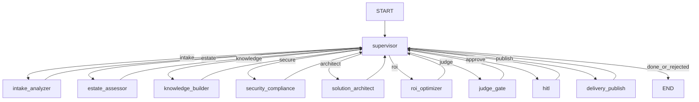

# RoboForge AI (`roboforge-ai`)

**Autonomous Enterprise AI Delivery Platform** for Robots & Pencils — compress weeks of discovery, architecture, compliance, and ROI work into a governed multi-agent run that learns from every engagement.

Client intake packs (RFP / architecture / cloud inventory / policies) are ingested, assessed across cloud + legacy + security/compliance, retrieved via hybrid RAG + Neo4j GraphRAG, assembled into a Bedrock-first solution blueprint (three memory layers), scored by in-graph judges, paused for **human-in-the-loop** executive approval, then published as a delivery pack (roadmap + ROI + risk matrix).

- **Orchestration:** LangGraph **supervisor loop** — workers never route to each other
- **Workers:** `intake_analyzer` → `estate_assessor` → `knowledge_builder` → `security_compliance` → `solution_architect` → `roi_optimizer` → `judge_gate` → `hitl` → `delivery_publish`
- **Memory:** procedural (AWS Pattern playbooks) · episodic (past engagements / lessons) · semantic (org + industry Store)
- **Knowledge graph:** Neo4j GraphRAG (App → API → DataStore → PII → Control → CloudResource)
- **Models:** AWS Bedrock primary or Google Vertex secondary; `fake` for offline demos
- **Judges:** Architecture soundness · Groundedness · Security/Compliance · Cost realism (consensus offline)
- **UI:** FastAPI Forge Console on **port 8003**
- **Deploy:** Bedrock AgentCore **and** Vertex AI Agent Engine
- **Quality / safety:** LangSmith evals + deploy gates + 50-attack injection suite (pass ≥ 95%)

Sibling platform (multi-tenant IP reuse / compliance fabric): [`../rp-agentic-fabric`](../rp-agentic-fabric/).  
Design record: [`AS_BUILT.md`](AS_BUILT.md) · Architecture: [`docs/architecture.md`](docs/architecture.md) · System design: [`docs/SYSTEM_DESIGN.md`](docs/SYSTEM_DESIGN.md) · Cursor prompts: [`project-prompts.md`](project-prompts.md)

---

## Unique problem (R&P-specific)

Robots & Pencils is an Applied AI Engineering Partner (AWS Advanced Tier, Pattern Partner, Bellevue GenAI studio, Velocity Pods shipping in 30–45 days). The competitive bottleneck is no longer “can we build an agent?” — it is:

> How do we **autonomously transform weeks of repeated enterprise consulting work** (discovery, cloud/legacy assessment, compliance mapping, RAG/agent design, ROI, roadmap) **into hours**, while keeping enterprise-grade quality, explainability, HITL governance, and a delivery system that **gets smarter with every engagement**?

This is the **Autonomous Enterprise AI Solution Factory** problem — meta-delivery for an AWS-first agentic consultancy.

---

## Better design vs the 30+ agent draft

| Draft idea | Locked v1 improvement |
|------------|------------------------|
| 30+ peer agents + CrewAI + Temporal + Kafka | **9-node LangGraph supervisor** (Project 2 contract) |
| Separate Discovery / Cloud / Legacy / Security / Compliance / RAG / ROI / Docs agents as peers | Folded into **estate_assessor**, **security_compliance**, **solution_architect**, **roi_optimizer** (+ tools) |
| React/Next.js executive dashboard first | FastAPI Forge Console `:8003` (Next.js deferred) |
| Mongo + Redis + Neptune + Pinecone + Weaviate all at once | Procedural files · episodic JSONL/pgvector · semantic Store · Neo4j (JSONL fallback) |
| Multi-orchestrator (LangGraph + CrewAI + Step Functions in the hot path) | LangGraph only for the engagement loop; Step Functions optional for batch ingest later |
| Azure + AWS + GCP cloud assessment equally | **AWS-first**; Azure/GCP inventory as mock stubs |

---

## Architecture

Canonical HLA/LLA: [`docs/architecture.md`](docs/architecture.md).

```
Intake pack → FastAPI (/forge | /forge/demo)
                 → LangGraph (SqliteSaver locally)
                      START → supervisor
                                ├─ intake_analyzer       objectives, stakeholders, constraints
                                ├─ estate_assessor       cloud + legacy score (mock inventories)
                                ├─ knowledge_builder     GraphRAG upsert + hybrid retrieve
                                ├─ security_compliance   OWASP/IAM + reg mapping
                                ├─ solution_architect    Bedrock/AgentCore blueprint (3 memories)
                                ├─ roi_optimizer         cost + ROI + latency model
                                ├─ judge_gate            architecture / groundedness / security / cost
                                ├─ hitl                  interrupt → approve | edit | reject
                                ├─ delivery_publish      roadmap + risk matrix + delivery pack
                                └─ END
                 ← Approval UI polls /pending → POST /approve/{thread_id}
```



**Routing (pure logic):** missing intake → analyzer; no estate → assessor; no KG evidence → knowledge_builder; no security findings → security_compliance; no blueprint → architect; no ROI → optimizer; no scores → judge_gate; fail judges or always-HITL → hitl; approved → delivery_publish; rejected → END.

---

## Project 2 → RoboForge mapping

| Ticket Triage (Project 2) | R&P Fabric (sibling) | RoboForge AI |
|---------------------------|----------------------|--------------|
| Ticket domains | Verticals | Engagement domains: `modernize` \| `agentic` \| `rag` \| `migration` |
| `triager` | `vertical_router` | `intake_analyzer` |
| `investigator` + tools | `retrieval` + `reuse_broker` | `estate_assessor` + `knowledge_builder` + `security_compliance` |
| `responder` | `engagement_synthesizer` | `solution_architect` + `roi_optimizer` |
| — | `judge_gate` | `judge_gate` (4 scores) |
| `hitl` | `hitl` | `hitl` (executive approve) |
| `send` | `audit_publish` | `delivery_publish` |

**How this differs from Fabric:** Fabric governs *multi-tenant IP reuse + compliance isolation* across concurrent clients. RoboForge is the *solution factory* that turns client artifacts into a validated delivery blueprint and continuously learns playbooks from published packs.

---

## Target metrics (demo-measurable)

| Metric | Target |
|--------|--------|
| Discovery pack → draft blueprint | &lt; 4 hours narrative; demo path &lt; 2 minutes offline |
| Groundedness / citation coverage | ≥ 0.85 / ≥ 90% |
| Security-compliance judge | ≥ 0.90 |
| Cost realism judge | ≥ 0.80 |
| Injection suite (50) | ≥ 95% blocked/escalated |
| HITL | Required before `delivery_publish` |
| Pattern reuse from episodic memory | ≥ 1 cited past engagement when corpus has match |

---

## Locked stack (summary)

| Layer | Choice |
|-------|--------|
| Agents | LangGraph supervisor (not CrewAI / AutoGen / Strands) |
| Memory | Procedural + episodic + semantic (+ org learning via published packs) |
| KG | Neo4j GraphRAG (JSONL fallback) |
| Models | Bedrock primary · Vertex secondary · `fake` offline |
| RAG | Hybrid dense+BM25 + GraphRAG; Bedrock KB optional |
| UI | FastAPI Forge Console `:8003` |
| Deploy | Bedrock AgentCore **and** Vertex Agent Engine |
| Safety | Hard-block + Bedrock Guardrails + 50-attack suite ≥ 95% |

---

## CI gates

GitHub Actions (`.github/workflows/ci.yml`) runs on push/PR:

- `uv sync --frozen --extra dev`
- `ruff check`
- `pytest` (smoke / unit)
- `evals/run_all.py` with `RFAI_MODEL=fake`
- injection suite ≥ 95% (`security/injection_eval.py`)

Locally: same commands from the package root. Copy `.env.example` → `.env` for offline defaults.

Docker: `docker build -t roboforge-ai .` then run on **port 8003** (`/health`).

### Roadmap to excellent

- Shared composite action for `uv` + ruff + pytest across sibling packages
- Nightly LangSmith eval runs (non-fake models) on a schedule
- `uv pip audit` / dependency vulnerability gate in CI

---

## How to build

1. Keep [`AS_BUILT.md`](AS_BUILT.md) as locked source of truth.
2. Implement via [`project-prompts.md`](project-prompts.md) day order (or port patterns from `rp-agentic-fabric`).
3. Workers never set each other's `next` — only the supervisor routes.
