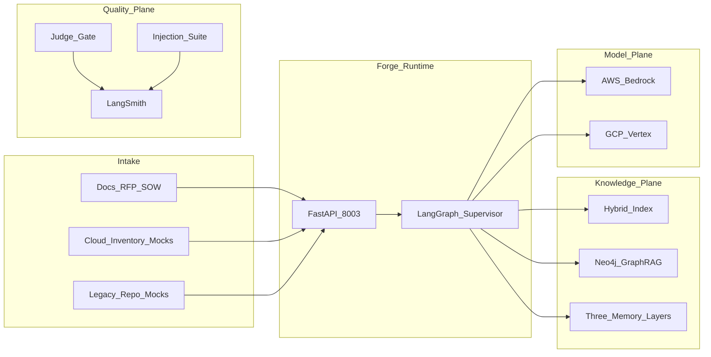

# System Design Document — RoboForge AI

## 1. Problem statement and use cases

### Problem

Robots & Pencils Velocity Pods still burn 2–4 weeks on repeated discovery, estate assessment, compliance mapping, RAG/agent design, and ROI before an engagement can commit to build. Roughly 70–80% of that work recurs across clients, while experts manually review documents, diagrams, APIs, repos, and cloud inventories.

**Unique intricate problem:** build an **Autonomous Enterprise AI Solution Factory** that turns weeks of consulting into hours — with explainability, HITL governance, and continuous learning so each engagement improves the next.

### Primary use cases

| ID | Actor | Use case |
|----|-------|----------|
| UC1 | Engagement lead | Drop intake pack → get draft Bedrock architecture + roadmap |
| UC2 | Cloud architect | Review estate score + modernization recommendations |
| UC3 | Security / compliance | See control mapping + residual risks before approve |
| UC4 | Finance / sponsor | Inspect ROI + token/infra cost model |
| UC5 | Platform eng | Block ship if judges or injection suite fail |

### Non-goals (v1)

- Live multi-cloud inventory APIs  
- Full IDE-grade code migration automation  
- Multi-orchestrator stacks in the hot path  
- Replacing sibling Fabric’s tenant-isolation product

---

## 2. Success metrics

| Category | Metric | Target |
|----------|--------|--------|
| Speed | Discovery → draft blueprint (narrative) | &lt; 4 hours |
| Quality | Groundedness | ≥ 0.85 |
| Quality | Citation coverage | ≥ 90% |
| Safety | Security-compliance judge | ≥ 0.90 |
| Cost | Cost-realism judge | ≥ 0.80 |
| Safety | Injection suite (50) | ≥ 95% |
| Learning | Episodic writeback on publish | 100% of approved packs |
| Business | Time-to-production (narrative) | 45 days → 15–20 days |

---

## 3. High-level architecture



---

## 4. Multi-agent design

### Supervisor contract

Workers never route to each other. Routing is pure state logic.

### Worker contracts

| Worker | Input | Output |
|--------|-------|--------|
| `intake_analyzer` | `raw_pack` | `intake` (objectives, stakeholders, constraints, risks, domain) |
| `estate_assessor` | intake + mocks | `estate` (cloud score, legacy score, modernization notes) |
| `knowledge_builder` | estate + corpus | `evidence[]` (chunks + graph paths) |
| `security_compliance` | evidence + intake | `security_findings` (controls, gaps, severity) |
| `solution_architect` | all prior + memory | `blueprint` (Bedrock/AgentCore topology, RAG, APIs) |
| `roi_optimizer` | blueprint + estate | `roi` (cost, savings, payback, risks) |
| `judge_gate` | blueprint + evidence + findings | `judge_scores` |
| `hitl` | interrupt payload | `approval` |
| `delivery_publish` | approved artifacts | `published`, `delivery_pack_id`, episodic lesson |

### Collapsed from the 30+ agent draft

| Draft agents | Folded into |
|--------------|-------------|
| Discovery, Human Review (brief) | `intake_analyzer` |
| Cloud Assessment, Legacy Application | `estate_assessor` (+ tools) |
| Enterprise Knowledge, Retriever, Researcher | `knowledge_builder` |
| Security, Compliance | `security_compliance` |
| RAG Architect, AI Architecture, Developer/Docs stubs | `solution_architect` |
| Cost Optimization, ROI | `roi_optimizer` |
| Planner / Executive Supervisor | LangGraph `supervisor` |
| Evaluator / Judges | `judge_gate` (+ offline consensus evals) |
| Deployment | `delivery_publish` (mock) + deploy scripts |

---

## 5. Memory and continuous learning

| Layer | Store | Learning loop |
|-------|-------|---------------|
| Procedural | Versioned playbooks on disk | Prompt refine proposes v+1 (HITL to apply) |
| Episodic | JSONL / pgvector past packs | `delivery_publish` appends lesson + outcome tags |
| Semantic | LangGraph Store | Org standards, industry templates, AWS Pattern Partner motifs |
| Long-term org memory | Episodic + KG PastProject nodes | Cross-engagement GraphRAG reuse without client data bleed (coordinate with Fabric isolation patterns when multi-tenant) |

---

## 6. Knowledge graph schema

```text
(:Application)-[:USES]->(:API)-[:ACCESSES]->(:DataStore)
(:DataStore)-[:CONTAINS]->(:PIIClass)-[:REQUIRES]->(:Control)
(:Application)-[:RUNS_ON]->(:CloudResource)
(:Engagement)-[:PROPOSES]->(:ArchitecturePattern)
(:Engagement)-[:RELATED_TO]->(:PastProject)
```

Demo seeds: `data/kg/seed_entities.jsonl`, `data/kg/seed_relations.jsonl`.

---

## 7. Judges

| Judge | In-graph | Ship bar |
|-------|----------|----------|
| Architecture soundness | Yes | ≥ 0.85 |
| Groundedness / faithfulness | Yes | ≥ 0.85 |
| Security & compliance | Yes | ≥ 0.90 |
| Cost realism | Yes | ≥ 0.80 |
| Multi-model consensus (Claude/Gemini) | Offline evals | Majority agree to ship |

Tools: LangSmith, Ragas/DeepEval-style rubrics, Promptfoo/custom `attacks.jsonl`, optional Arize Phoenix later.

---

## 8. Tool / framework inventory (locked + recommended)

**Orchestration:** LangGraph, LangChain, Pydantic v2  

**RAG / Graph:** hybrid dense+BM25, RRF, Neo4j GraphRAG, optional Bedrock Knowledge Bases, OpenSearch (cloud)  

**Models:** Bedrock (Claude / Nova / Titan embed), Vertex Gemini fallback, vision/OCR stubs for doc parsing  

**Safety:** Bedrock Guardrails, hard-block patterns, Garak/Promptfoo-style red-team, OWASP LLM Top 10 coverage in attack set  

**Observability:** LangSmith, OpenTelemetry, CloudWatch/Datadog (design)  

**Deploy:** Bedrock AgentCore, Vertex Agent Engine, Terraform sketch, CDK notes  

**Not in v1 hot path:** CrewAI, AutoGen, Temporal, Kafka, Step Functions (batch ingest later only)

---

## 9. Risks and mitigations

| Risk | Mitigation |
|------|------------|
| Hallucinated cloud inventory | Mock fixtures + groundedness judge + citations |
| Scope explosion back to 30 agents | AS_BUILT worker lock; tools not nodes |
| Overlap with Fabric | Clear port/artifact/HITL boundary in AS_BUILT |
| Unsafe auto-deploy | Publish is mock pack only; no live Terraform apply |

---

## 10. Why this is strategically valuable for R&P

It productizes the consultancy’s own delivery system — aligning with AWS Pattern Partner “validated, repeatable patterns,” Velocity Pod cadence, and Bedrock/AgentCore production focus — so every engagement is faster, more consistent, and measurable, while humans retain final go-live authority.
