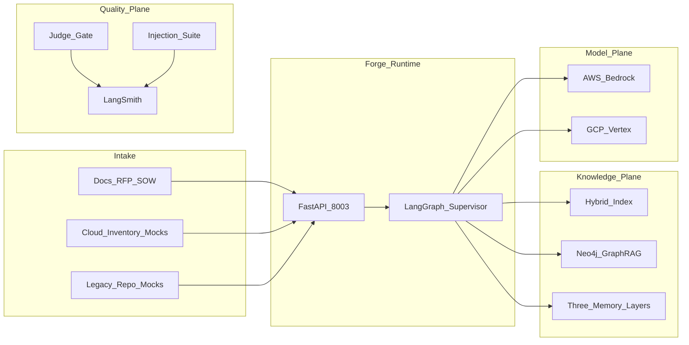
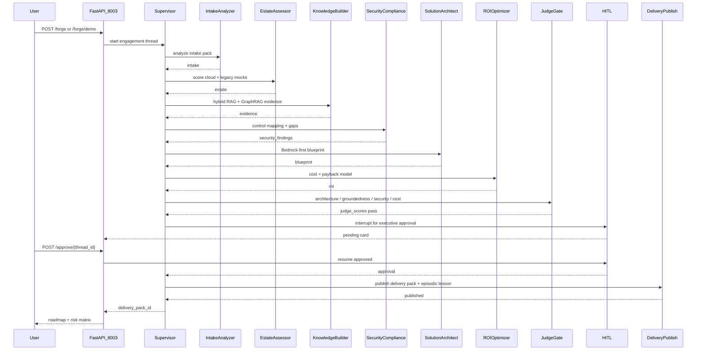

# Architecture

Canonical HLA/LLA for RoboForge AI. Narrative design: [SYSTEM_DESIGN.md](SYSTEM_DESIGN.md). Locked decisions: [`../AS_BUILT.md`](../AS_BUILT.md).

## High-Level Architecture (HLA)

Adapted from [SYSTEM_DESIGN.md](SYSTEM_DESIGN.md) §3.

Workers: `intake_analyzer` → `estate_assessor` → `knowledge_builder` → `security_compliance` → `solution_architect` → `roi_optimizer` → `judge_gate` → `hitl` → `delivery_publish`.

## Low-Level Architecture (LLA)

Engagement forge happy path with executive HITL before delivery-pack publish.

