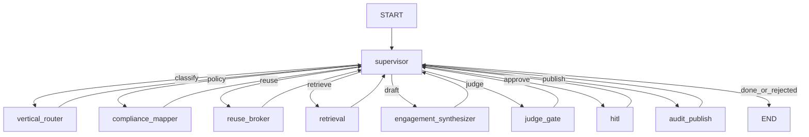

# As-Built Planning Document

## Project title

**R&P Agentic Delivery Fabric (LangGraph Supervisor + Multi-Tenant Compliance + HITL)**

Package: `rp-agentic-fabric` v0.1.0 — Robots & Pencils Agentic AI portfolio project.  
Reference implementation patterns: Resonance Ticket Triage (Project 2) + EGKP doc format.

---

## Purpose

A multi-tenant GenAI delivery fabric that:

1. Classifies engagement briefs by vertical (EdTech / Healthcare / FinServ / Retail)  
2. Loads a versioned compliance policy pack (FERPA / HIPAA / GLBA / SOC2 / PCI) before tools run  
3. Decides IP reuse via Reuse-Broker (sanitize prior tenant embeddings)  
4. Retrieves tenant-scoped evidence (hybrid RAG + Neo4j GraphRAG)  
5. Drafts an engagement plan using procedural / episodic / semantic memory  
6. Scores Compliance + Faithfulness + Cross-Tenant Leakage before publish  
7. Pauses for human approval (HITL) on regulated verticals or failed judges  
8. Publishes an immutable audit/provenance pack (mock log)

UI: FastAPI Delivery Cockpit at `http://127.0.0.1:8002`.

---

## Locked decisions

| Area | Decision (as built) |
|------|---------------------|
| Orchestration | LangGraph **supervisor loop** — workers never route to each other |
| Workers | `vertical_router` → `compliance_mapper` → `reuse_broker` → `retrieval` → `engagement_synthesizer` → `judge_gate` → `hitl` → `audit_publish` |
| Chat model (default) | `bedrock_converse:openai.gpt-oss-120b-1:0` via `RPADF_MODEL` |
| Vertex swap | `google_vertexai:gemini-2.5-pro` (+ `GCP_PROJECT` / `GCP_LOCATION`) |
| Offline / throttle | `RPADF_MODEL=fake`; auto fake fallback on Bedrock quota (configurable) |
| Embeddings | `bedrock:amazon.titan-embed-text-v2:0` (or fake hashed vectors) |
| Local checkpointer | `SqliteSaver` → `checkpoints.sqlite` |
| AgentCore checkpointer | `PostgresSaver` via `POSTGRES_DSN` |
| Semantic memory | LangGraph Store (`RPADF_MEMORY=memory` or `postgres`) |
| Episodic memory | pgvector / JSONL past engagements, tenant-partitioned |
| Procedural memory | Versioned prompts in `data/prompts/synthesizer_{vertical}.json` (`latest`) |
| Policy packs | `data/policy_packs/{vertical}.yaml` — loaded before retrieval tools |
| Knowledge graph | Neo4j (`bolt://localhost:7687`) or JSONL fallback in `data/kg/` |
| HITL | `langgraph.types.interrupt` inside `hitl_node` only |
| Retrieval tool budget | Max **8** tool calls |
| Outbound publish | Mock append to `data/audit_packs.log` |
| Input guardrail | Hard-block injection patterns in `app/guardrails.py` (+ optional Bedrock Guardrail) |
| Deploy | Bedrock AgentCore **and** Vertex AI Agent Engine |
| AgentCore managed memory | Disabled by default (`DISABLE_AGENTCORE_MEMORY=1`) |
| Evals | LangSmith experiments; security pass bar **≥ 95%** (48/50) |
| Injection suite | **50** attacks (vertical-specific PHI / FERPA / cross-tenant) |
| UI stack | FastAPI + fetch-polled approval page — no React/npm |
| Azure OpenAI | **Out of scope** (v1) |
| Explicitly not primary | CrewAI, AutoGen, Strands Agents |

### Composer follow-up constraints (do not regress)

1. Workers never call each other — only the supervisor routes.  
2. Every tool receives `tenant_id`; vector/Cypher queries must filter on it.  
3. Healthcare + finserv always HITL before `audit_publish`.  
4. Reused IP nodes must pass Reuse-Broker sanitization (`reusable_ip=true`, no prior tenant embeddings).  
5. Prefer updating this document’s checklist when behavior is intentionally changed.

---

## Architecture

### Graph flow (as built)

```
START → supervisor
          ├─ vertical_router         → supervisor
          ├─ compliance_mapper       → supervisor
          ├─ reuse_broker            → supervisor
          ├─ retrieval               → supervisor
          ├─ engagement_synthesizer  → supervisor
          ├─ judge_gate              → supervisor
          ├─ hitl                    → supervisor   (interrupt until approve/edit/reject)
          ├─ audit_publish           → supervisor
          └─ END
```

| Route condition | Next |
|-----------------|------|
| `approval == "rejected"` | `END` |
| `vertical is None` | `vertical_router` |
| `guardrail_config is None` | `compliance_mapper` |
| `reuse_decided == False` | `reuse_broker` |
| `evidence == []` | `retrieval` |
| `draft_plan is None` | `engagement_synthesizer` |
| `judge_scores is None` | `judge_gate` |
| judges fail or regulated vertical and `approval == "pending"` | `hitl` |
| approved/edited and not `published` | `audit_publish` |
| non-regulated, judges pass, auto path | `audit_publish` (or HITL if pending) |
| else | `END` |

### State (`EngagementState`)

`engagement_id`, `tenant_id`, `raw_brief`, `vertical` (`edtech` \| `healthcare` \| `finserv` \| `retail`),  
`sensitivity`, `policy_pack_id`, `guardrail_config`, `reuse_decided`, `reuse_decisions`,  
`evidence`, `draft_plan`, `judge_scores`,  
`approval` (`pending` \| `approved` \| `edited` \| `rejected` \| `auto`),  
`published`, `audit_pack_id`, `step_log`, `next`

### Memory layers (Synthesizer)

| Layer | Module | Behaviour |
|-------|--------|-----------|
| Procedural | `app/memory/procedural.py` | Vertical playbook prompt from disk (`latest`) |
| Episodic | `app/memory/episodic.py` | Similar past engagements (JSONL / pgvector) |
| Semantic | `app/memory/semantic.py` | Per-tenant facts via Store |

### Security model

- **Blocked:** hard-block patterns or Bedrock/Vertex guardrail refusal → `approval=rejected`  
- **HITL:** healthcare / finserv / failed judges / synthesizer risk flags → interrupt  
- Eval: `security/injection_eval.py` vs `security/attacks.jsonl` (50 attacks)



---

## Project layout (as built)

```
rp-agentic-fabric/
├── app/
│   ├── main.py
│   ├── graph.py
│   ├── state.py
│   ├── llm.py / _fake_llm.py / guardrails.py
│   ├── hitl.py / hitl_log.py
│   ├── agents/          # supervisor + 7 workers + audit_publish
│   ├── memory/          # procedural, episodic, semantic
│   ├── tools/           # retrieval, kg, integrations, publish
│   ├── ui/              # cockpit.html, styles.css
│   └── ops/dashboard.py
├── evals/
├── security/
├── deploy/
├── data/
│   ├── policy_packs/
│   ├── prompts/
│   ├── verticals/{edtech,healthcare,finserv,retail}/
│   ├── kg/
│   ├── hitl_outcomes.jsonl
│   └── audit_packs.log
├── docs/SYSTEM_DESIGN.md
├── project-prompts.md
├── AS_BUILT.md
└── pyproject.toml
```

---

## Implementation plan

| Phase | Deliverable | Status |
|-------|-------------|--------|
| Docs | README + AS_BUILT + SYSTEM_DESIGN + prompts | Done |
| Scaffold | Package layout + fake LLM | Done |
| Core graph | Supervisor + router + compliance mapper | Done |
| Retrieval | Reuse-broker + retrieval + KG seed | Done |
| Draft + judges | Synthesizer + memory + judge_gate | Done |
| HITL + UI | Interrupt + FastAPI cockpit + audit_publish | Done |
| Deploy | AgentCore + Vertex scripts | Done |
| Quality | LangSmith-ready evals + 50-attack suite | Done |

---

## Demo engagement set

### Primary UI path

1. Start UI: `uv run python -m app.main` → open `http://127.0.0.1:8002`  
2. Click **Demo engagement** → EdTech FERPA student-onboarding brief  
3. Approve when HITL card appears (healthcare/finserv always HITL; edtech HITL if judges flag risk)

### Sample briefs

| ID | Vertical | Tenant | Brief |
|----|----------|--------|-------|
| ENG-1001 | edtech | tenant-asu-demo | FERPA-safe student onboarding agent |
| ENG-2001 | healthcare | tenant-careco | HIPAA care-ops triage with FHIR stubs |
| ENG-3001 | finserv | tenant-northbank | GLBA account-ops summarizer |

---

## Out of scope (v1)

- Real client data, live EHR/SIS/Salesforce  
- Full multi-IdP SSO (simulate `tenant_id` + role)  
- Azure OpenAI routing  
- Next.js cockpit / Neo4j visual explorer  
- Auto-applying prompt refine without HITL  

---

## Verification checklist

- [ ] `RPADF_MODEL=fake` CLI run reaches `published=True` or HITL interrupt  
- [ ] Cross-tenant query cannot return other tenant chunks  
- [ ] Healthcare brief always hits HITL  
- [ ] `security/injection_eval.py` ≥ 95%  
- [ ] Audit pack written to `data/audit_packs.log` after approve  
- [ ] Workers never set each other's `next` (only supervisor)
