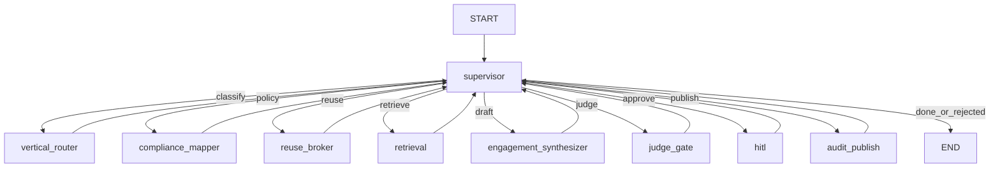

# R&P Agentic Delivery Fabric (`rp-agentic-fabric`)

**Multi-tenant GenAI delivery platform** for Robots & Pencils — assemble, govern, and audit bespoke multi-agent systems across regulated verticals without cross-tenant leakage.

Engagement briefs are classified by vertical, mapped to a compliance policy pack (FERPA / HIPAA / GLBA / SOC2 / PCI), sanitized for reusable IP, retrieved via tenant-scoped RAG + Neo4j GraphRAG, drafted into an engagement plan (three memory layers), scored by in-graph judges, paused for **human-in-the-loop** on regulated paths, then published as an **audit/provenance pack**.

- **Orchestration:** LangGraph **supervisor loop** — workers never route to each other
- **Workers:** `vertical_router` → `compliance_mapper` → `reuse_broker` → `retrieval` → `engagement_synthesizer` → `judge_gate` → `hitl` → `audit_publish`
- **Memory:** procedural (versioned playbooks) · episodic (past engagements) · semantic (per-tenant Store)
- **Knowledge graph:** Neo4j GraphRAG (Client → Engagement → DataAsset → Reg → AgentComponent → RiskFlag)
- **Models:** AWS Bedrock (`gpt-oss-120b`) or Google Vertex (`gemini-2.5-pro`); `fake` for offline demos
- **Judges:** Compliance · Faithfulness/Groundedness · Cross-Tenant Leakage (Brand/Tone offline)
- **UI:** FastAPI Delivery Cockpit on **port 8002**
- **Deploy:** Bedrock AgentCore **and** Vertex AI Agent Engine
- **Quality / safety:** LangSmith evals + deploy gates + 50-attack injection suite (pass ≥ 95%)

Design record: [`AS_BUILT.md`](AS_BUILT.md) · Architecture: [`docs/architecture.md`](docs/architecture.md) · System design: [`docs/SYSTEM_DESIGN.md`](docs/SYSTEM_DESIGN.md) · Cursor prompts: [`project-prompts.md`](project-prompts.md)

---

## The problem

Robots & Pencils is an Applied AI Engineering Partner (AWS Advanced Tier, AWS Pattern Partner, Bellevue GenAI studio, Velocity Pods shipping in 30–45 days). Their clients sit in FERPA / HIPAA / GLBA / PCI shops. The intricate problem:

> Productize reusable agent components as IP across many engagements **without** letting one client's data, prompts, or embeddings leak into another — and prove safety with a graph-verified audit pack before go-live.

---

## Architecture

Canonical HLA/LLA: [`docs/architecture.md`](docs/architecture.md).

```
Brief → FastAPI (/ingest | /ingest/demo)
            → LangGraph (SqliteSaver locally)
                 START → supervisor
                           ├─ vertical_router       vertical + sensitivity + policy pack id
                           ├─ compliance_mapper     regs → guardrail / tool allowlist
                           ├─ reuse_broker          sanitize reusable IP before RAG
                           ├─ retrieval             tenant-scoped hybrid RAG + Neo4j (≤ 8 tools)
                           ├─ engagement_synthesizer plan + playbook (3 memory layers)
                           ├─ judge_gate            compliance / faithfulness / leakage
                           ├─ hitl                  interrupt → approve | edit | reject
                           ├─ audit_publish         immutable audit pack + client-safe summary
                           └─ END
            ← Approval UI polls /pending → POST /approve/{thread_id}
```



**Routing (pure logic, no LLM):** missing vertical → router; no policy → mapper; reuse undecided → broker; empty evidence → retrieval; no draft → synthesizer; no judge scores → judge_gate; regulated / fail judges → HITL; approved → audit_publish; rejected → END.

**Security:** hard-block prompt-injection patterns (and optional Bedrock Guardrail) refuse early; softer risk / regulated verticals escalate through judge_gate + HITL.

---

## Target metrics (demo-measurable)

| Metric | Target |
|--------|--------|
| Cross-tenant leakage judge | 0 leaks on golden set |
| Compliance judge pass | ≥ 0.90 on vertical suite |
| Faithfulness / groundedness | ≥ 0.85 |
| Injection suite (50) | ≥ 95% blocked/escalated |
| Reuse-broker sanitization | 100% of reused IP clean of prior tenant embeddings |
| HITL gate | Required for healthcare + finserv before `audit_publish` |

---

## Prerequisites

- **Python** 3.11 or 3.12 (`uv` recommended)
- Local **`.env`** (see `.env.example`)
- Optional: Docker Postgres on `:5433` for Store / episodic pgvector
- Optional: Docker Neo4j on `:7687` for GraphRAG (JSONL fallback if absent)
- Cloud creds as needed: AWS (Bedrock / AgentCore), GCP (Vertex / Agent Engine)
- Optional: `LANGSMITH_API_KEY`, `SLACK_BOT_TOKEN`, `BEDROCK_GUARDRAIL_ID`

---

## Quick start

```bash
cd rp-agentic-fabric
uv sync

# Offline dry-run (PowerShell)
# $env:RPADF_MODEL='fake'

uv run python -m app.graph          # CLI sample engagement
uv run python -m app.main           # UI http://127.0.0.1:8002
```

| Action | How |
|--------|-----|
| Demo engagement | Click **Demo** or `POST /ingest/demo` |
| Custom brief | `POST /ingest` with JSON body |
| Approve / edit / reject | Pending card → `/approve/{thread_id}` |

```bash
curl -X POST http://127.0.0.1:8002/ingest/demo
curl http://127.0.0.1:8002/pending
```

### Evals & security

```bash
uv run python evals/router_eval.py
uv run python evals/compliance_judge.py
uv run python evals/leakage_judge.py
uv run python evals/e2e_eval.py
uv run python evals/run_all.py

uv run python security/injection_eval.py   # expect ≥ 95%
```

---

## Demo verticals

| Vertical | Reg pack | Synthetic corpus |
|----------|----------|------------------|
| `edtech` | FERPA | Student-data onboarding playbook, SIS stubs |
| `healthcare` | HIPAA | Care-ops agent pattern, FHIR stubs |
| `finserv` | GLBA/SOC2 | Policy pack + leakage attacks (thin corpus) |
| `retail` | PCI-lite | Personalization agent stub |

---

## Locked stack (summary)

| Layer | Choice |
|-------|--------|
| Agents | LangGraph supervisor (not CrewAI / AutoGen / Strands) |
| Memory | Procedural + episodic + semantic |
| KG | Neo4j GraphRAG (JSONL fallback) |
| Models | Bedrock primary · Vertex secondary · `fake` offline |
| UI | FastAPI Delivery Cockpit `:8002` |
| Deploy | Bedrock AgentCore **and** Vertex Agent Engine |
| Safety | Hard-block + Bedrock Guardrails + 50-attack suite ≥ 95% |

---

## Project layout

```
rp-agentic-fabric/
├── app/           # graph, agents, memory, tools, UI
├── evals/         # component + e2e + judges
├── security/      # 50-attack injection suite
├── deploy/        # AgentCore + Vertex entrypoints
├── data/          # policy packs, prompts, verticals, kg seeds
├── docs/          # SYSTEM_DESIGN.md
├── AS_BUILT.md
├── project-prompts.md
└── README.md
```

---

## CI gates

GitHub Actions (`.github/workflows/ci.yml`) runs on push/PR:

- `uv sync --frozen --extra dev`
- `ruff check`
- `pytest` (smoke / unit)
- `evals/run_all.py` with `RPADF_MODEL=fake`
- injection suite ≥ 95% (`security/injection_eval.py`)

Locally: same commands from the package root.

Docker: `docker build -t rp-agentic-fabric .` then run on **port 8002** (`/health`).

### Roadmap to excellent

- Shared composite action for `uv` + ruff + pytest across sibling packages
- Nightly LangSmith eval runs (non-fake models) on a schedule
- `uv pip audit` / dependency vulnerability gate in CI

---

## How to build / extend

1. Keep [`AS_BUILT.md`](AS_BUILT.md) locked decisions as source of truth.
2. Paste prompts from [`project-prompts.md`](project-prompts.md) into Composer in order when extending.
3. Never let workers route to each other — only the supervisor sets `next`.
