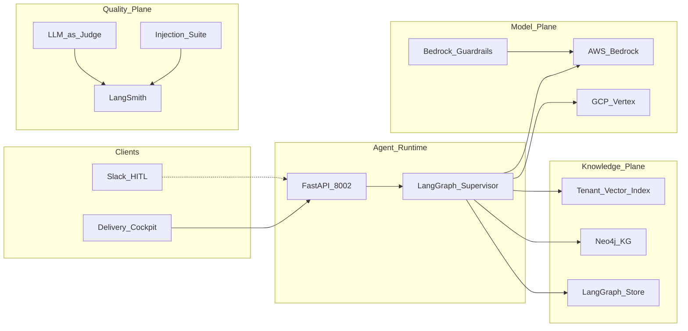

# System Design Document — R&P Agentic Delivery Fabric

## 1. Problem statement and use cases

### Problem

Robots & Pencils operates as an Applied AI Engineering Partner across regulated verticals (Education/FERPA, Healthcare/HIPAA, Financial Services/GLBA/SOC2/PCI, Retail/PCI). As an AWS Pattern Partner with Velocity Pods shipping agentic systems in 30–45 days, R&P must **reuse productized agent IP** across engagements while **never leaking** one client's data, prompts, or embeddings into another — and must **demonstrate** safety to client security/procurement before go-live.

The hard intersection:

1. Heterogeneous compliance regimes (different guardrails per vertical)  
2. Multi-tenant IP reuse without tenant-specific residue  
3. Legacy integration diversity (Slack, Salesforce, SIS, EHR/FHIR)  
4. Enterprise trust — audit provenance, not marketing claims  

### Primary use cases

| ID | Actor | Use case |
|----|-------|----------|
| UC1 | Delivery consultant | Ingest SOW brief → vertical + policy pack → engagement plan |
| UC2 | Compliance lead | Review judge scorecards + audit pack before go-live |
| UC3 | Reuse broker path | Reuse EdTech onboarding pattern in FinServ without prior tenant embeddings |
| UC4 | Security reviewer | Query Neo4j provenance: which components reused, under which regs |
| UC5 | Platform eng | Block deploy if injection suite &lt; 95% or leakage judge fails |

### Non-goals (v1)

- Live EHR / SIS / Salesforce APIs (mocks only)  
- Full enterprise IdP / SSO (simulate `tenant_id`)  
- Azure OpenAI as third model router  
- Multi-orchestrator stacks (CrewAI / AutoGen / Strands)

---

## 2. Success metrics

| Category | Metric | Target |
|----------|--------|--------|
| Isolation | Cross-tenant leakage on golden set | 0 |
| Compliance | Compliance judge pass rate | ≥ 0.90 |
| Quality | Faithfulness / groundedness | ≥ 0.85 |
| Safety | Injection suite (50) | ≥ 95% blocked/escalated |
| Reuse | Sanitized IP nodes | 100% free of prior tenant embeddings |
| Process | HITL on healthcare + finserv | Required before publish |
| Cost | Token + infra per engagement | Tracked; alert on budget |

---

## 3. High-level architecture



### Dual-cloud deployment

| Concern | AWS | GCP |
|---------|-----|-----|
| Chat / agents | Bedrock + **AgentCore** | Vertex + **Agent Engine** |
| Vectors | OpenSearch / Bedrock KB / local JSON | Vertex Vector Search / AlloyDB |
| Graph | Neo4j Aura (shared) | Neo4j Aura (shared) |
| Secrets | Vault / Secrets Manager (mocked locally) | Secret Manager |
| Observability | CloudWatch + LangSmith + OTel | Cloud Logging + LangSmith |

---

## 4. Multi-agent design

### Supervisor contract

Workers **never** route to each other. Each returns to the supervisor. Routing is pure state logic.

### Worker contracts

| Worker | Input | Output |
|--------|-------|--------|
| `vertical_router` | `raw_brief` | `vertical`, `sensitivity`, `policy_pack_id` |
| `compliance_mapper` | vertical | `guardrail_config` (allowlist, retention, regs) |
| `reuse_broker` | tenant + vertical | `reuse_decisions[]` (sanitized component ids) |
| `retrieval` | brief + allowlist + tenant | `evidence[]` (chunks + graph paths) |
| `engagement_synthesizer` | evidence + memory | `draft_plan` |
| `judge_gate` | draft + evidence | `judge_scores` (compliance, faithfulness, leakage) |
| `hitl` | interrupt payload | `approval`, optional edited plan |
| `audit_publish` | approved draft + scores | `published=true`, `audit_pack_id` |

### Memory model

| Layer | Storage | Use |
|-------|---------|-----|
| Procedural | `data/prompts/synthesizer_{vertical}.json` | Versioned playbook style |
| Episodic | JSONL / pgvector | Similar past engagements (tenant-filtered) |
| Semantic | LangGraph Store | Tenant + consultant facts |

---

## 5. Multi-tenant isolation model

1. **State:** every run carries `tenant_id`.  
2. **Tools:** `TenantBoundary` wrapper injects `tenant_id` into every tool call.  
3. **Vectors:** metadata filter `tenant_id == current OR reusable_ip == true`.  
4. **Cypher:** `WHERE n.tenant_id = $tenant_id OR n.reusable_ip = true`.  
5. **Reuse-Broker:** strips prior tenant embeddings; sets `reusable_ip=true` only after sanitization.  
6. **Judges:** Cross-Tenant Leakage scans for other tenant names / ids in draft.  
7. **Outbound:** Client Reporting filter (inside audit_publish) blocks foreign identifiers.

---

## 6. Knowledge graph schema

```text
(:Client {client_id, name, tenant_id})
(:Engagement {engagement_id, tenant_id, vertical})
(:DataAsset {asset_id, sensitivity, tenant_id})
(:RegulatoryRequirement {reg_id, name})   # FERPA, HIPAA, ...
(:AgentComponent {component_id, reusable_ip, sanitized})
(:RiskFlag {flag_id, severity})
(:PastProject {project_id, outcome})

(Client)-[:HAS_ENGAGEMENT]->(Engagement)
(Engagement)-[:USES_ASSET]->(DataAsset)
(Engagement)-[:SUBJECT_TO]->(RegulatoryRequirement)
(Engagement)-[:REUSES]->(AgentComponent)
(AgentComponent)-[:HAS_RISK]->(RiskFlag)
(Engagement)-[:RELATED_TO]->(PastProject)
```

Demo seeds: `data/kg/seed_entities.jsonl`, `data/kg/seed_relations.jsonl`.

---

## 7. Policy packs

Versioned YAML under `data/policy_packs/`:

```yaml
vertical: healthcare
regs: [HIPAA, SOC2]
tool_allowlist: [hybrid_search, lookup_entity, traverse_relations, fhir_stub_read]
retention_days: 2555
hitl_required: true
forbidden_topics: [clinical_diagnosis_advice, cross_tenant_lookup]
```

Loaded by `compliance_mapper` before retrieval. Tools not on the allowlist raise and are skipped.

---

## 8. RAG pipeline (engagement path)

1. Dense + BM25 over tenant-scoped corpus  
2. Metadata filter (`tenant_id` / `reusable_ip`)  
3. Optional Neo4j expansion (≤ 8 tools total)  
4. Context pack with citation ids  
5. Synthesizer drafts plan citing evidence  
6. Judge gate scores; HITL if needed  
7. Audit pack publish

---

## 9. Judges

| Judge | When | Ship bar |
|-------|------|----------|
| Compliance | In-graph `judge_gate` | ≥ 0.90 |
| Faithfulness | In-graph | ≥ 0.85 |
| Cross-Tenant Leakage | In-graph | score == 1.0 (0 leaks) |
| Brand/Tone | Offline eval only | advisory |

Mitigations: cross-provider judge when possible; structured rubrics; golden sets.

---

## 10. Quality / safety gates

- LangSmith component + e2e evals on every graph change  
- Deploy gate: vertical compliance suite must pass  
- 50-attack prompt-injection red-team in CI, ≥ 95%  
- Vertical attack variants: PHI extract, FERPA student PII, cross-tenant name probes, financial advice outside disclosures  

---

## 11. Risks and mitigations

| Risk | Mitigation |
|------|------------|
| Silent cross-tenant retrieval | TenantBoundary + leakage judge + golden tests |
| Policy pack drift | Versioned packs; eval per pack version |
| Fake model masking bugs | Keep golden structured outputs aligned with fake LLM shapes |
| Over-scoped workers | v1 locks 7 workers; intake/codegen as tools only |

---

## 12. Tooling inventory

LangGraph, LangChain, Pydantic v2, FastAPI, Bedrock / Vertex, Neo4j, pgvector, LangSmith, OpenTelemetry (design), Bedrock Guardrails, Ragas/DeepEval-style judges, custom `attacks.jsonl`, Terraform sketches, Vault-mocked secrets, Slack notify mock, Salesforce/SIS/FHIR stubs.
