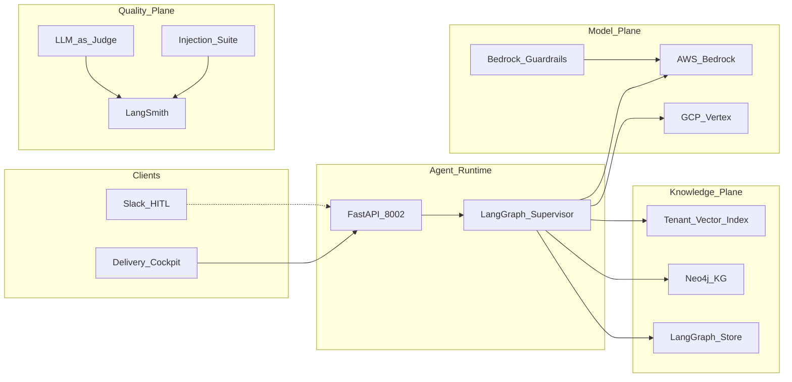
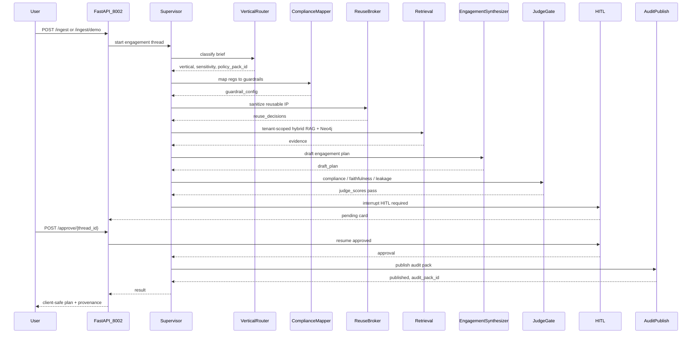

# Architecture

Canonical HLA/LLA for R&P Agentic Delivery Fabric. Narrative design: [SYSTEM_DESIGN.md](SYSTEM_DESIGN.md). Locked decisions: [`../AS_BUILT.md`](../AS_BUILT.md).

## High-Level Architecture (HLA)

Adapted from [SYSTEM_DESIGN.md](SYSTEM_DESIGN.md) §3.

Workers: `vertical_router` → `compliance_mapper` → `reuse_broker` → `retrieval` → `engagement_synthesizer` → `judge_gate` → `hitl` → `audit_publish`.

## Low-Level Architecture (LLA)

Regulated engagement happy path (e.g. healthcare / finserv) with mandatory HITL before audit publish.

