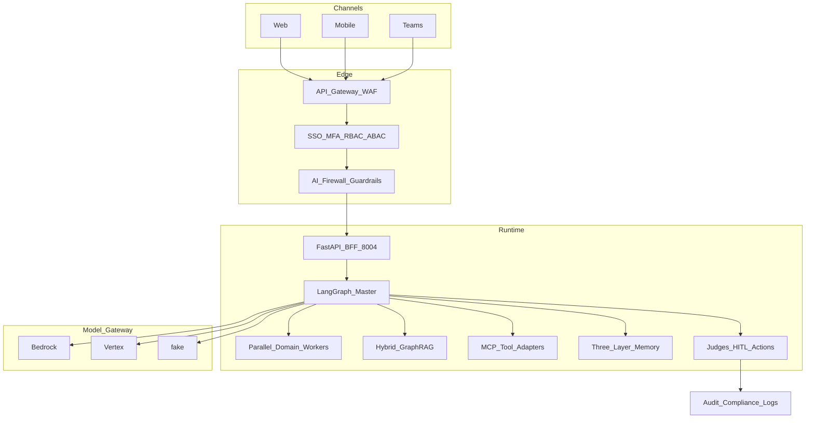
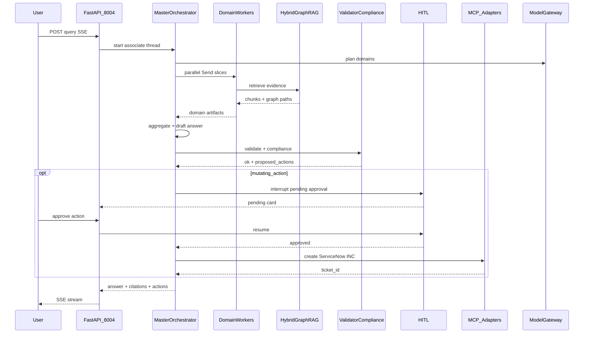

# Architecture

Canonical HLA/LLA for WAIP (Walmart Associate Intelligence Platform). Extended layer notes and deploy detail historically lived in uppercase `ARCHITECTURE.md`; this file is the Wave-1 canonical view. See also [SYSTEM_DESIGN.md](SYSTEM_DESIGN.md) and [`../AS_BUILT.md`](../AS_BUILT.md).

**Port:** FastAPI BFF **8004**.

## High-Level Architecture (HLA)

ASCII layers converted to Mermaid:

Master planner emits parallel `Send(worker, state_slice)` for selected domains (HR / Payroll / Benefits / Leave / Ticket / Search). Aggregator merges evidence; Validator + Compliance run on the merge; mutating actions require HITL then MCP write adapters.

## Low-Level Architecture (LLA)

Happy path: associate query that needs a HITL-gated ServiceNow ticket (e.g. short paycheck + medical leave).

