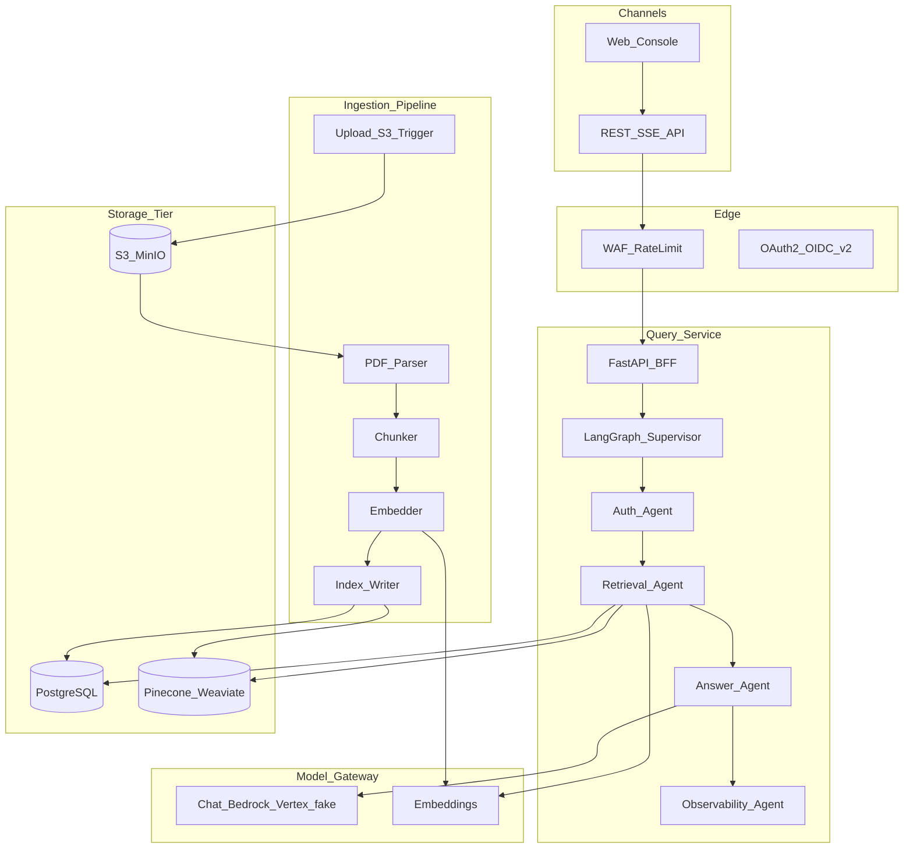
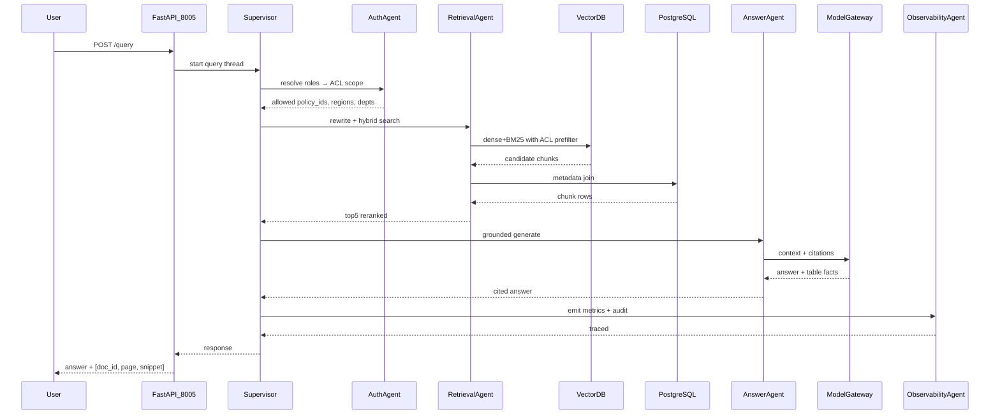

# Architecture

Canonical HLA/LLA for WIDRA (Walmart Intelligent Document Retrieval Assistant).

**Relation to prior docs:** An earlier uppercase `ARCHITECTURE.md` in this folder held the same Mermaid HLA plus storage/auth deep-dives. This Wave-1 `architecture.md` is the canonical entry point (HLA + LLA sequence). Extended ingestion/storage tables remain useful context in [SYSTEM_DESIGN.md](SYSTEM_DESIGN.md) and [`../AS_BUILT.md`](../AS_BUILT.md).

**Port:** FastAPI console **8005**.

## High-Level Architecture (HLA)

## Low-Level Architecture (LLA)

Happy path: authorized conversational query with citations (hot path).

