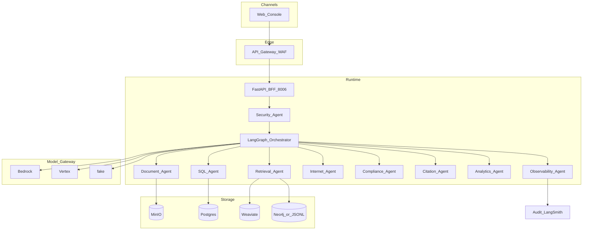
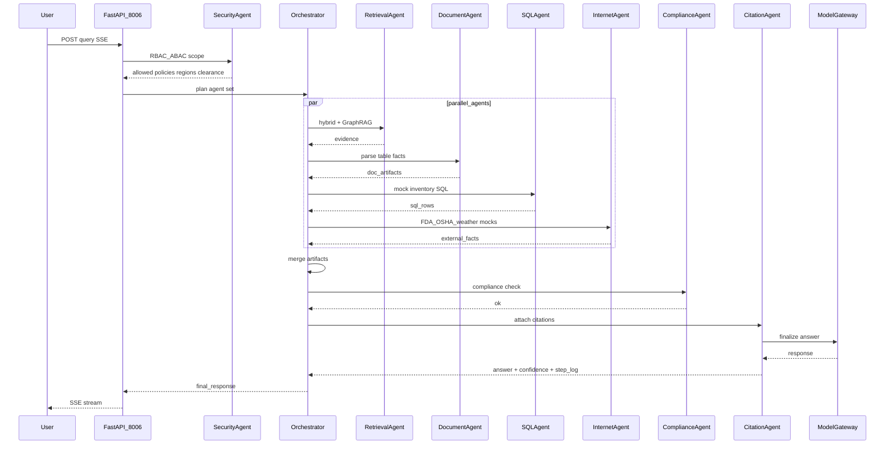

# Architecture

Canonical HLA/LLA for WOKA (Walmart OmniKnowledge AI). Extended layer notes historically lived in uppercase `ARCHITECTURE.md`; this file is the Wave-1 canonical view. See also [SYSTEM_DESIGN.md](SYSTEM_DESIGN.md) and [`../AS_BUILT.md`](../AS_BUILT.md).

**Port:** FastAPI BFF **8006**.

## High-Level Architecture (HLA)

ASCII layers converted to Mermaid:

## Low-Level Architecture (LLA)

Happy path: supply-chain disruption query (UC-1) with parallel agents → compliance → citations.

